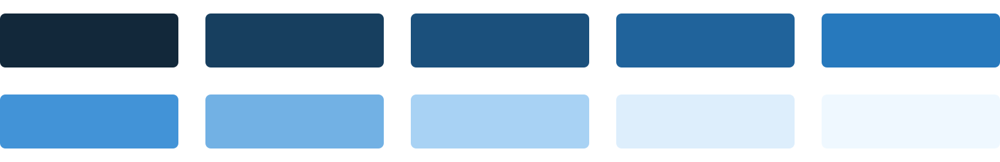
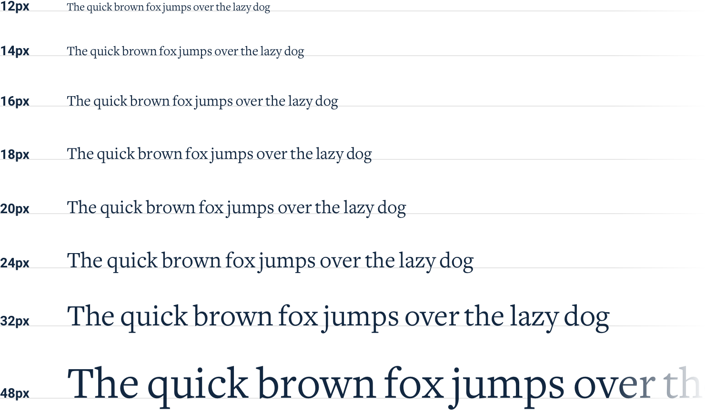

**Limit your choices**

Having millions of colors and thousands of fonts to choose from might
sound nice in theory, but in practice it’s usually a paralyzing curse.

And it’s not just fonts and colors, either — you can easily waste time
agonizing over almost any minor design decision.

*Should this text be 12px or 13px?*

*Should this box shadow have a 10% opacity or a 15% opacity?*

*Should this avatar be 24px or 25px tall?*

*Should I use a medium font weight for this button or semibold?*

*Should this headline have a bottom margin of 18px or 20px?*

When you’re designing without constraints, decision-making is torture
because there’s always going to be more than one right choice.

For example, these buttons all have different background colors, but
it’s almost impossible to tell the difference between them by just
looking at them.

How are you supposed to make a confident decision if none of these would
really be bad choices?

29

Limit your choices

**Define systems in advance**

Instead of hand-picking values from a limitless pool any time you need
to make a decision, *start with a smaller set of options*.

Don’t reach for the color picker every time you need to pick a new shade
of blue — choose from a set of 8-10 shades picked out ahead of time.

Similarly, don’t tweak a font size one pixel at a time until it looks
perfect.

Define a restrictive type scale in advance and use that to make any
future font size decisions.

Limit your choices

30

When you build systems like this, you only have to do the hard work of
picking the initial values *once* instead of every time you’re designing
a new piece of UI. It’s a bit more work up front, but it’s worth it —
it’ll save you a ton of decision fatigue down the road.

**Designing by process of elimination**

When you’re designing using a constrained set of values, decision-making
is a lot easier because there are a lot fewer “right” choices.

For example, say you’re trying to choose a size for an icon. You’ve
defined a sizing scale in advance where your only small-to-medium sized
options are 12px, 16px, 24px, and 32px.

To pick the best option, start by taking a guess at which one will look
best, maybe 16px. Then try the values on either side (12px and 24px) for
comparison.

Chances are, two of those options will seem like *obviously* bad
choices. If it’s the options on the outside, you’re done — the middle
option is the only good choice.

31

Limit your choices

If one of the outer options looks best, do another comparison using that
option as the “middle” value and make sure there’s not a better choice.

This approach works for anything where you’ve defined a system. When
you’re limited to a set of options that all look noticeably different,
picking the best one is a piece of cake.

**Systematize everything**

The more systems you have in place, the faster you’ll be able to work
and the less you’ll second guess your own decisions.

You’ll want systems for things like:

• Font size

• Font weight

• Line height

• Color

• Margin

• Padding

• Width

• Height

• Box shadows

Limit your choices

32

• Border radius

• Border width

• Opacity

…and anything else you run into where it feels like you’re laboring over
a low-level design decision.

You don’t have to define all of this stuff ahead of time, just make sure
you’re approaching design with a system-focused mindset. Look for
opportunities to introduce new systems as you make new decisions, and
try to avoid having to make the same minor decision twice.

Designing with systems is going to be a recurring theme throughout this
book, and in later chapters we’ll talk about building a lot of these
systems in finer detail.

