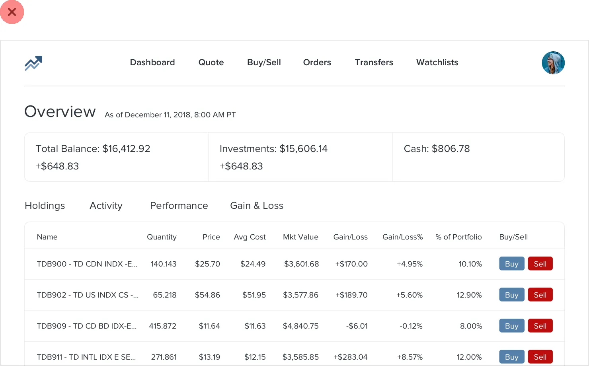
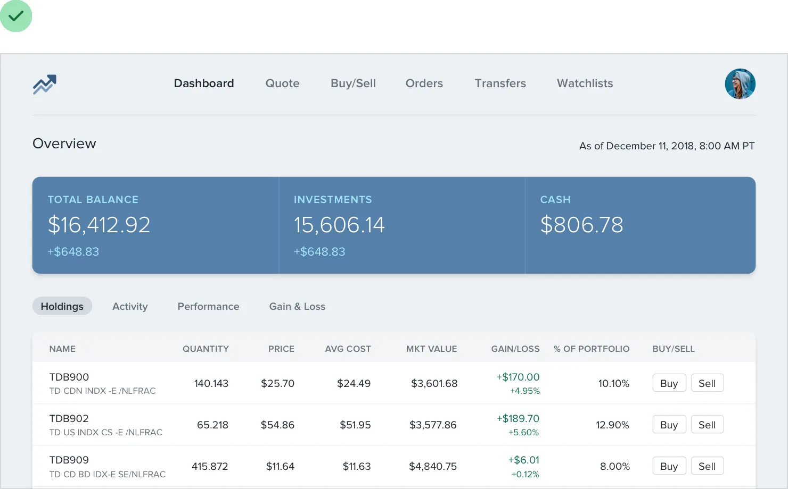
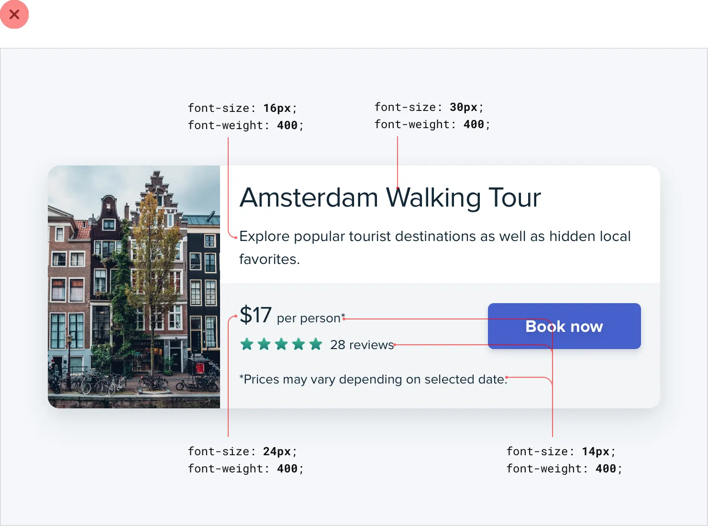

**Hierarchy is Everything**

**Not all elements are equal**

When you think of visual design as “styling things so they look good”,
it’s easy to see why it might feel hard to achieve without innate
artistic talent.

But it turns out that one of the biggest factors in making something
“look good” has nothing to do with superficial styling at all.

*Visual hierarchy* refers to how important the elements in an interface
appear in relation to one another, and it’s the most effective tool you
have for making something feel “designed”.

When everything in an interface is competing for attention, it feels
noisy and chaotic, like one big wall of content where it’s not clear
what actually matters:

37

Not all elements are equal

When you deliberately de-emphasize secondary and tertiary information,
and make an effort to highlight the elements that are most important,
the result is immediately more pleasing, even though the color scheme,
font choice, and layout haven’t changed:

So how do you actually make this happen? In the following chapters,
we’ll cover a number of specific strategies you can use to introduce
hierarchy into your designs.

