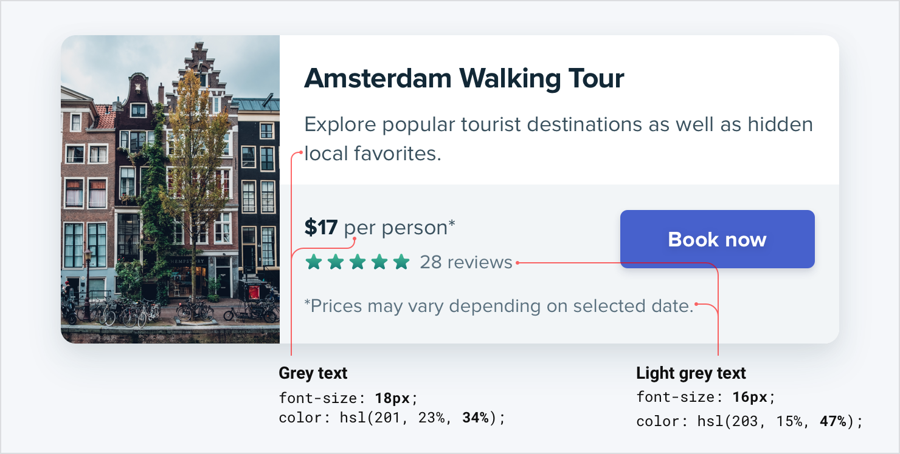
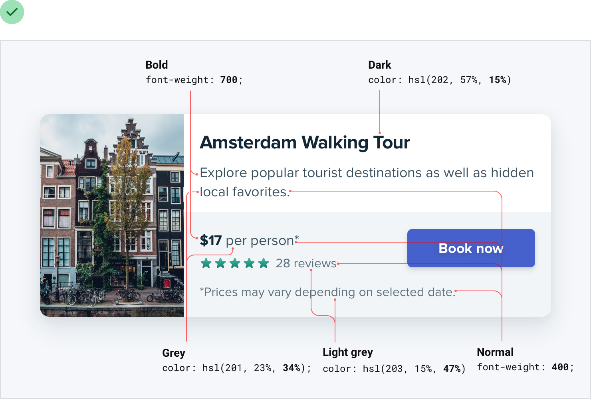
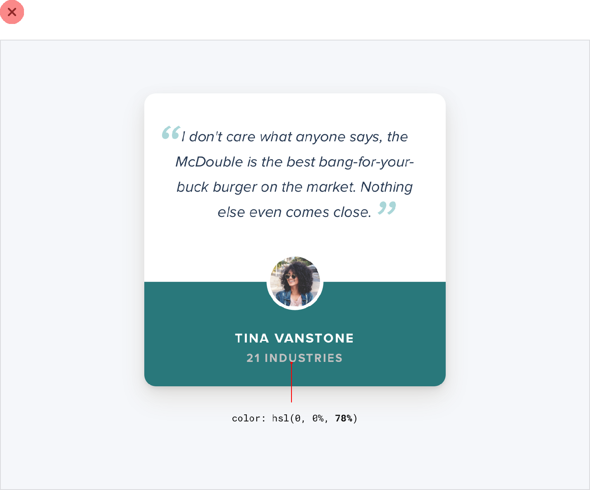

**Size isn’t everything**

Relying too much on font size to control your hierarchy is a mistake —
it often leads to primary content that’s too large, and secondary
content that’s too small.

Instead of leaving all of the heavy lifting to font size alone, try
using font weight or color to do the same job.

For example, making a primary element bolder lets you use a more

39

Size isn’t everything

reasonable font size, and often does a better job at communicating its
importance anyways:

Similarly, using a softer color for supporting text instead of a tiny
font size makes it clear that the text is secondary while sacrificing
less on readability:

Size isn’t everything

40

Try and stick to two or three colors:

• A dark color for primary content (like the headline of an article)

• A grey for secondary content (like the date an article was published)

• A lighter grey for tertiary content (maybe the copyright notice in a
footer)

Similarly, two font weights are usually enough for UI work:

• A normal font weight (400 or 500 depending on the font) for most text

• A heavier font weight (600 or 700) for text you want to emphasize Stay
away from font weights under 400 for UI work — they can work for large
headings but are too hard to read at smaller sizes. If you’re
considering

41

Size isn’t everything

using a lighter weight to de-emphasize some text, use a lighter color or
smaller font size instead.

