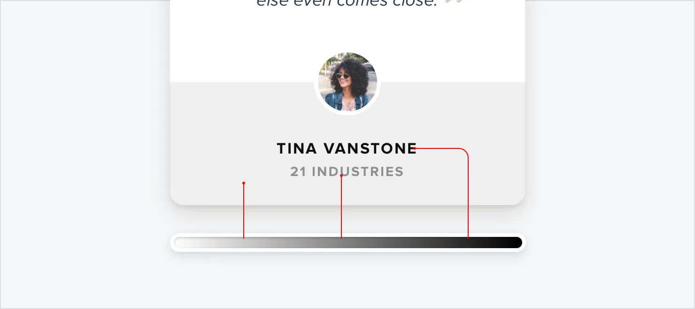
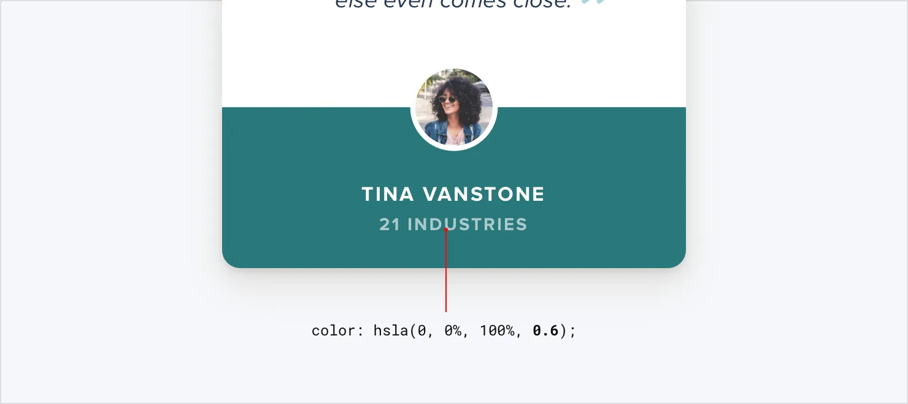
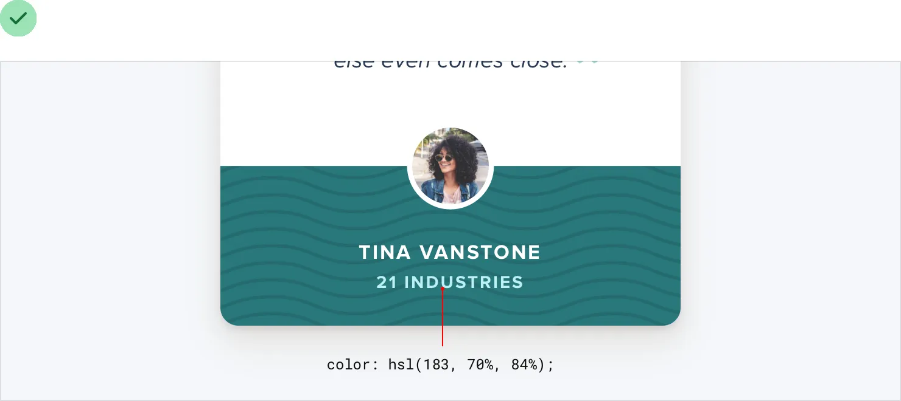

**Don’t use grey text on colored backgrounds**

Making text a lighter grey is a great way to de-emphasize it on white
backgrounds, but it doesn’t look so great on colored backgrounds.

That’s because the effect we’re actually seeing with grey on white is
*reduced* *contrast*.

43

Don’t use grey text on colored backgrounds

Making the text closer to the background color is what actually helps
create hierarchy, not making it light grey.

You might think that the easiest way to achieve this is to use white
text and reduce the opacity:

While this *does* reduce the contrast, it often results in text that
looks dull, washed out, and sometimes even disabled.

Don’t use grey text on colored backgrounds

44

Even worse, using this approach on top of an image or pattern means the
background will show through the text:

A better approach is to *hand-pick a new color*, based on the background
color.

Choose a color with the same hue, and adjust the saturation and
lightness until it looks right to you:

Hand-picking a color this way makes it easy to reduce the contrast
without the text looking faded.

45

Don’t use grey text on colored backgrounds

