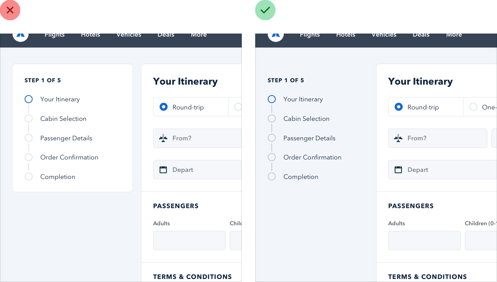
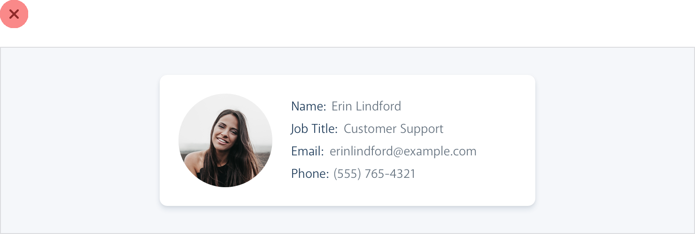

**Emphasize by de-emphasizing**

Sometimes you’ll run into a situation where the main element of an
interface isn’t standing out enough, but there’s nothing you can add to
it to give it the emphasis it needs.

For example, despite trying to make this active nav item “pop” by giving
it a different color, it still doesn’t really stand out compared to the
inactive items: When you run into situations like this, instead of
trying to further emphasize the element you want to draw attention to,
figure out how you can *de-emphasize* the elements that are competing
with it.

In this example, you could do that by giving the inactive items a softer
color so they sit more in the background:

You can apply this thinking to bigger pieces of an interface as well.
For

47

Emphasize by de-emphasizing

example, if a sidebar feels like it’s competing with your main content
area, don’t give it a background color — let the content sit directly on
the page background instead:

