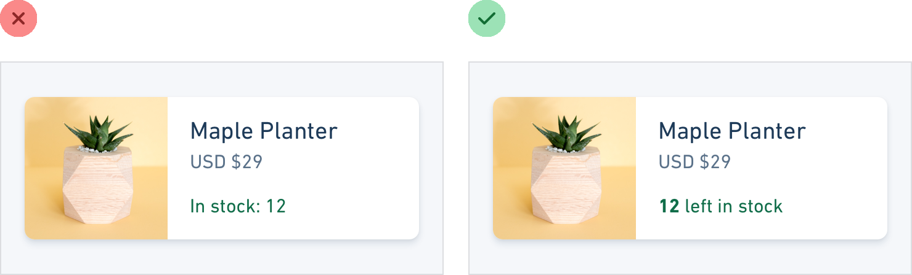
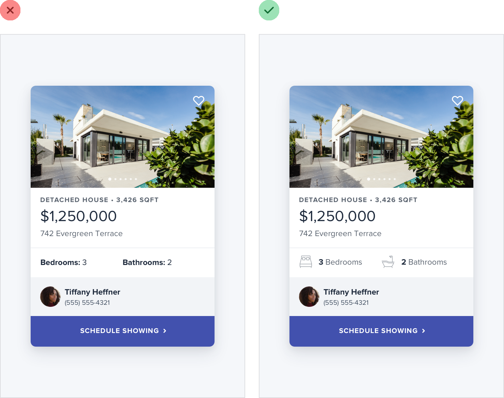
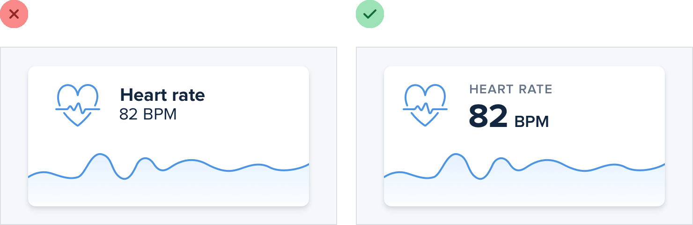
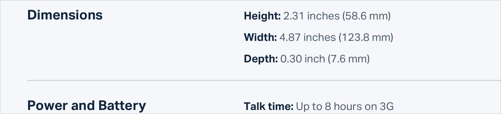
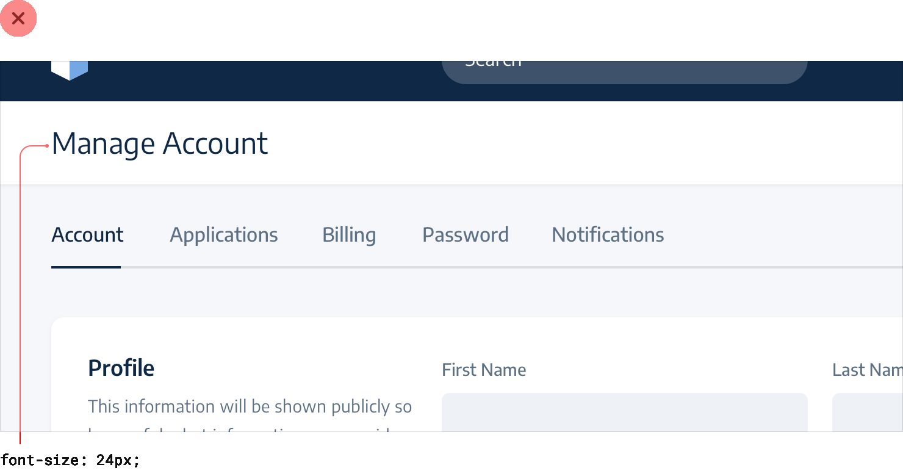

**Labels are a last resort**

Put down the accessibility pitchfork — this isn’t about forms.

When presenting data to the user (especially data from the database),
it’s easy to fall into the trap of displaying it using a naive *label:
value* format.

The problem with this approach is that it makes it difficult to present
the data with any sort of hierarchy; every piece of data is given equal
emphasis.

**You might not need a label at all**

In a lot of situations, you can tell what a piece of data is just by
looking at the format.

For example, *janedoe@example.com* is an email address, *(555) 765-4321*
is a phone number and *\$19.99* is a price.

When the format isn’t enough, the context often is. When you see the
phrase

*“Customer Support”* listed below someone’s name in an employee
directory,

49

Labels are a last resort

you don’t need a label to make the connection that that is the
department the person works in.

When you’re able to present data without labels, it’s much easier to
emphasize important or identifying information, making the interface
easier to use while at the same time making it feel more “designed”.

**Combine labels and values**

Even when a piece of data isn’t completely clear without a label, you
can often avoid adding a label by adding clarifying text to the value.

For example, if you need to display inventory in an e-commerce
interface, instead of “In stock: 12”, try something like “12 left in
stock”.

Labels are a last resort

50

If you’re building a real estate app, something like “Bedrooms: 3” could
simply become “3 bedrooms”.

When you’re able to combine labels and values into a single unit, it’s
much easier to give each piece of data meaningful styling without
sacrificing on clarity.

**Labels are secondary**

Sometimes you really *do* need a label; for example when you’re
displaying multiple pieces of similar data and they need to be easily
scannable, like on a dashboard.

51

Labels are a last resort

In these situations, add the label, but treat it as supporting content.
The data itself is what matters, the label is just there for clarity.

De-emphasize the label by making it smaller, reducing the contrast,
using a lighter font weight, or some combination of all three.

**When to emphasize a label**

If you’re designing an interface where you know the user will be
*looking for* the label, it might make sense to the emphasize the label
instead of the data.

This is often the case on information-dense pages, like the technical
specifications of a product.

If a user is trying to find out the dimensions of a smartphone, they’re
probably scanning the page for words like “depth”, not “7.6mm”.

Labels are a last resort

52

Don’t de-emphasize the data *too* much in these scenarios; it’s still
important information. Simply using a darker color for the label and a
slightly lighter color for the value is often enough.

53

Labels are a last resort

