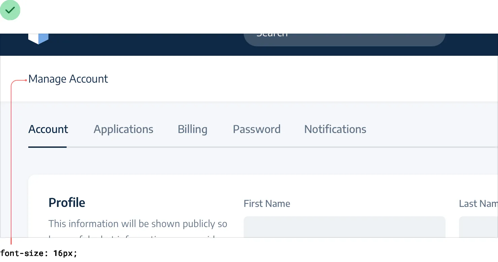
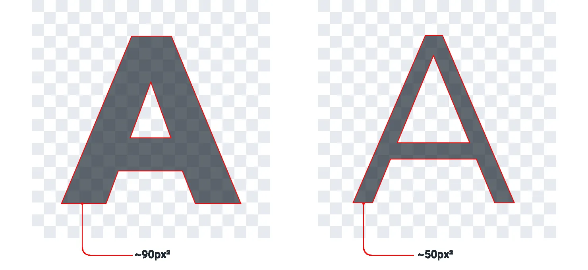

**Separate visual hierarchy from document hierarchy**

It’s important to use semantic markup when building for the web, which
means you’ll often be using heading tags like h1, h2, or h3 if you
decide to add a title to part of an interface.

By default, web browsers assign progressively smaller font sizes to
heading elements, so an h1 is pretty large, and an h6 is pretty small.
This can be helpful for document-style content like articles or
documentation, but it can encourage some bad decisions in application
UIs.

Using an h1 tag to add a title like *Manage Account* to a page makes
perfect sense semantically, but because we’re trained to believe that h1
elements should be big, it’s easy to fall into the trap of making those
titles bigger than they really need to be.

55

Separate visual hierarchy from document hierarchy

A lot of the time, section titles act more like *labels* than headings —
they are supportive content, they shouldn’t be stealing all the
attention.

Usually the *content* in that section should be the focus, not the
title. That means that a lot of the time, titles should actually be
pretty small: Taken to the extreme, you might even include section
titles in your markup for accessibility reasons but *completely hide*
them visually because the content speaks for itself.

Don’t let the element you’re using influence how you choose to style it
—

pick elements for semantic purposes and style them however you need to
create the best visual hierarchy.

