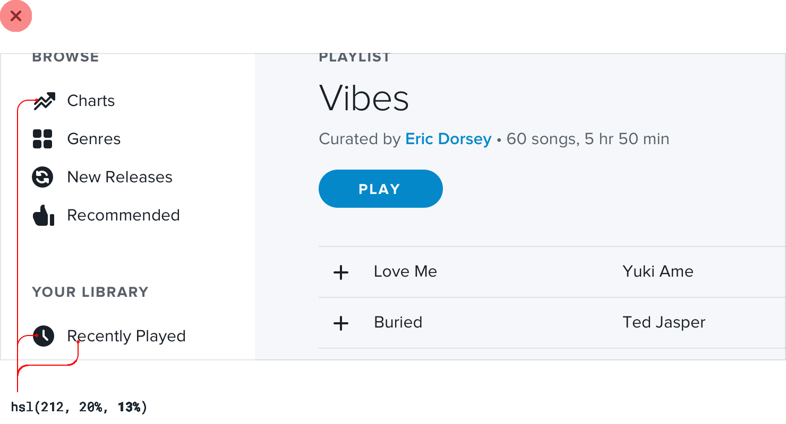
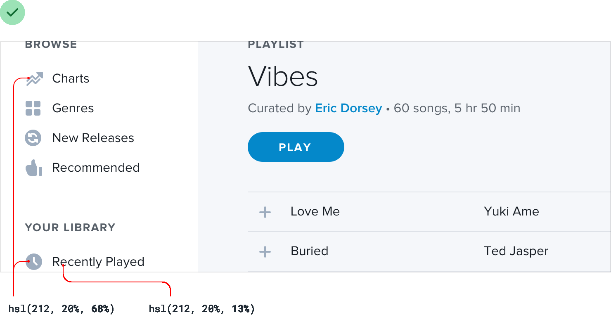
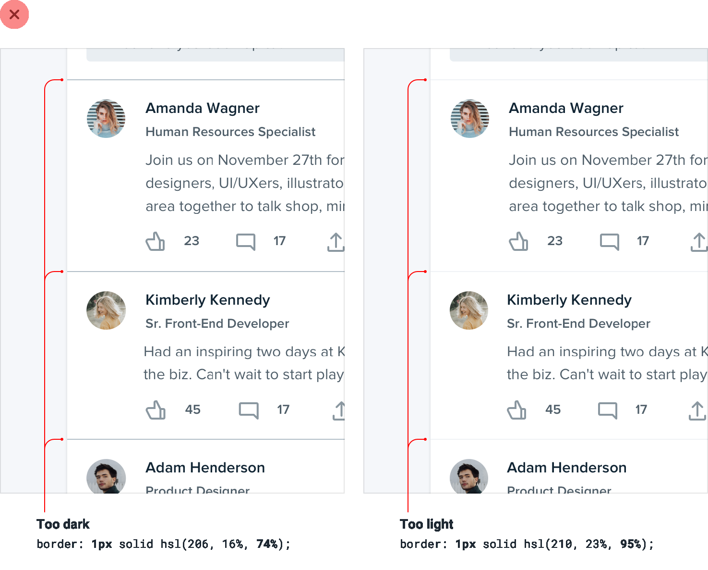
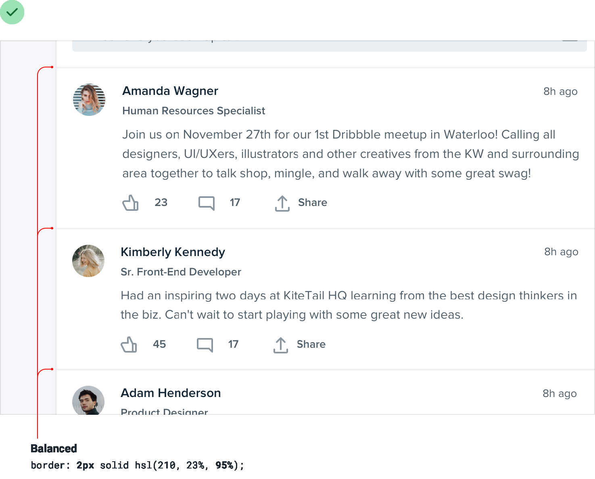
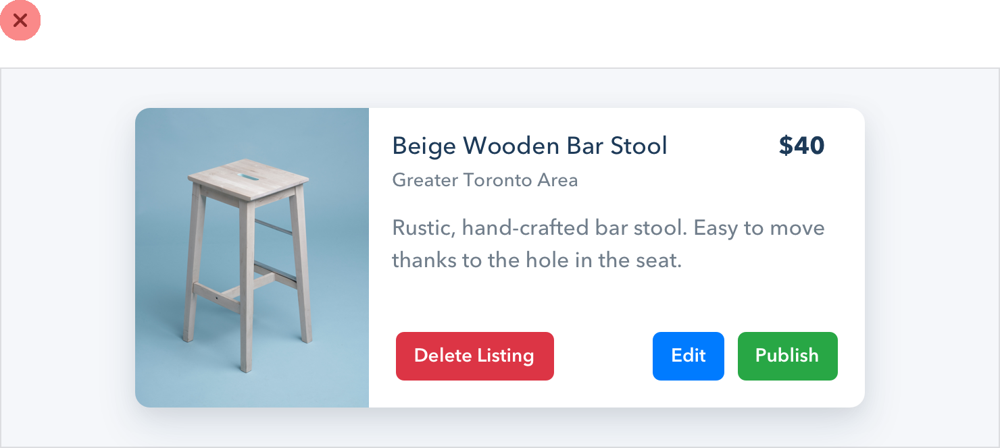

**Balance weight and contrast**

The reason bold text feels emphasized compared to regular text is that
bold text covers more surface area — in the same amount of space, more
pixels are used for text than for the background.

So why is this interesting? Well it turns out that the relationship
between surface area and hierarchy has implications on other elements in
a UI as well.

**Using contrast to compensate for weight**

One of the places understanding this relationship becomes important is
when working with icons.

Just like bold text, icons *(especially solid ones)* are generally
pretty “heavy”

and cover a lot of surface area. As a result, when you put an icon next
to some text, the icon tends to feel emphasized.

57

Balance weight and contrast

Unlike text, there’s no way to change the “weight” of an icon, so to
create balance it needs to be de-emphasized in some other way.

A simple and effective way to do this is to lower the contrast of the
icon by giving it a softer color.

Balance weight and contrast

58

This works anywhere you need to balance elements that have different
weights. Reducing the contrast works like a counterbalance, making
heavier elements feel lighter even though the weight hasn’t changed.

**Using weight to compensate for contrast**

Just like how reducing contrast helps to de-emphasize heavy elements,
increasing weight is a great way to add a bit of emphasis to low
contrast elements.

This is useful when things like thin 1px borders are too subtle using a
soft color, but darkening the color makes the design feel harsh and
noisy.

59

Balance weight and contrast

Making the border a bit heavier by increasing the width helps to
emphasize it without losing the softer look:

