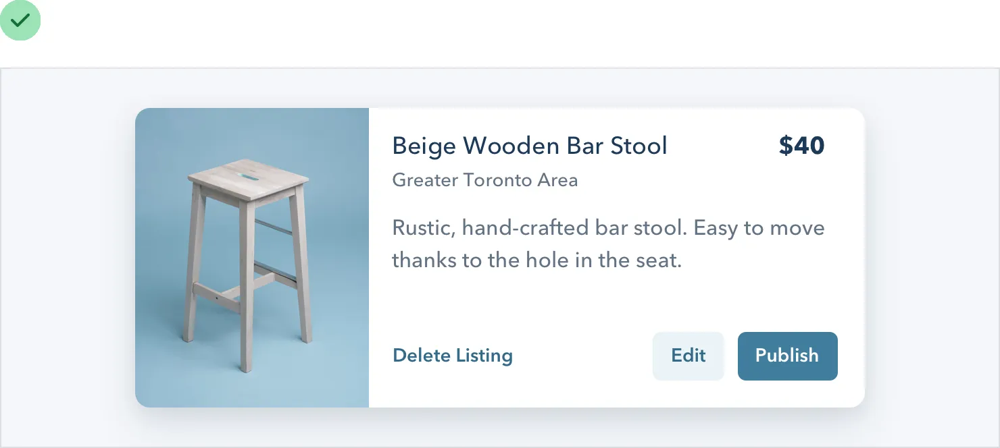
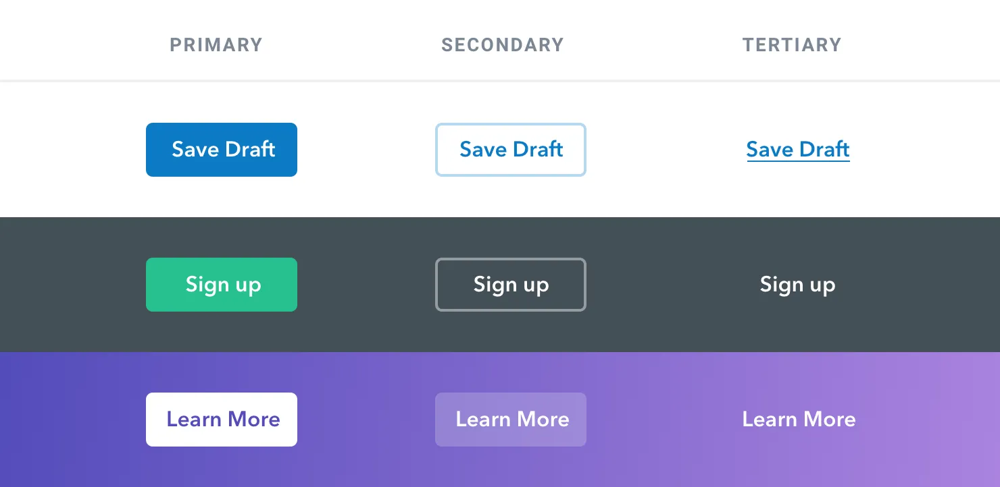
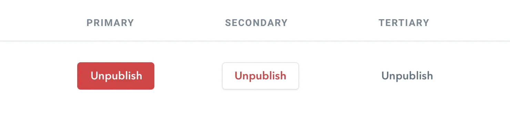
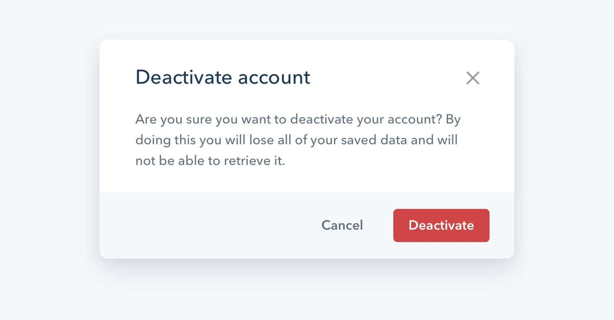

**Semantics are secondary**

When there are multiple actions a user can take on a page, it’s easy to
fall into the trap of designing those actions based purely on semantics.

Semantics are an important part of button design, but that doesn’t mean
you can forget about hierarchy.

Every action on a page sits somewhere in a pyramid of importance. Most
pages only have one true primary action, a couple of less important
secondary actions, and a few seldom used tertiary actions.

When designing these actions, it’s important to communicate their place
in the hierarchy.

• **Primary actions should be obvious.** Solid, high contrast background
colors work great here.

61

Semantics are secondary

• **Secondary actions should be clear but not prominent.** Outline
styles or lower contrast background colors are great options.

• **Tertiary actions should be discoverable but unobtrusive.** Styling
these actions like links is usually the best approach.

When you take a hierarchy-first approach to designing the actions on
page, the result is a much less busy UI that communicates more clearly:

Semantics are secondary

62

**Destructive actions**

Being destructive or high severity doesn’t automatically mean a button
should be big, red, and bold.

If a destructive action isn’t the primary action on the page, it might
be better to give it a secondary or tertiary button treatment.

Combine this with a confirmation step where the destructive action
actually is the primary action, and apply the big, red, bold styling
there.

