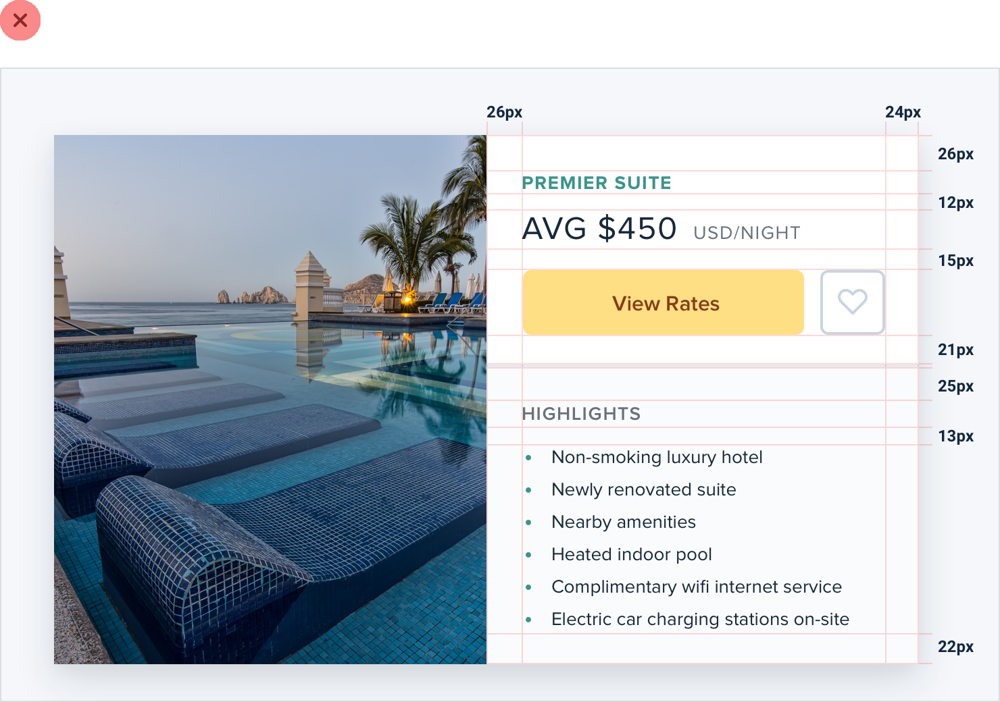

**Layout and Spacing**

**Start with too much white space**

One of the easiest ways to clean up a design is to simply give every
element a little more room to breathe.

Sounds simple enough, right? So how come we don’t usually do it?

67

Start with too much white space

**White space should be removed, not added**

When designing for the web, white space is almost always *added* to a
design

— if something looks little too cramped, you add a bit of margin or
padding until things look better.

The problem with this approach is that elements are only given the
minimum amount of breathing room necessary to not look *actively bad*.
To make something actually look *great*, you usually need more white
space.

Start with too much white space

68

A better approach is to start by giving something *way too much* space,
then remove it until it you’re happy with the result.

69

Start with too much white space

You might think you’d end up with too much white space this way, but in
practice, what might seem like “a little too much” when focused on an
individual element ends up being closer to “just enough” in the context
of a complete UI.

**Dense UIs have their place**

While interfaces with a lot of breathing room almost always feel cleaner
and simpler, there are certainly situations where it makes sense for a
design to be much more compact.

For example, if you’re designing some sort of dashboard where a lot of
information needs to be visible at once, packing that information
together so it all fits on one screen might be worth making the design
feel more busy.

The important thing is to make this a deliberate decision instead of
just being the default. It’s a lot more obvious when you need to remove
white space than it is when you need to add it.

