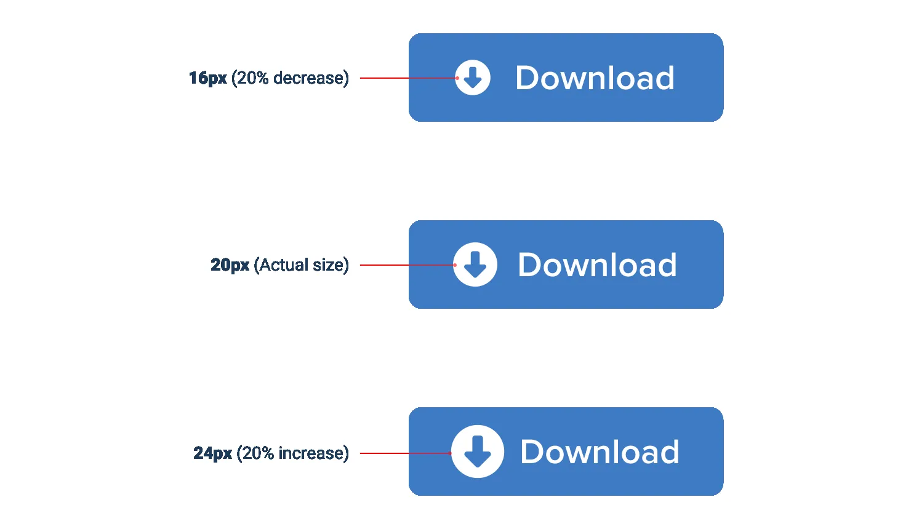
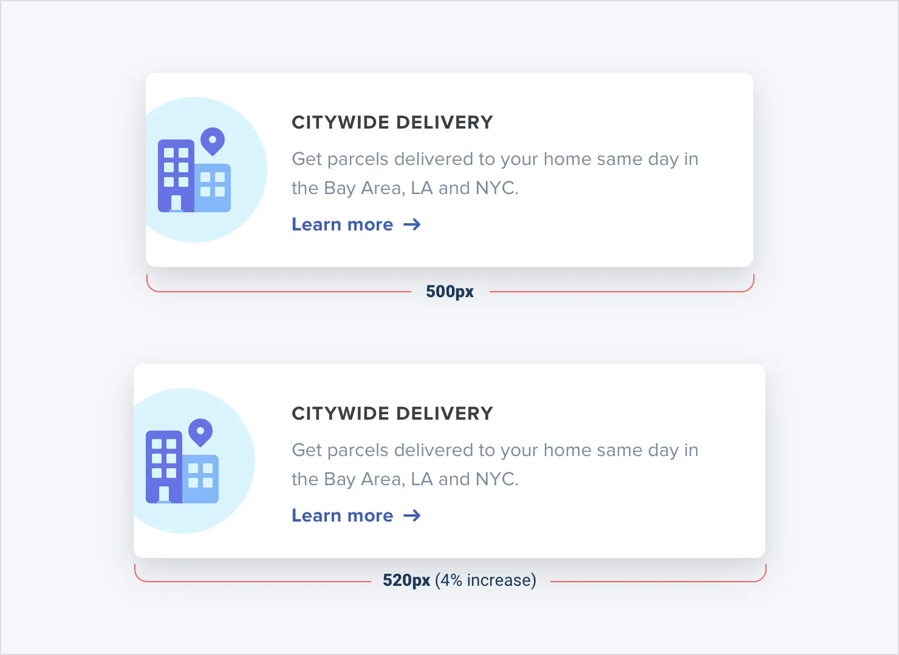
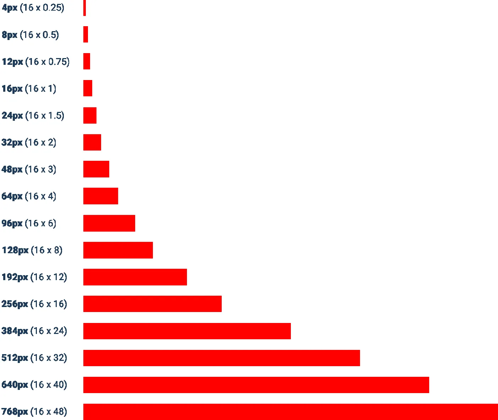
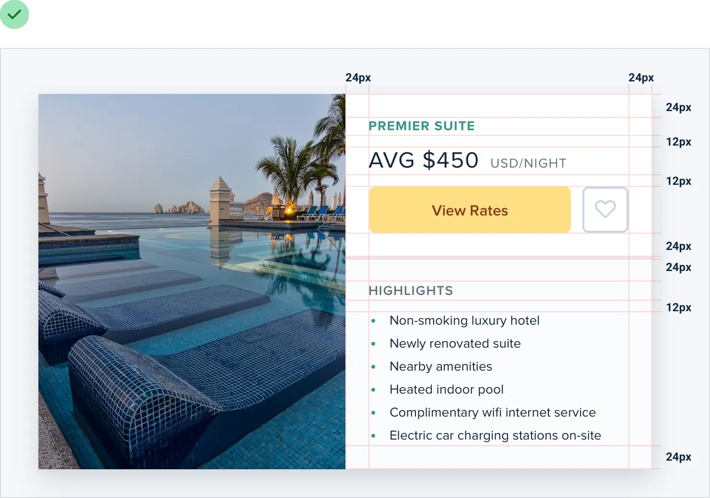
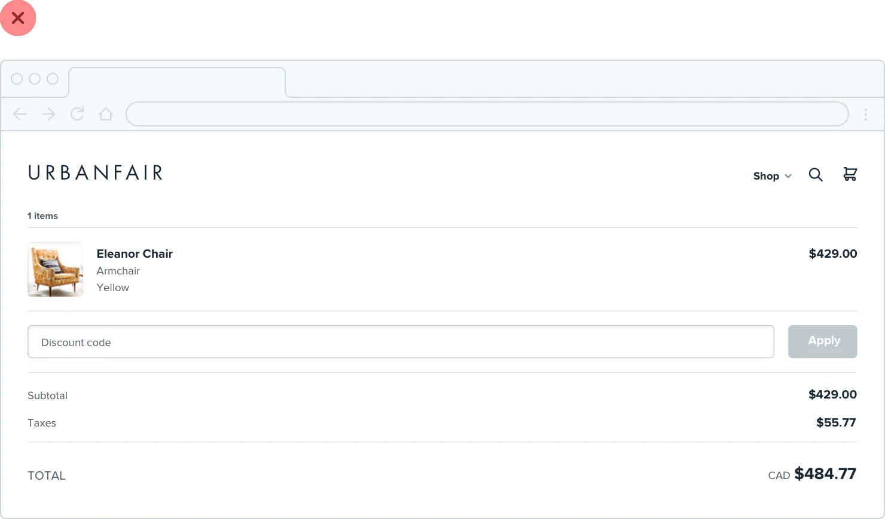

**Establish a spacing and sizing system**

You shouldn’t be nitpicking between 120px and 125px when trying to
decide on the perfect size for an element in your UI.

Painfully trialing arbitrary values one pixel at a time will drastically
slow you down at best, and create ugly, inconsistent designs at worst.

Instead, limit yourself to a constrained set of values, defined in
advance.

71

Establish a spacing and sizing system

**A linear scale won’t work**

Creating a spacing and sizing system isn’t quite as simple as something
like

*“make sure everything is a multiple of 4px”* — a naive approach like
that doesn’t make it any easier to choose between 120px and 125px.

For a system to be truly useful, it needs to take into consideration the
*relative* difference between adjacent values.

At the small end of the scale *(like the size of an icon, or the padding
inside a* *button)*, a couple of pixels can make a big difference.
Jumping from 12px to 16px is an increase of 33%!

But at the large end *(the width of a card, or the vertical spacing in a
landing* *page hero)*, a couple of pixels is basically imperceivable.
Even increasing the width of a card from 500px to 520px is only a
difference of 4%, which is *eight times* less significant than the jump
from 12px to 16px.

Establish a spacing and sizing system

72

If you want your system to make sizing decisions easy, make sure no two
values in your scale are ever closer than about 25%.

**Defining the system**

Just like you don’t want to toil over arbitrary values when sizing an
element or fine-tuning the space between elements, you don’t want to
build your spacing and sizing scale from arbitrary values either.

A simple approach is to start with a sensible *base* value, then build a
scale using factors and multiples of that value.

16px is a great number to start with because it divides nicely, and also
happens to be the default font size in every major web browser.

73

Establish a spacing and sizing system

The values at the small end of the scale should start pretty packed
together, and get progressively more spaced apart as you get further up
the scale.

Here’s an example of a fairly practical scale built using this approach:
**Using the system**

Once you’ve defined your spacing and sizing system, you’ll find that
you’re able to design a hell of a lot faster, especially if you design
in the browser *(sticking to a system is easier when you’re typing in
numbers than when* *you’re dragging with the mouse.)*

Establish a spacing and sizing system

74

Need to add some space under an element? Grab a value from your scale
and try it out. Not quite enough? The next value is probably perfect.

While the workflow improvements are probably the biggest benefit, you’ll
also start to notice a subtle consistency in your designs that wasn’t
there before, and things will look just a little bit cleaner.

A spacing and sizing system will help you create better designs, with
less effort, in less time. Design advice doesn’t get much more valuable
than that.

75

Establish a spacing and sizing system

