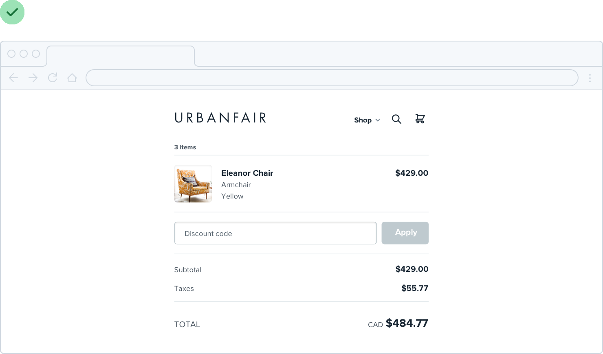
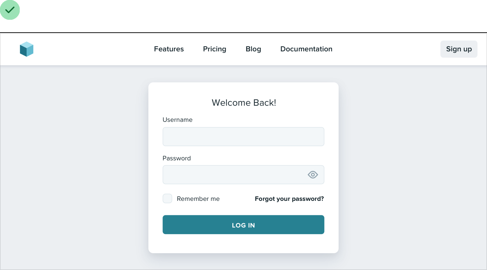
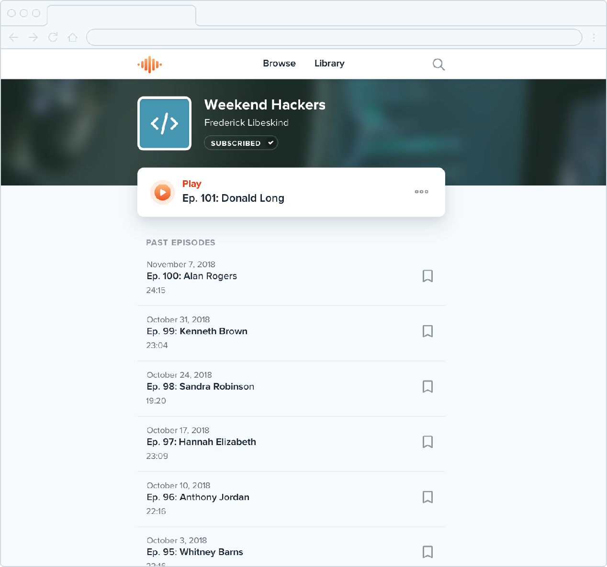
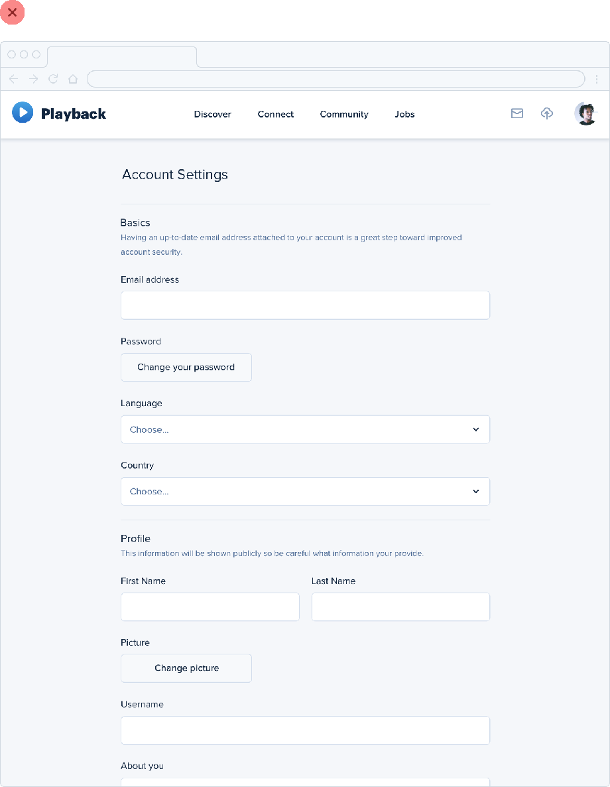
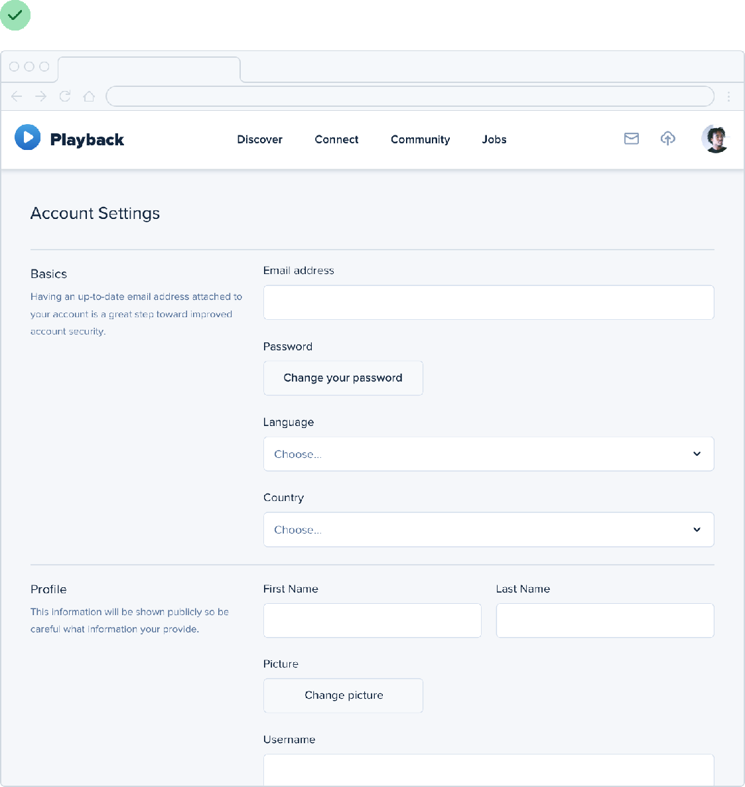
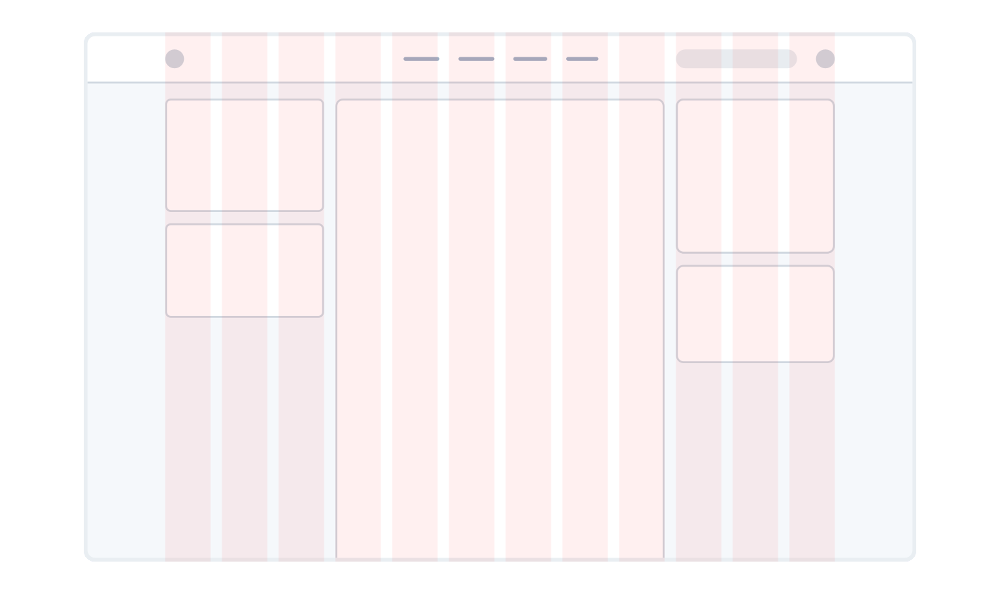

**You don’t have to fill the whole screen**

Remember when 960px was the de facto layout width for desktop-size
designs? These days you’d be hard-pressed to find a *phone* with a
resolution that low.

So it’s no surprise that when most of us open our design tool of choice
on our high resolution displays, we give ourselves *at least*
1200-1400px of space to fill. But just because you have the space,
doesn’t mean you need to use it.

If you only need 600px, use 600px. Spreading things out or making things
unnecessarily wide just makes an interface harder to interpret, while a
little extra space around the edges never hurt anyone.

77

You don’t have to fill the whole screen

This is just as applicable to individual sections of an interface, too.
You don’t need to make *everything* full-width just because something
else (like your navigation) is full-width.

You don’t have to fill the whole screen

78

Give each element just the space it needs — don’t make something worse
just to make it match something else.

**Shrink the canvas**

If you’re having a hard time designing a small interface on a large
canvas, shrink the canvas! A lot of the time it’s easier to design
something small when the constraints are real.

If you’re building a responsive web application, try starting with a
~400px canvas and designing the mobile layout first.

79

You don’t have to fill the whole screen

Once you have a mobile design you’re happy with, bring it over to a
larger size screen and adjust anything that felt like a compromise on
smaller screens. Odds are you won’t have to change as much as you think.

**Thinking in columns**

If you’re designing something that works best at a narrower width but
feels unbalanced in the context of an otherwise wide UI, see if you can
split it into columns instead of just making it wider.

You don’t have to fill the whole screen

80

For example, take this narrow form layout:

81

You don’t have to fill the whole screen

If you wanted to make better use of the available space without making
the form harder to use, you could break the supporting text out into a
separate column:

This makes the design feel more balanced and consistent without
compromising on the optimal width for the form itself.

You don’t have to fill the whole screen 82

**Don’t force it**

Just like you shouldn’t worry about filling the whole screen, you
shouldn’t try to cram everything into a small area unnecessarily either.

If you need a lot of space, go for it! Just don’t feel obligated to fill
it if you don’t have to.

83

You don’t have to fill the whole screen

