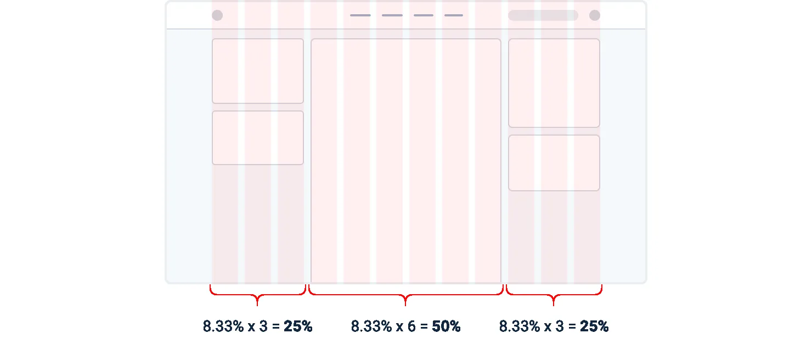
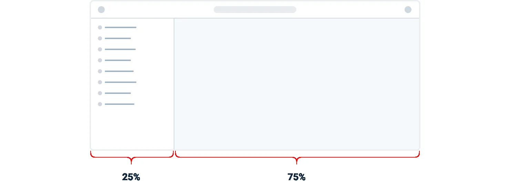
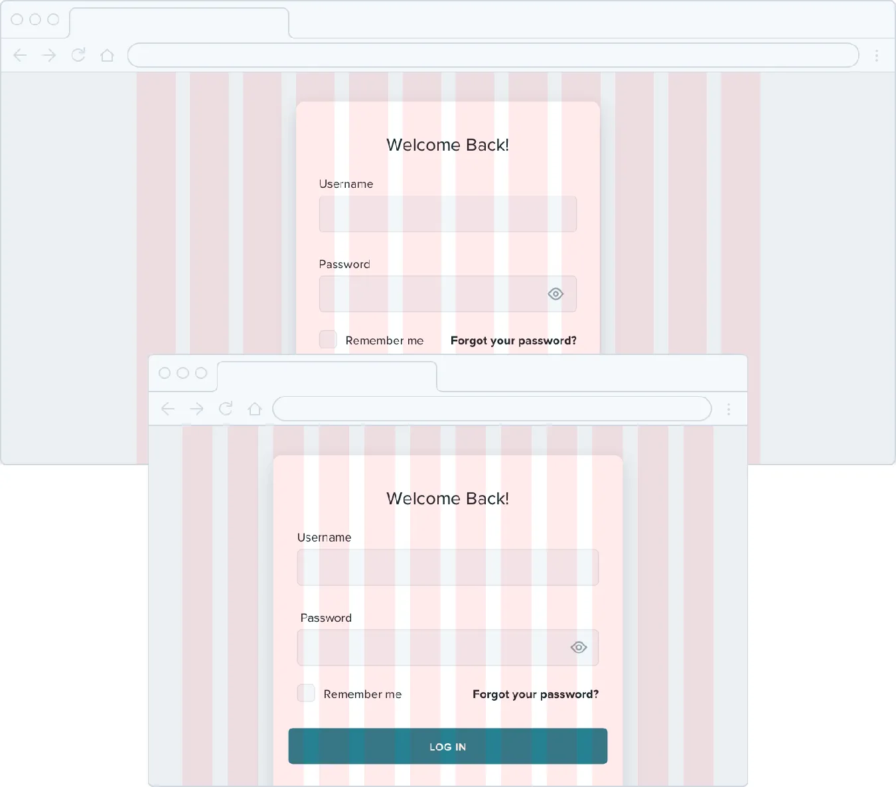
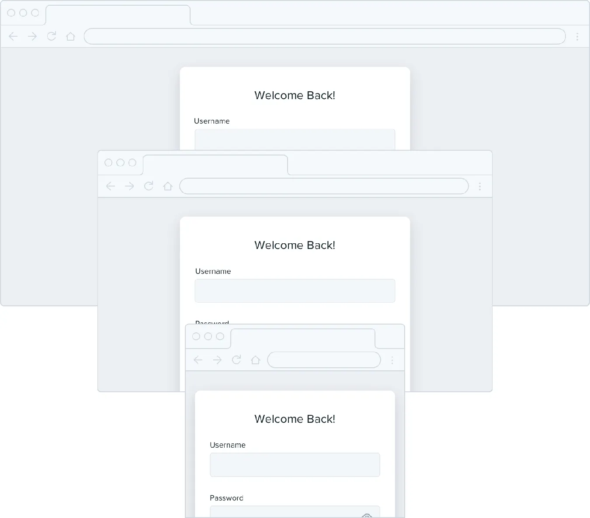
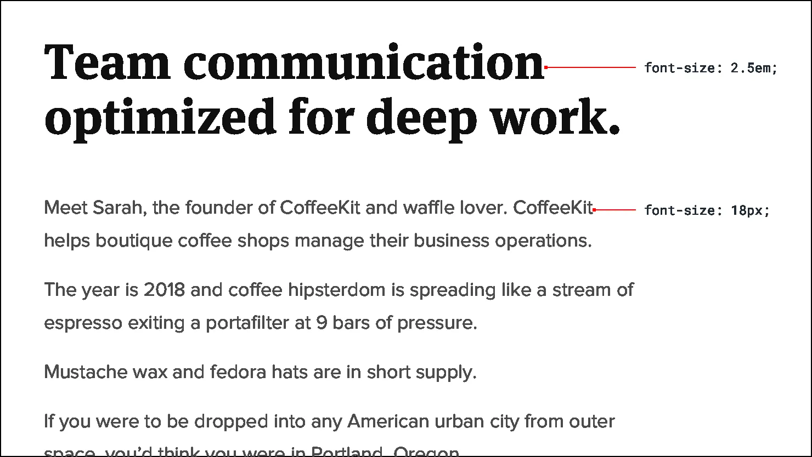

**Grids are overrated**

Using a system like a 12-column grid is a great way to simplify layout
decisions, and can bring a satisfying sense of order to your designs.

But even though grids can be useful, outsourcing *all* of your layout
decisions to a grid can do more harm than good.

**Not all elements should be fluid**

Fundamentally, a grid system is just about giving elements fluid,
percentage-based widths, where you’re choosing from a constrained set of
percentages.

For example, in a 12-column grid each column is 8.33% wide. As long as
an

85

Grids are overrated

element’s width is some multiple of 8.33% *(including any gutters)*,
that element is “on the grid”.

The problem with treating grid systems like a religion is that there are
a lot of situations where it makes much more sense for an element to
have a *fixed* width instead of a relative width.

For example, consider a traditional sidebar layout. Using a 12-column
grid system, you might give the sidebar a width of three columns (25%)
and the main content area a width of nine columns (75%).

Grids are overrated

86

This might seem fine at first, but think about what happens when you
resize the screen.

If you make the screen wider the sidebar gets wider too, taking up space
that could’ve been put to better use by the main content area.

Similarly, if you make the screen narrower, the sidebar can shrink below
its minimum reasonable width, causing awkward text wrapping or
truncation.

In this situation, it makes much more sense to give the sidebar a fixed
width that’s optimized for its contents. The main content area can then
flex to fill the remaining space, using its own *internal* grid to lay
out its children.

87

Grids are overrated

This applies within components, too — don’t use percentages to size
something unless you actually want it to scale.

Grids are overrated

88

**Don’t shrink an element until you need to**

Say you’re designing a login card. Using the full screen width would
look ugly, so you give it a width of 6 columns (50%) with a 3-column
offset on each side.

On medium-sized screens you realize the card is a little narrow even
though you have the space to make it bigger, so at that screen size you
switch it to a width of 8 columns, with two empty columns on each side.

89

Grids are overrated

The silly thing about this approach is that because column widths are
fluid, there’s a range in screen sizes where the login card is *wider*
on medium screens than it is on large screens:

If you know that say 500px is the optimal size for the card, why should
it ever get smaller than that if you have the space for it?

Instead of sizing elements like this based on a grid, give them a
max-width so they don’t get too large, and only force them to shrink
when the screen gets smaller than that max-width.

Grids are overrated

90

Don’t be a slave to the grid — give your components the space they need
and don’t make any compromises until it’s actually necessary.

91

Grids are overrated

