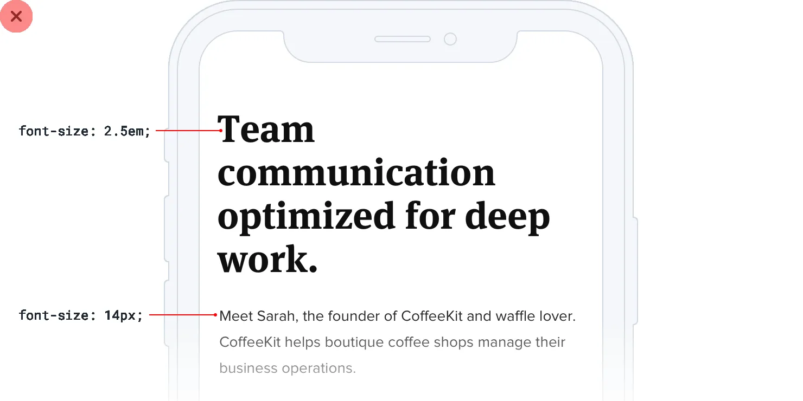
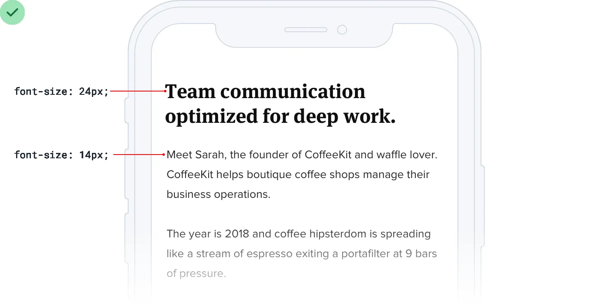
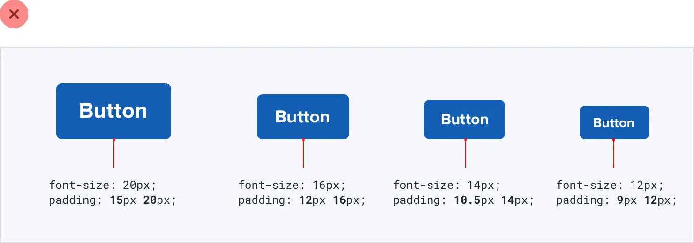
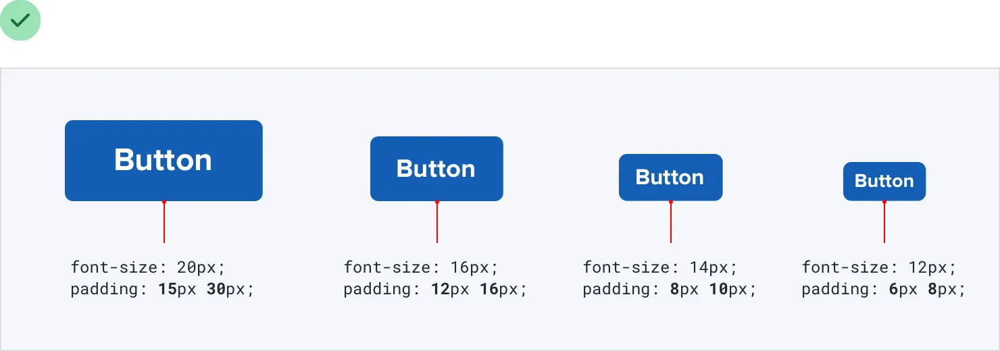

**Relative sizing doesn’t scale**

It’s tempting to believe that every part of an interface should be sized
relative to one another, and that if element A needs to shrink by 25% on
smaller screens, that element B should shrink by 25%, too.

For example, say you’re designing an article at a large screen size. If
your body copy is 18px and your headlines are 45px, it’s tempting to
encode that relationship by defining your headline size as *2.5em*; 2.5
times the current font size.

There’s nothing inherently wrong with using relative units like *em*,
but don’t be fooled into believing that relationships defined this way
can remain static

— 2.5em might be the perfect headline size on desktop but there’s no
guarantee that it’ll be the right size on smaller screens.

93

Relative sizing doesn’t scale

Say you reduce the size of your body copy to 14px on small screens to
keep the line length in check. Keeping your headlines at 2.5em means a
rendered font size of 35px — way too big for a small screen!

A better headline size for small screens might be somewhere between 20px
and 24px:

Relative sizing doesn’t scale

94

That’s only 1.5-1.7x the size of the 14px body copy — a totally
different relationship than what made sense on desktop screens. That
means there isn’t any real relationship at all, and that there’s no real
benefit in trying to define the headline size relative to the body copy
size.

As a general rule, elements that are large on large screens need to
shrink *faster* than elements that are already fairly small — the
difference between small elements and large elements should be less
extreme at small screen sizes.

**Relationships within elements**

The idea that things should scale independently doesn’t just apply to
sizing elements at different screen sizes; it applies to the properties
of a single component, too.

Say you’ve designed a button. It’s got a 16px font size, 16px of
horizontal padding, and 12px of vertical padding:

Much like the previous example, it’s tempting to think that the padding
should be defined in terms of the current font size. That way if you
want a larger or smaller button, you only need to change the font size
and the padding will update automatically, right?

95

Relative sizing doesn’t scale

This works — the buttons *do* scale up or down and preserve the same
proportions. But is that what we really want?

Compare that to these buttons, where the padding gets more generous at
larger sizes and disproportionately tighter at smaller sizes: Here the
large button actually *feels* like a larger button, and the small
buttons actually feel like smaller buttons, not like we simply adjusted
the zoom.

Let go of the idea that everything needs to scale proportionately —
giving yourself the freedom to fine-tune things independently makes it a
hell of a lot easier to design for multiple contexts.

