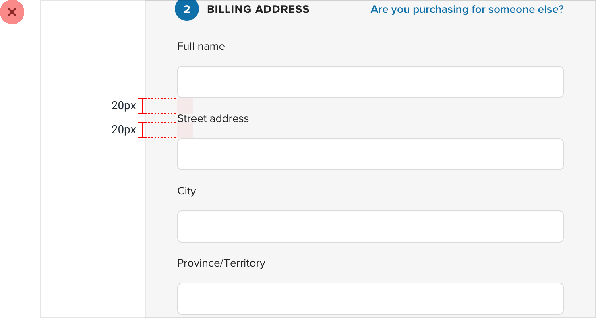
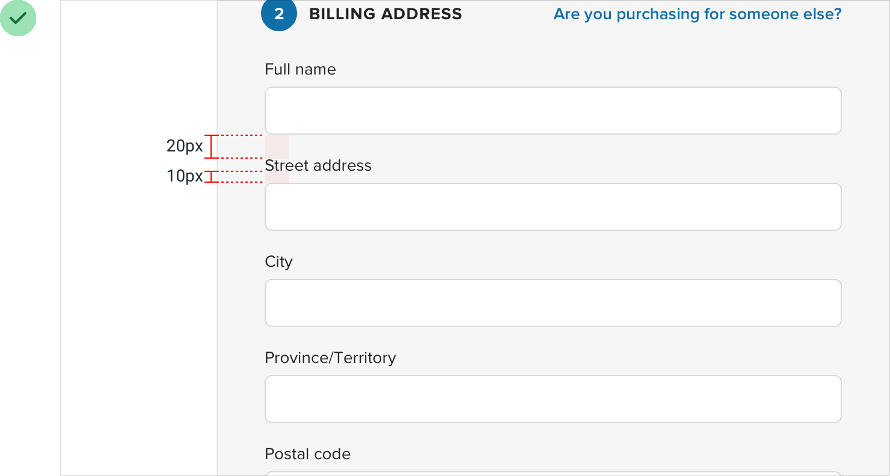
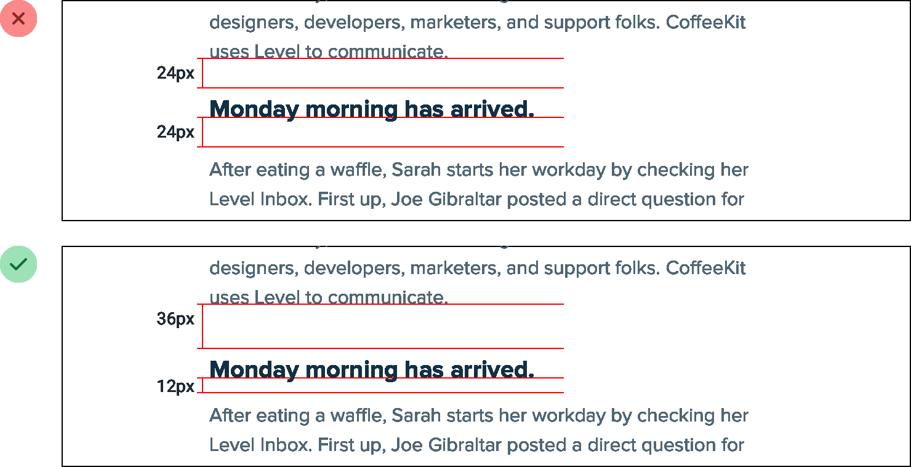
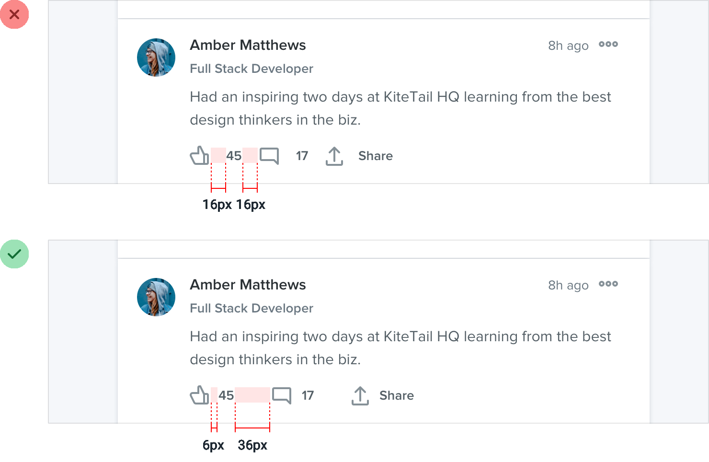

**Avoid ambiguous spacing**

When groups of elements are explicitly separated — usually by a border
or background color — it’s obvious which elements belong to which group.

But when there isn’t a visible separator, it’s not always so obvious.

Say you’re designing a form with stacked labels and inputs. If the
margin below the label is the same as the margin below the input, the
elements in the form group won’t feel obviously “connected”.

97

Avoid ambiguous spacing

At best the user has to work harder to interpret the UI, and at worst it
means accidentally putting the wrong data in the wrong field.

The fix is to increase the space between each form group so it’s clear
which label belongs to which input:

Avoid ambiguous spacing

98

This same problem shows up in article design when there’s not enough
space above section headings:

…and in bulleted lists, when the space between bullets matches the
line-height of a single bullet:

99

Avoid ambiguous spacing

It’s not just vertical spacing that you have to worry about either; it’s
easy to make this mistake with components that are laid out
horizontally, too: Whenever you’re relying on spacing to connect a group
of elements, always make sure there’s more space *around* the group than
there is within it —

interfaces that are hard to understand always look worse.

