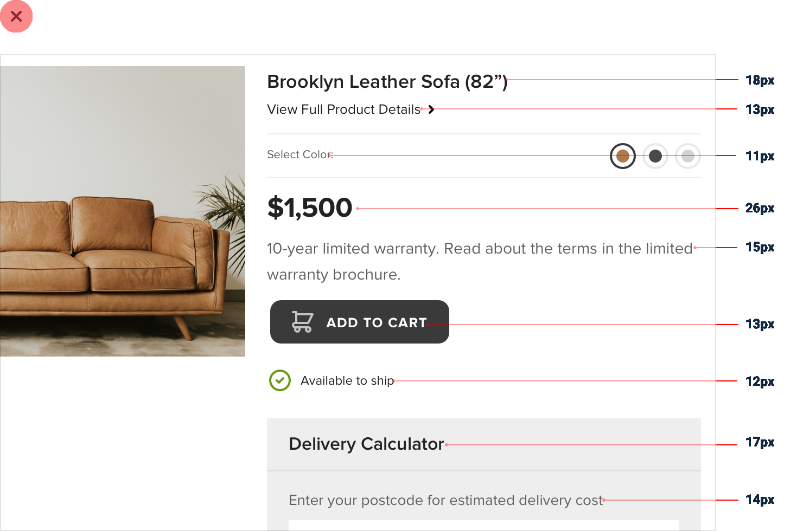
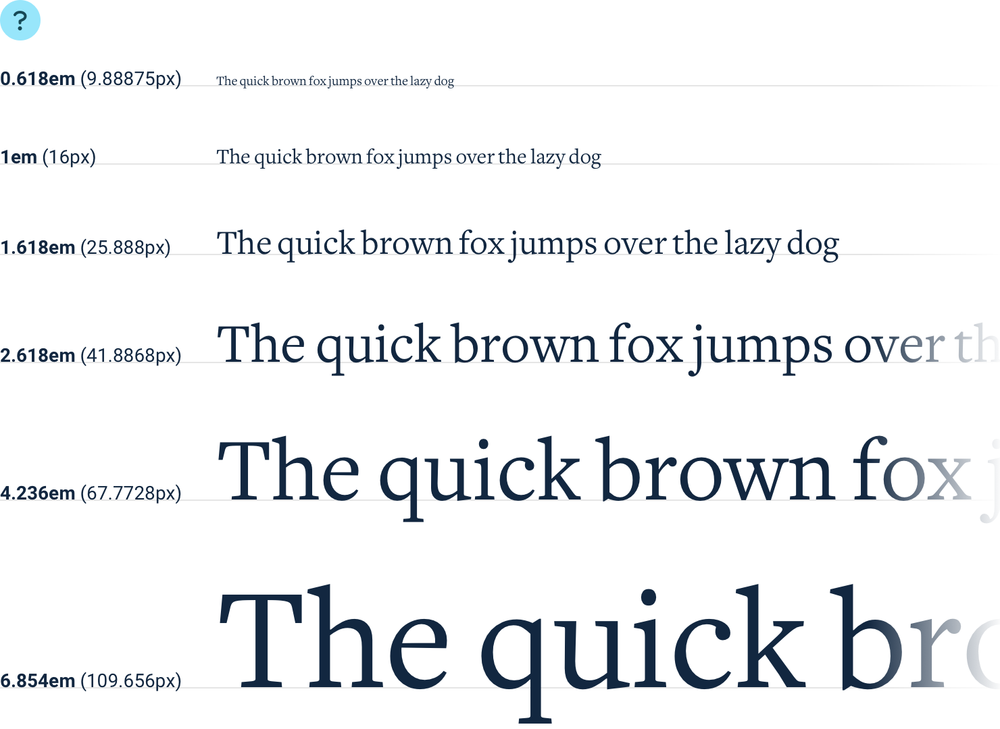
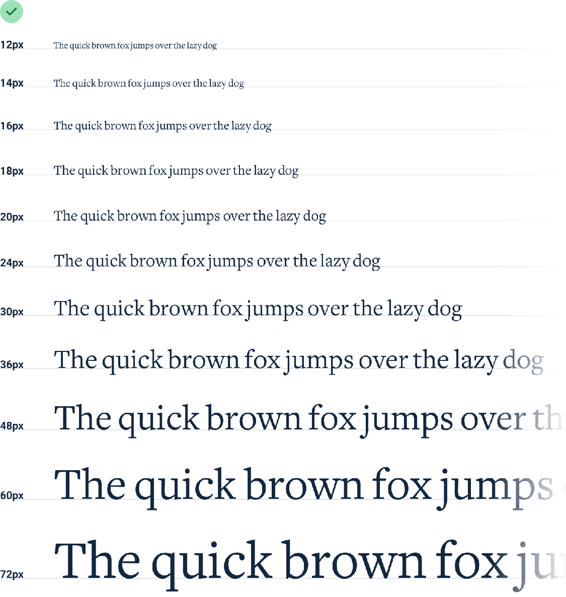
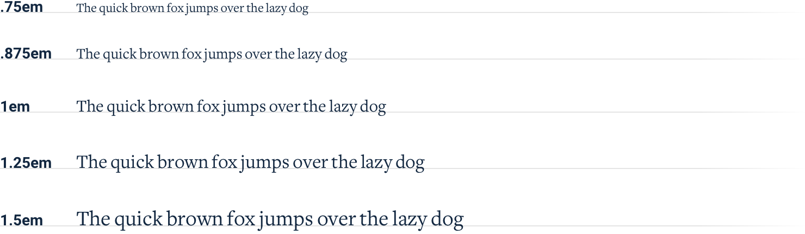
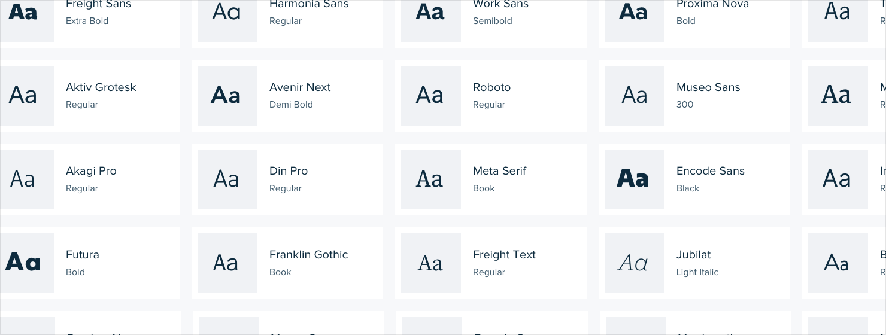

**Designing Text**

**Establish a type scale**

Most interfaces use way too many font sizes. Unless a team has a rigid
design system in place, it’s not uncommon to find that every pixel value
from 10px to 24px has been used in the UI *somewhere*.

Choosing font sizes without a system is a bad idea for two reasons: 1.
It leads to annoying inconsistencies in your designs.

2\. It slows down your workflow.

So how do you define a type system?

103

Establish a type scale

**Choosing a scale**

Just like with spacing and sizing, [a linear scale won’t work. Smaller
jumps](#index_split_000.html_p71)

between font sizes are useful at the bottom of the scale, but you don’t
want to waste time deciding between 46px and 48px for a large headline.

**Modular scales**

One approach is to calculate your type scale using a *ratio*, like 4:5
*(a “major* *third”)*, 2:3 *(a “perfect fifth”)*, or perhaps the “golden
ratio”, 1:1.618. This is often called a “modular scale”.

You start with a sensible base value *(16px is common since it’s the
default* *font size for most browsers)*, apply your ratio to get the
next value, then apply your ratio to *that* value to get the next value,
and so on and so forth:

Establish a type scale

104

The mathematical purity of this approach is alluring, but in practice,
it’s not perfect for a couple of reasons.

1\. **You end up with fractional values.**

Using a 16px base and 4:5 ratio, your scale will end up with lots of
sizes that don’t land right on the pixel, like 31.25px, 39.063px,
48.828px, etc.

Browsers all handle subpixel rounding a little bit differently, so it’s
best to avoid fractional sizes if you can avoid it.

If you do want to use this approach, make sure you round the values
yourself when defining the scale to avoid off-by-one pixel issues across
browsers.

2\. **You usually need more sizes.**

This approach can work well if you’re defining a type scale for long
form content like an article, but for interface design, the jumps you
get using a modular scale are often a bit *too* limiting.

With a *(rounded)* 3:4 type scale, you get sizes like 12px, 16px, 21px,
and 28px. While this might not seem too limiting on the surface, in
practice you’re going to wish you had a size between 12px and 16px, and
another between 16px and 21px.

You could use a tighter ratio like 8:9, but at this point you’re just
trying to pick a scale that happens to match the sizes you already know
you want.

**Hand-crafted scales**

For interface design, a more practical approach is to simply pick values
by hand. You don’t have to worry about subpixel rounding errors this
way, and you have total control over which sizes exist instead of
outsourcing that job to some mathematical formula.

105

Establish a type scale

Here’s an example of a scale that works well for most projects and
aligns nicely with the spacing and sizing scale recommended in
*“Establishing a* *spacing and sizing system”* :

It’s constrained just enough to speed up your decision making, but isn’t
so limited as to make you feel like you’re missing a useful size.

Establish a type scale

106

**Avoid em units**

When you’re building a type scale, don’t use *em* units to define your
sizes.

Because *em* units are relative to the current font size, the computed
font size of nested elements is often not actually a value in your
scale.

For example, say you’ve defined an em-based type scale like this:

107

Establish a type scale

If you give an element a font size of 1.25em *(20px by default)*, inside
of that element 1em is now equal to 20px. That means that if you give
one of the *nested* elements a font size of .875em, the actual computed
font size is 17.5px, not a value from your type scale!

Stick to *px* or *rem* units — it’s the only way to guarantee you’re
actually sticking to the system.

