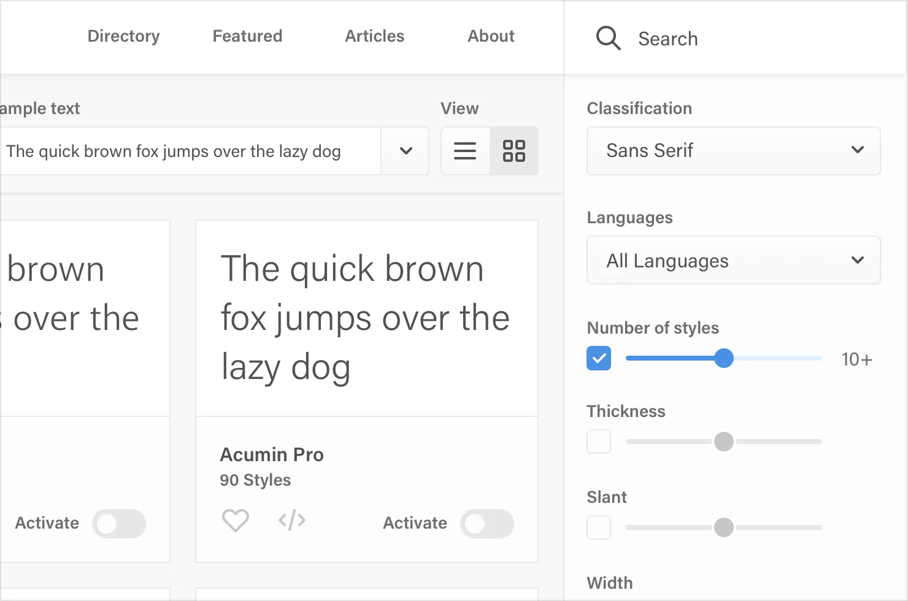
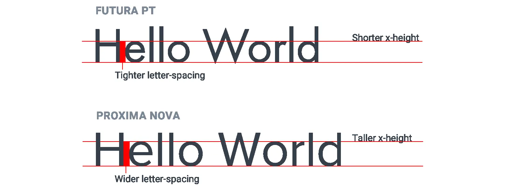
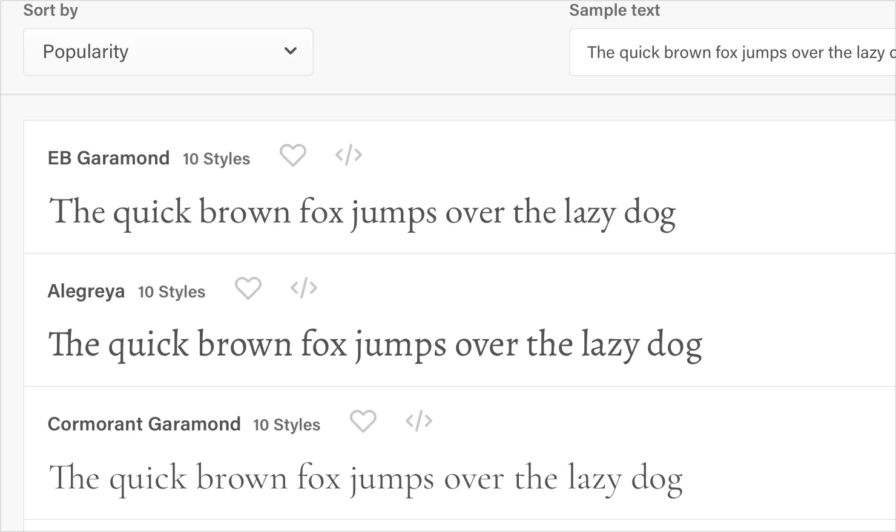
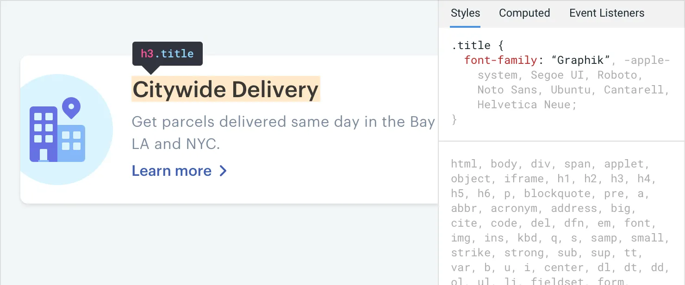
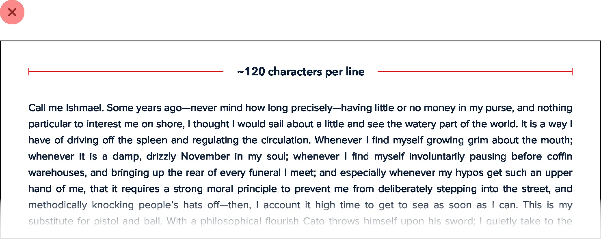
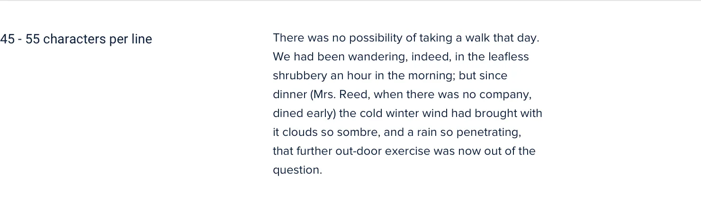

**Use good fonts**

With thousands of different typefaces out there to choose from,
separating the good from the bad can be an intimidating task.

Developing an eye for all of the details that make a good typeface can
take years. You probably don’t have years, so here are a few tricks you
can use to start picking out high quality typefaces right away.

**Play it safe**

For UI design, your safest bet is a fairly neutral sans-serif — think
something like Helvetica.

If you really don’t trust your own taste, one great option is to rely on
the system font stack:

-apple-system, Segoe UI, Roboto, Noto Sans, Ubuntu, Cantarell, Helvetica
Neue;

109

Use good fonts

It might not be the most ambitious choice, but at least your users will
already be used to seeing it.

**Ignore typefaces with less than five weights**

This isn’t *always* true, but as a general rule, typefaces that come in
a lot of different weights tend to be crafted with more care and
attention to detail than typefaces with fewer weights.

Many font directories *(like Google Fonts)* will let you filter by
“number of styles”, which is a combination of the available weights as
well as the italic variations of those weights.

A great way to limit the number of options you have to choose from is to
crank that up to 10+ *(to account for italics)*:

Use good fonts

110

On Google Fonts specifically, that cuts out 85% of the available
options, leaving you with less than 50 sans-serifs to choose from.

**Optimize for legibility**

When someone designs a font family, they are usually designing it for a
specific purpose. Fonts meant for headlines usually have tighter
letter-spacing and shorter lowercase letters *(a shorter x-height)*,
while fonts meant for smaller sizes have wider letter-spacing and taller
lowercase letters.

Keep this in mind and avoid using condensed typefaces with short
x-heights for your main UI text.

**Trust the wisdom of the crowd**

If a font is popular, it’s probably a good font. Most font directories
will let you sort by popularity, so this can be a great way to limit
your choices.

This is especially useful when you’re trying to pick out something other
than a neutral UI typeface. Picking a nice serif with some personality
for example can be tough.

111

Use good fonts

Leveraging the collective decision-making power of thousands of other
people can make it a lot easier.

**Steal from people who care**

Inspect some of your favorite sites and see what typefaces they are
using.

Use good fonts

112

There are a lot of great design teams out there full of people with
*really* strong opinions about typography, and they’ll often choose
great fonts that you might have never found using some of the safer
approaches outlined above.

**Developing your intuition**

Once you start paying closer attention to the typography on
well-designed sites, it’s not long before you feel pretty comfortable
labeling a typeface as awesome or terrible.

You’re gonna be a type snob soon enough, but the advice outlined above
will help get you by in the meantime.

113

Use good fonts

