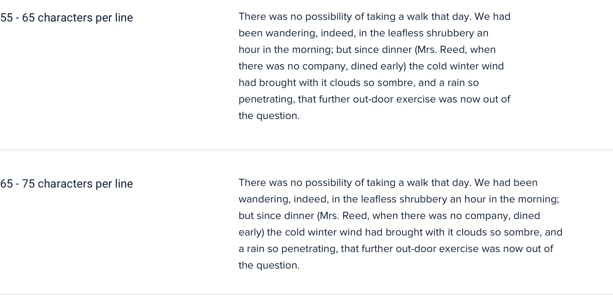

**Keep your line length in check**

When styling paragraphs, it’s easy to make the mistake of fitting the
text to your layout instead of trying to create the best reading
experience.

Usually this means lines that are too long, making text harder to read.

For the best reading experience, make your paragraphs wide enough to fit
between 45 and 75 characters per line. The easiest way to do this on the
web is using *em* units, which are relative to the current font size. A
width of 20-35em will get you in the right ballpark.

115

Keep your line length in check

Going a bit wider than 75 characters per line can sometimes work too,
but be aware that you’re entering risky territory — stick to the 45-75
range if you want to play it safe.

**Dealing with wider content**

If you’re mixing paragraph text with images or other large components,
you should still limit the paragraph width even if the overall content
area needs to be wider to accommodate the other elements.

Keep your line length in check

116

It might seem counterintuitive at first to use different widths in the
same content area, but the result almost always looks more polished.

117

Keep your line length in check

