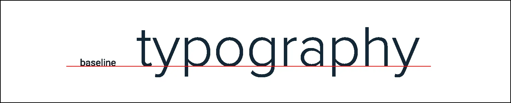
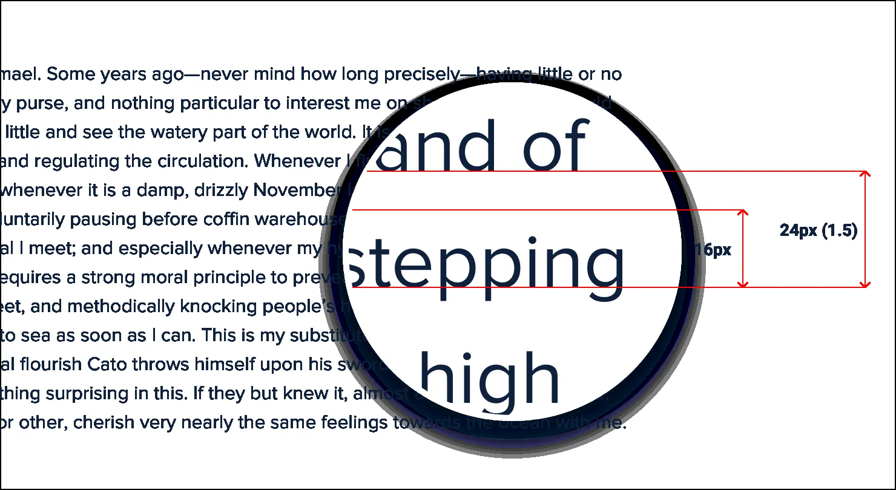

**Baseline, not center**

There are a lot of situations where it makes sense to use multiple font
sizes to create hierarchy on a single line.

For example, maybe you’re designing a card that has a large title in the
top left and a smaller list of actions in the top right.

When you’re mixing font sizes like this, your instinct might be to
vertically center the text for balance:

119

Baseline, not center

When there’s a decent amount of space between the different font sizes
it often won’t look bad enough to catch your attention, but when the
text is close together the awkward alignment becomes more obvious: A
better approach is to align mixed font sizes by their *baseline*, which
is the imaginary line that letters rest on:

Baseline, not center

120

When you align mixed font sizes by their baseline, you’re taking
advantage of an alignment reference that your eyes already perceive.

The result is a simpler, cleaner look than what you get when you center
two pieces of text and offset their baselines.

121

Baseline, not center

