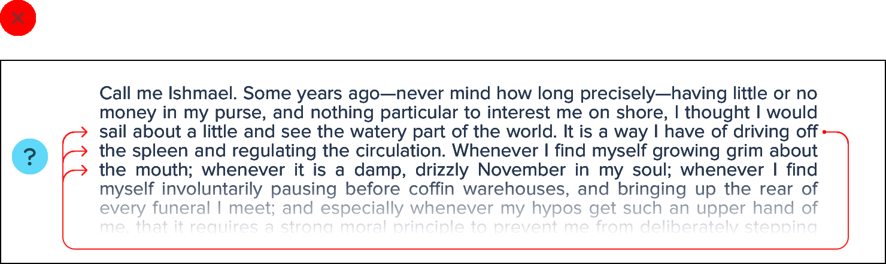
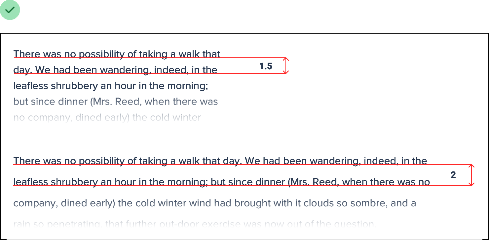
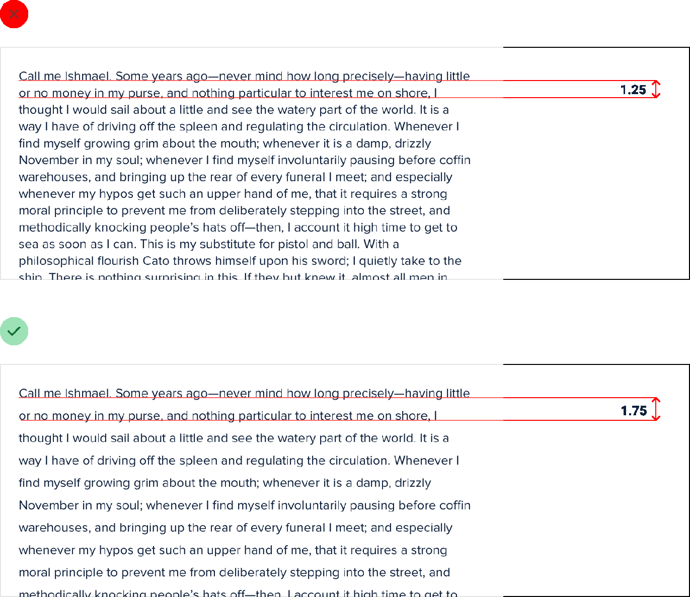
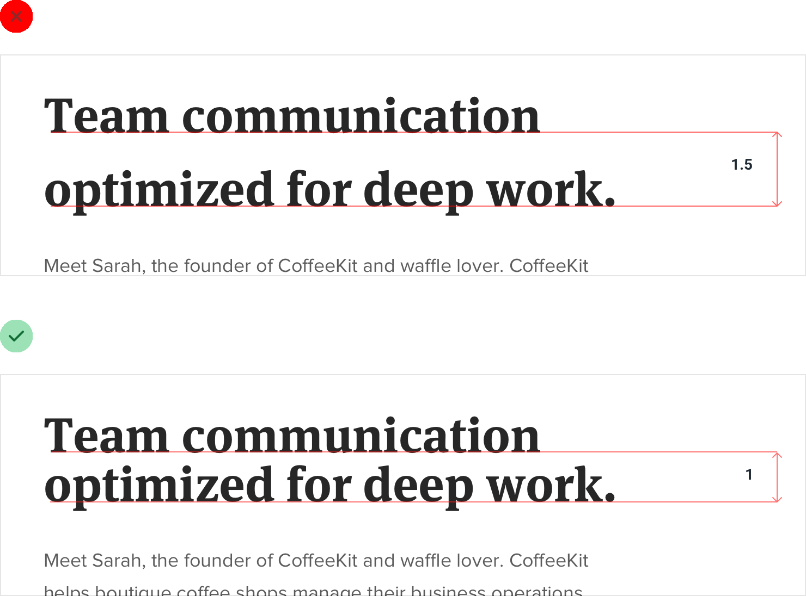
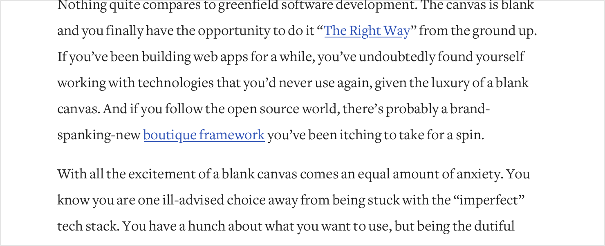

**Line-height is proportional**

You might have heard the advice that a line-height of about 1.5 is a
good starting point from a readability perspective.

While that’s not necessarily untrue, choosing the right line-height for
your text is a bit more complicated than just using the same value
across the board in all situations.

**Accounting for line length**

The reason we add space between lines of text is to make it easy for the
reader to find the next line when the text wraps. Have you ever
accidentally read the same line of text twice, or accidentally skipped a
line? The line-height was probably too short.

123

Line-height is proportional

When lines of text are spaced too tightly, it’s easy to finish reading a
line of text at the right edge of a page then jump your eyes all the way
back to the left edge only to be unsure which line is next.

This problem is magnified when lines of text are long. The further your
eyes have to jump horizontally to read the next line, the easier it is
to lose your place.

That means that your line-height and paragraph width should be
proportional — narrow content can use a shorter line-height like 1.5,
but wide content might need a line-height as tall as 2.

Line-height is proportional

124

**Accounting for font size**

Line length isn’t the only factor in choosing the right line-height —
font size has a big impact as well.

When text is small, extra line spacing is important because it makes it
a lot easier for your eyes to find the next line when the text wraps.

But as text gets larger, your eyes don’t need as much help. This means
that for large headline text you might not need any extra line spacing,
and a line-height of 1 is perfectly fine.

125

Line-height is proportional

Line-height and font size are *inversely* proportional — use a taller
line-height for small text and a shorter line-height for large text.

