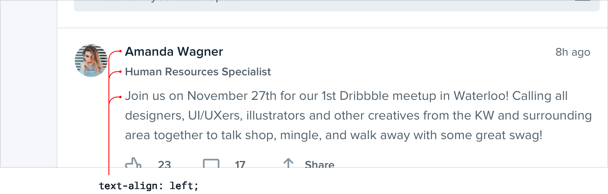

part of the main path a user takes through the application, consider
adding an underline or changing the color *only on hover*.

They’ll still be discoverable to any users who think to try, but won’t
compete for attention with more important actions on the page.

