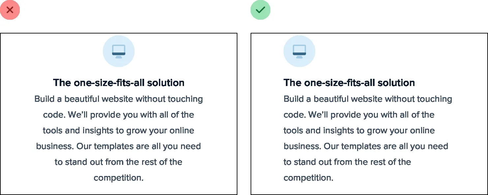
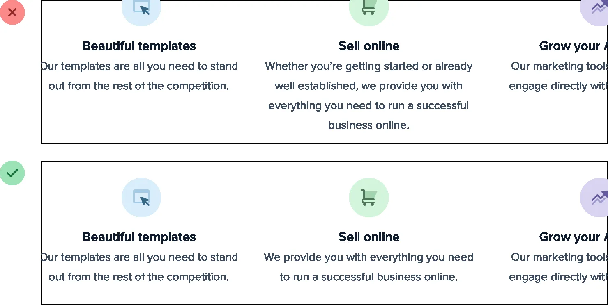
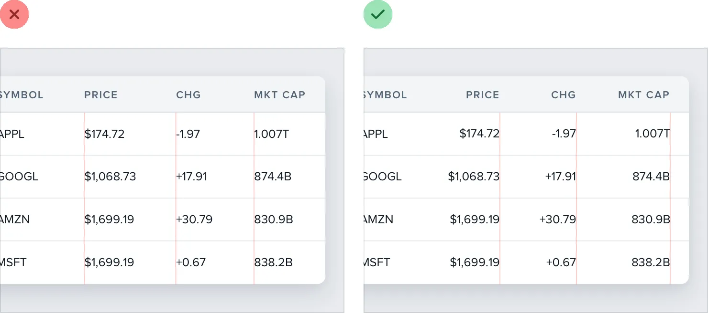
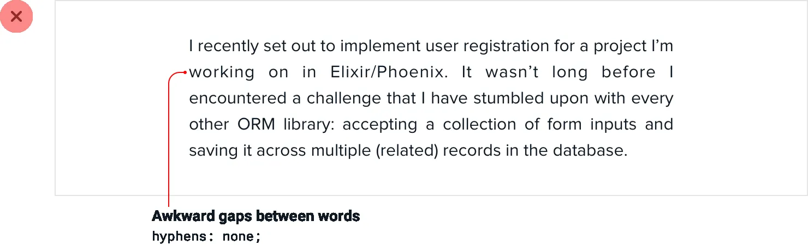
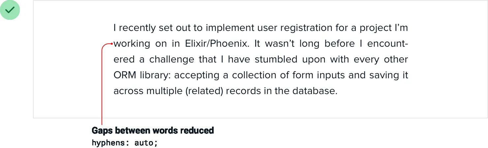
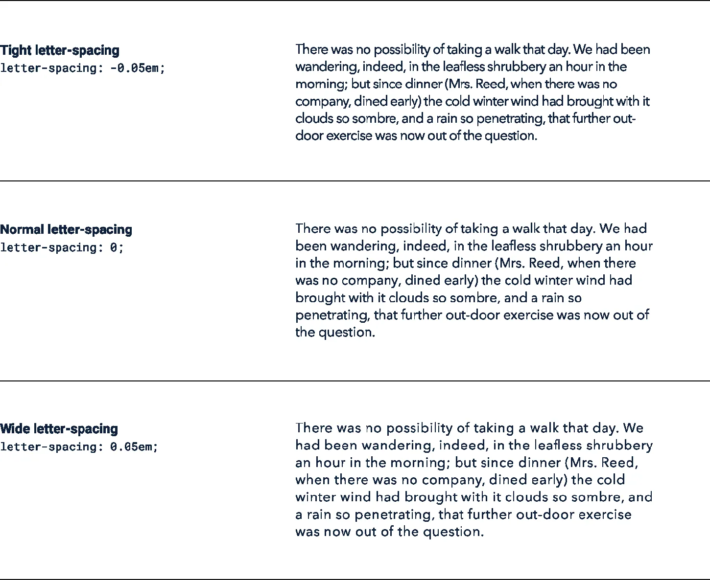

**Align with readability in mind**

In general, text should be aligned to match the direction of the
language it’s written in. For English (and most other languages), that
means that the vast majority of text should be left-aligned.

Other alignment options do have their place though, you just need to use
them effectively.

**Don’t center long form text**

Center-alignment can look great for headlines or short, independent
blocks of text.

129

Align with readability in mind

But if something is longer than two or three lines, it will almost
always look better left-aligned.

If you’ve got a few blocks of text you want to center but one of them is
a bit too long, the easiest fix is to rewrite the content and make it
shorter: Not only will it fix the alignment issue, it will make your
design feel more consistent, too.

Align with readability in mind

130

**Right-align numbers**

If you’re designing a table that includes numbers, right-align them.

When the decimal in a list of numbers is always in the same place,
they’re a lot easier to compare at a glance.

**Hyphenate justified text**

Justified text looks great in print and can work well on the web when
you’re going for a more formal look, but without special care, it can
create a lot of awkward gaps between words:

131

Align with readability in mind

To avoid this, whenever you justify text, you should also enable
hyphenation: Justified text works best in situations where you’re trying
to mimic a print look, perhaps for an online magazine or newspaper. Even
then, left aligned text works great too, so it’s really just a matter of
preference.

