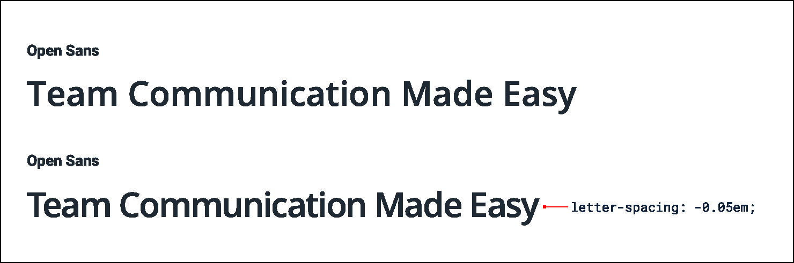
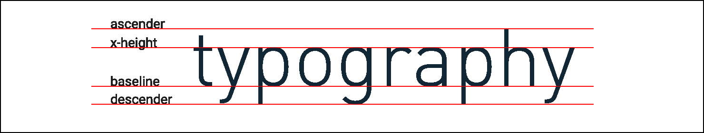
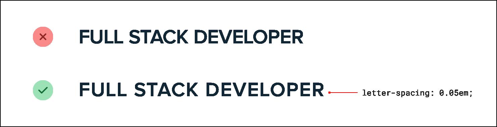

**Use letter-spacing effectively**

When styling text, a lot of effort is put into getting the weight,
color, and line-height just right, but it’s easy to forget that
letter-spacing can be tweaked, too.

As a general rule, you should trust the typeface designer and leave
letter-spacing alone. That said, there are a couple of common situations
where adjusting it can improve your designs.

133

Use letter-spacing effectively

**Tightening headlines**

When someone designs a font family, they design it with a purpose in
mind.

A family like Open Sans is designed to be highly legible even at small
sizes, so the built-in letter-spacing is a lot wider than a family like
Oswald which is designed for headlines.

If you want to use a family with wider letter-spacing for headlines or
titles, it can often make sense to decrease the letter-spacing to mimic
the condensed look of a purpose-built headline family:

Avoid trying to make this work the other way around though — headline
fonts rarely work well at small sizes even if you increase the letter
spacing.

Use letter-spacing effectively

134

**Improving all-caps legibility**

The letter-spacing in most font families is optimized for normal
“sentence case” text — a capital letter followed by mostly lowercase
letters.

Lowercase letters have a lot of variety visually. Letters like *n*, *v*,
and *e* fit entirely within a typeface’s x-height, other letters like
*y*, *g*, and *p* have *descenders* that poke out below the baseline,
and letters like *b*, *f*, and *t* have *ascenders* that extend above.

All-caps text on the other hand isn’t so diverse. Since every letter is
the same height, using the default letter-spacing often leads to text
that is harder to read because there are fewer distinguishing
characteristics between letters.

For that reason, it often makes sense to increase the letter-spacing of
all-caps text to improve readability:

