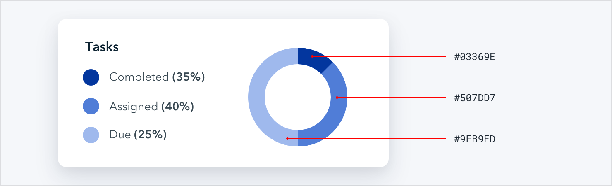
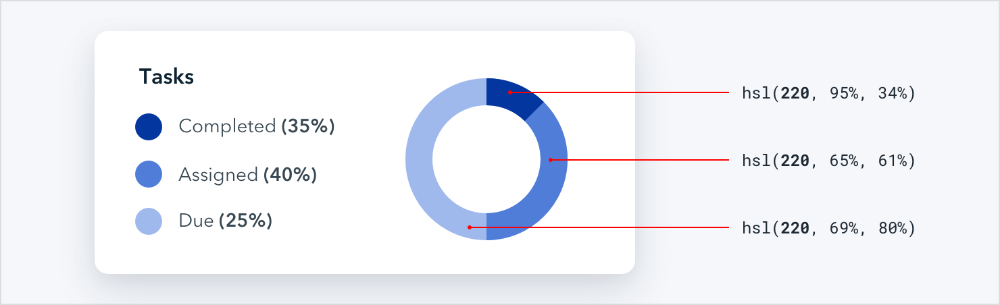
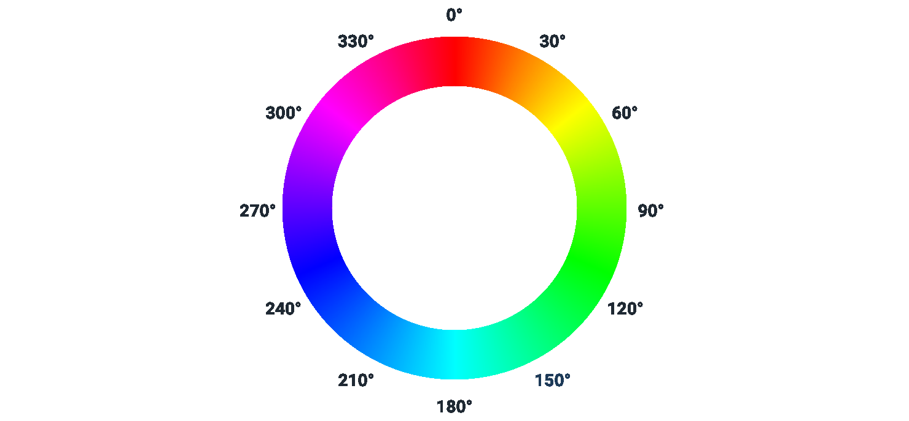
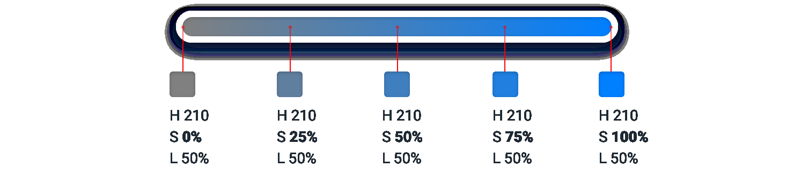
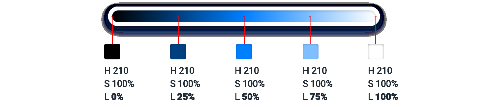
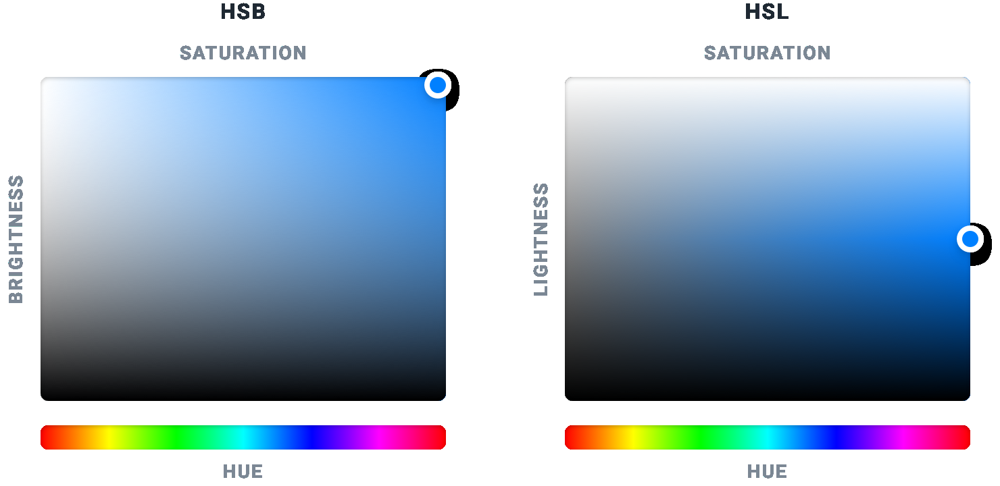
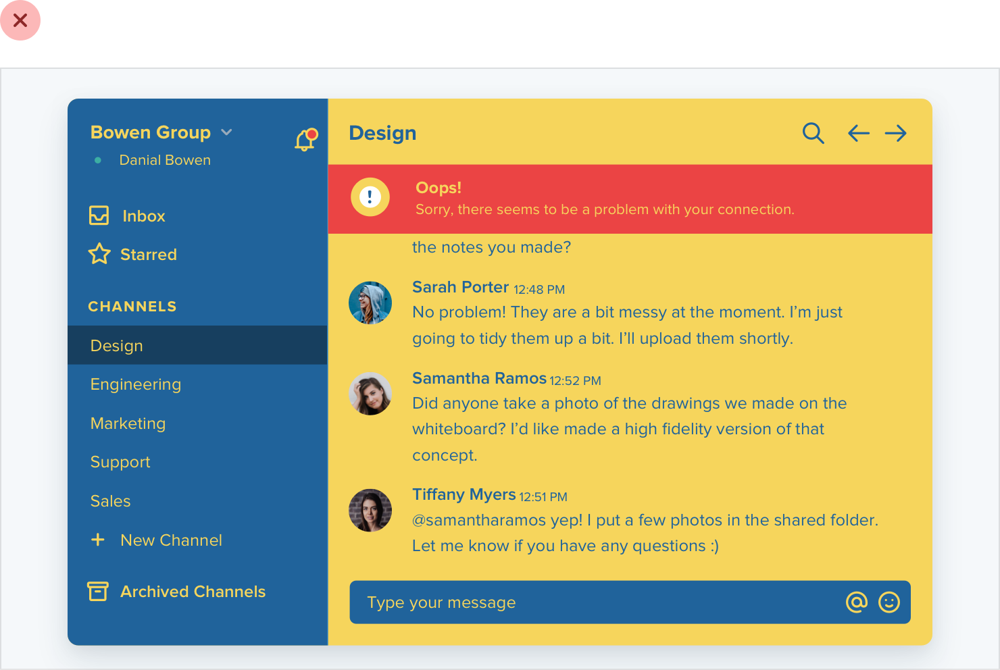

**Working with Color**

**Ditch hex for HSL**

Hex and RGB are the most common formats for representing color on the
web, but they’re not the most useful.

Using hex or RGB, colors that have a lot in common visually look nothing
alike in code.

HSL fixes this by representing colors using attributes the human-eye
intuitively perceives: *hue*, *saturation*, and *lightness*.

**Hue** is a color’s position on the color wheel — it’s the attribute of
a color that lets us identify two colors as “blue” even if they aren’t
identical.

139

Ditch hex for HSL

Hue is measured in degrees, where 0° is red, 120° is green, and 240° is
blue.

**Saturation** is how colorful or vivid a color looks. 0% saturation is
grey (no color), and 100% saturation is vibrant and intense.

Without saturation, hue is irrelevant — rotating the hue when saturation
is 0% doesn’t actually change the color at all.

Ditch hex for HSL

140

**Lightness** is just what it sounds like — it measures how close a
color is to black or to white. 0% lightness is pure black, 100%
lightness is pure white, and 50% lightness is a pure color at the given
hue.

**HSL vs. HSB**

Don’t confuse HSL for HSB — *lightness* in HSL is not the same than
*brightness* in HSB.

In HSB, 0% brightness is always black, but 100% brightness is only white
when the saturation is 0%. When saturation is 100%, 100% brightness in
HSB

is the same as 100% saturation and *50%* lightness in HSL.

141

Ditch hex for HSL

HSB is more common than HSL in design software, but browsers only
understand HSL, so if you’re designing for the web, HSL should be your
weapon of choice.

