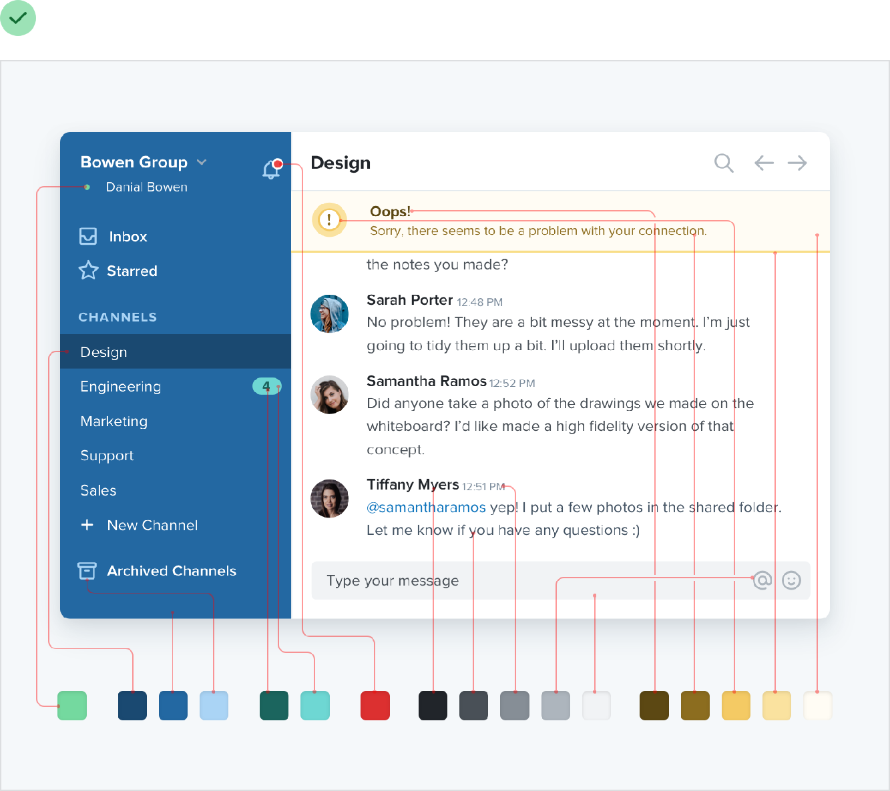
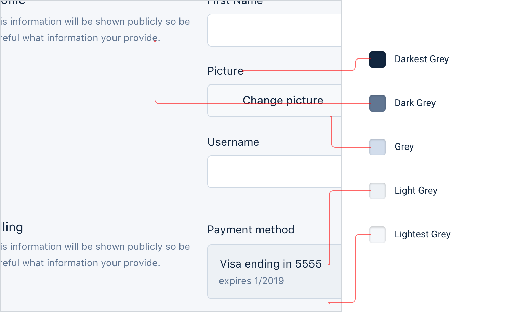
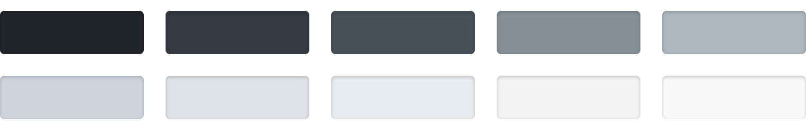
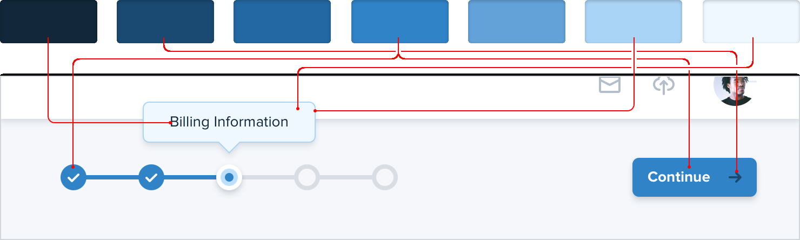
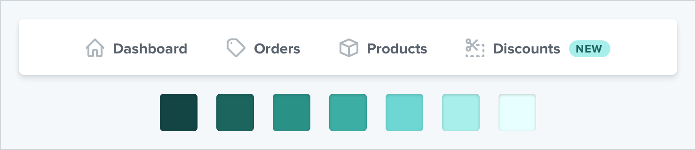
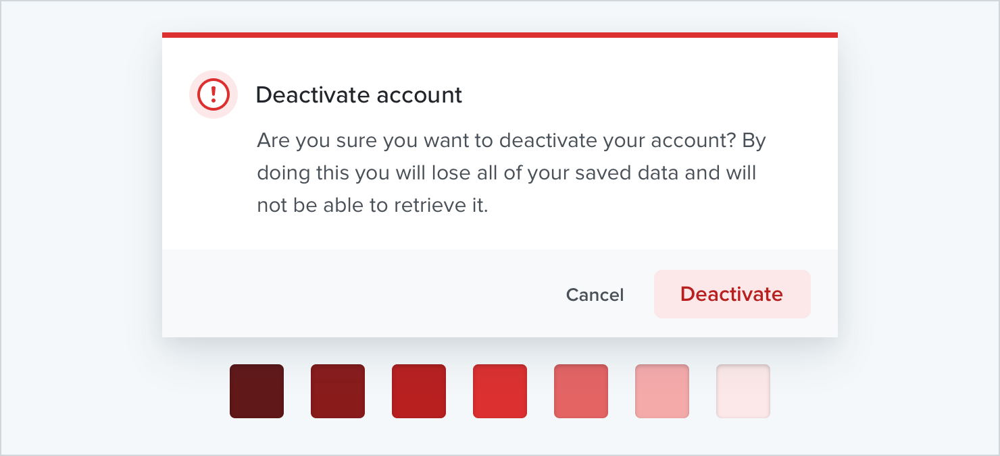
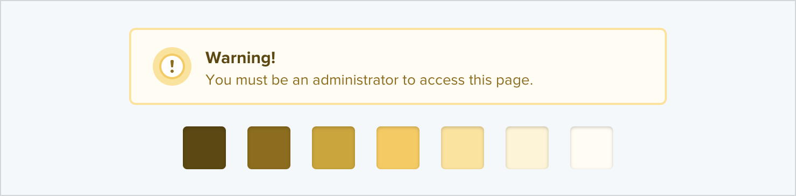
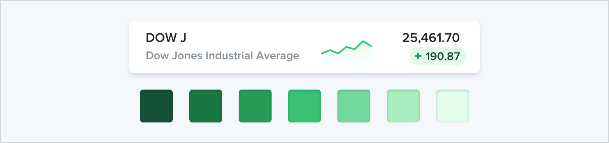
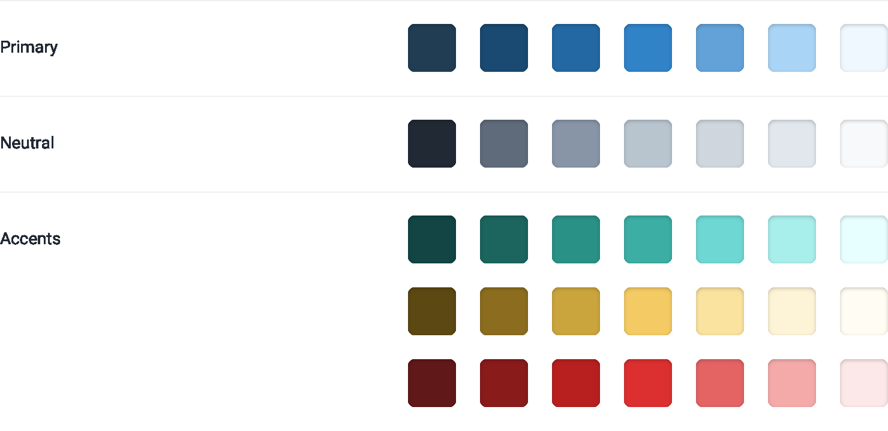

**You need more colors than you think**

Ever used one of those color palette generators where you pick a
starting color, tweak some options, and are then bestowed the five
perfect colors you should use to build your website?

This calculated approach to picking the perfect color scheme is
extremely seductive, but it’s not very useful unless you want your site
to look like this:

143

You need more colors than you think

**What you actually need**

You can’t build anything with five hex codes. To build something real,
you need a much more comprehensive set of colors to choose from.

You can break a good color palette down into three categories.

**Greys**

Text, backgrounds, panels, form controls — almost everything in an
interface is grey.

You need more colors than you think

144

You’ll need more greys than you think, too — three or four shades might
sound like plenty but it won’t be long before you wish you had something
a little darker than shade \#2 but a little lighter than shade \#3.

In practice, you want 8-10 shades to choose from (more on this in
“*Define* *your shades up front*”). Not so many that you waste time
deciding between shade \#77 and shade \#78, but enough to make sure you
don’t have to compromise too much.

True black tends to look pretty unnatural, so start with a really dark
grey and work your way up to white in steady increments.

145

You need more colors than you think

**Primary color(s)**

Most sites need one, *maybe* two colors that are used for primary
actions, active navigation elements, etc. These are the colors that
determine the overall look of a site — the ones that make you think of
Facebook as “blue”.

Just like with greys, you need a variety *(5-10)* of lighter and darker
shades to choose from.

Ultra-light shades can be useful as a tinted background for things like
alerts, while darker shades work great for text.

**Accent colors**

On top of primary colors, every site needs a few *accent* colors for
communicating different things to the user.

For example, you might want to use an eye-grabbing color like yellow,
pink, or teal to highlight a new feature:

You need more colors than you think

146

You might also need colors to emphasize different semantic *states*,
like red for confirming a destructive action:

…yellow for a warning message:

…or green to highlight a positive trend:

147

You need more colors than you think

You’ll want multiple shades for these colors too, even though they
should be used pretty sparingly throughout the UI.

If you’re building something where you need to use color to distinguish
or categorize similar elements (like lines on graphs, events in a
calendar, or tags on a project), you might need even more accent colors.

All in, it’s not uncommon to need as many as *ten* different colors with
*5-10*

*shades each* for a complex UI.

