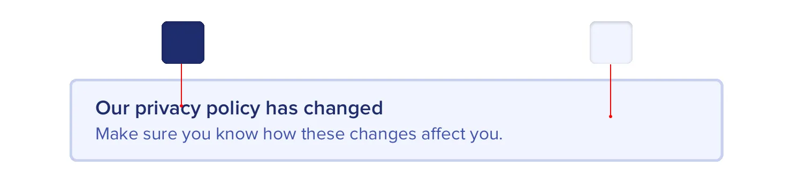
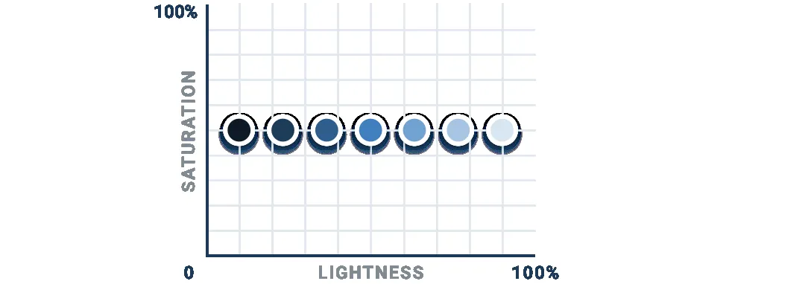
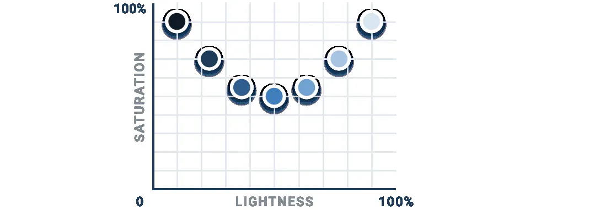

**Define your shades up front**

When you need to create a lighter or darker variation of a color in your
palette, don’t get clever using CSS preprocessor functions like
“lighten” or

“darken” to create shades on the fly. That’s how you end up with 35
*slightly* different blues that all look the same.

Instead, define a fixed set of shades up front that you can choose from
as you work.

So how do you put together a palette like this anyways?

**Choose the base color first**

Start by picking a *base* color for the scale you want to create — the
color in the middle that your lighter and darker shades are based on.

149

Define your shades up front

There’s no real scientific way to do this, but for primary and accent
colors, a good rule of thumb is to pick a shade that would work well as
a button background.

It’s important to note that there are no real rules here like “start at
50%

lightness” or anything — every color behaves a bit differently, so
you’ll have to rely on your eyes for this one.

**Finding the edges**

Next, pick your darkest shade and your lightest shade. There’s no real
science to this either, but it helps to think about where they will be
used and choose them using that context.

The darkest shade of a color is usually reserved for text, while the
lightest shade might be used to tint the background of an element.

A simple alert component is a good example that combines both of these
use cases, so it can be a great place to pick these colors.

Define your shades up front

150

Start with a color that matches the hue of your base color, and adjust
the saturation and lightness until you’re satisfied.

**Filling in the gaps**

Once you’ve got your base, darkest, and lightest shades, you just need
to fill in the gaps in between them.

For most projects, you’ll need at least 5 shades per color, and probably
closer to 10 if you don’t want to feel too constrained.

Nine is a great number because it’s easy to divide and makes filling in
the gaps a little more straightforward. Let’s call our darkest shade
*900*, our base shade *500*, and our lightest shade *100*.

Start by picking shades *700* and *300*, the ones right in the middle of
the gaps. You want these shades to feel like the perfect compromise
between the shades on either side.

This creates four more holes in the scale ( *800*, *600*, *400*, and
*200*), which you can fill using the same approach.

151

Define your shades up front

You should end up with a pretty balanced set of colors that provide just
enough options to accommodate your design ideas without feeling
limiting.

**What about greys?**

With greys the base color isn’t as important, but otherwise the process
is the same. Start at the edges and fill in the gaps until you have what
you need.

Pick your darkest grey by choosing a color for the darkest text in your
project, and your lightest grey by choosing something that works well
for a subtle off-white background.

**It’s not a science**

As tempting as it is, you can’t rely purely on math to craft the perfect
color palette.

A systematic approach like the one described above is great to get you
started, but don’t be afraid to make little tweaks if you need to.

Once you actually start using your colors in your designs, it’s almost
inevitable that you’ll want to tweak the saturation on a shade, or make
a couple of shades lighter or darker. Trust your eyes, not the numbers.

Just try to avoid adding *new* shades too often if you can avoid it. If
you’re not diligent about limiting your palette, you might as well have
no color system at all.

