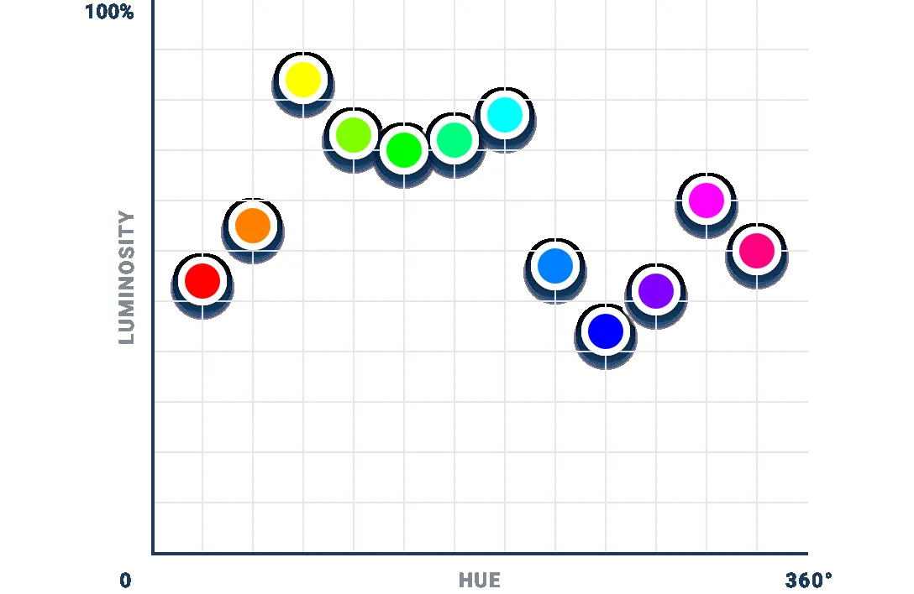
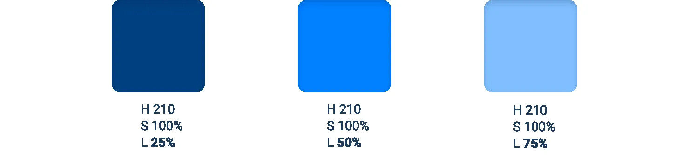
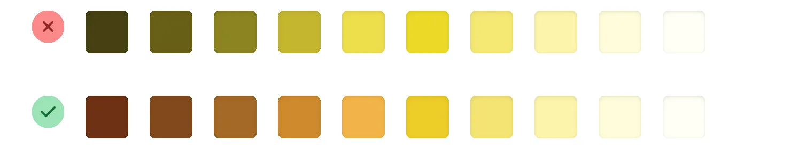
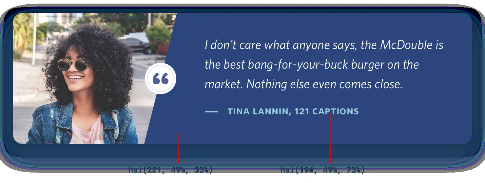
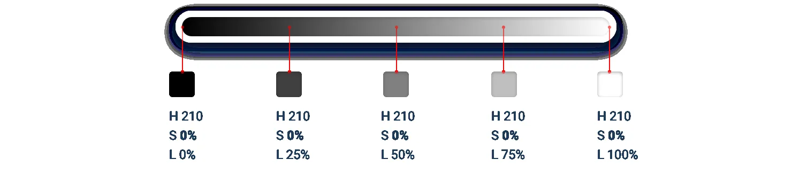
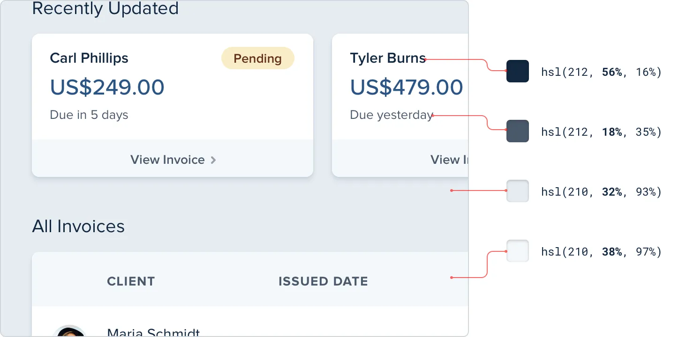

**Don’t let lightness kill your saturation**

In the HSL color space, as a color gets closer to 0% or 100% lightness,
the impact of saturation is weakened — the same saturation value at 50%

lightness looks more colorful than it does at 90% lightness.

That means that if you don’t want the lighter and darker shades of a
given color to look washed out, you need to increase the saturation as
the lightness gets further away from 50%.

153

Don’t let lightness kill your saturation

It’s subtle but little details like this add up, especially when a color
is being applied to a large section of a UI.

But what if your *base* color is already heavily saturated? How do you
increase the saturation if it’s already at 100%?

**Use perceived brightness to your advantage**

Which of these two colors do you think is lighter?

The yellow, right? Well it turns out both colors actually have the exact
same

“lightness” in terms of HSL:

So why do we see the yellow as lighter? Well it turns out that every hue
has an inherent *perceived* brightness due to how the human eye
perceives color.

You can calculate the perceived brightness of a color by plugging its
RGB

components into this formula:

Don’t let lightness kill your saturation

154

Taking samples of different hues with 100% saturation and 50% lightness,
we can get a good sense of the perceived brightness of different colors
around the color wheel:

As expected, yellow has a higher perceived brightness than blue. But
what’s interesting here is that perceived brightness doesn’t simply
change linearly from the darkest hue to the lightest hue — instead,
there are three separate local minimums (red, green, and blue) and three
local maximums (yellow, cyan, and magenta).

**Changing brightness by rotating hue**

On the surface, this is certainly an interesting thing to understand
about color. But things get really interesting when you realize how you
can use this knowledge in your designs.

155

Don’t let lightness kill your saturation

Normally when you want to change how light a color looks, you adjust the
*lightness* component:

While this does work to lighten or darken a color, you often lose some
of the color’s *intensity* — the color also looks closer to white or to
black, not just lighter or darker.

Since different hues have a different perceived brightness, another way
you can change the brightness of a color is *by rotating its hue*.

To make a color lighter, rotate the hue towards the nearest bright hue —
60°, 180°, or 300°.

Don’t let lightness kill your saturation

156

To make a color darker, rotate the hue towards the nearest dark hue —
0°, 120°, or 240°.

This can be really useful when trying to create a palette for a light
color like yellow. By gradually rotating the hue towards more of an
orange as you decrease the lightness, the darker shades will feel warm
and rich instead of dull and brown:

You can of course combine these approaches too, getting some of the
brightness by adjusting the hue and some from adjusting the lightness.

157

Don’t let lightness kill your saturation

While this is a great way to change a color’s brightness without
affecting its intensity, it works best in small doses. Don’t rotate the
hue more than 20-30°

or it will look like a totally different color instead of just lighter
or darker.

