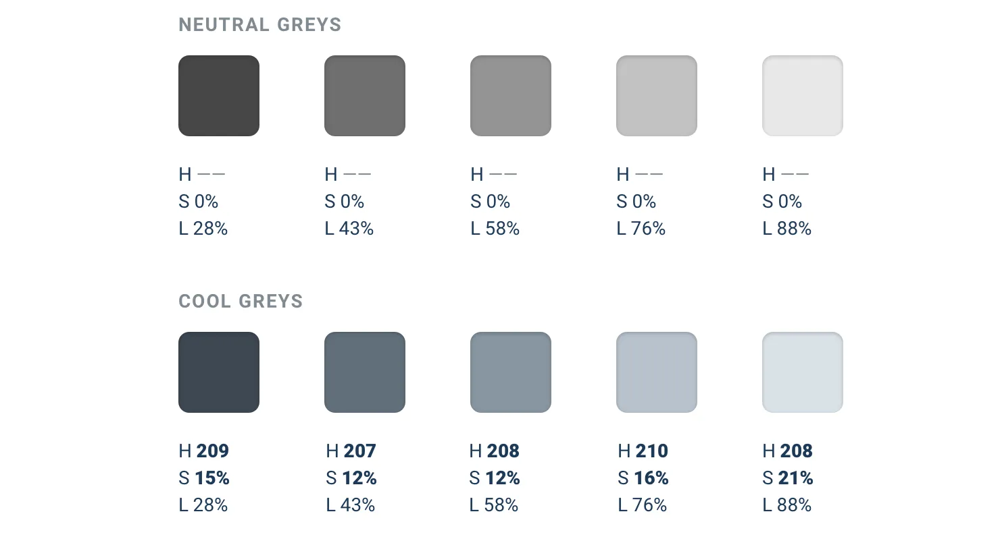
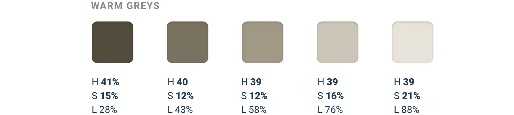
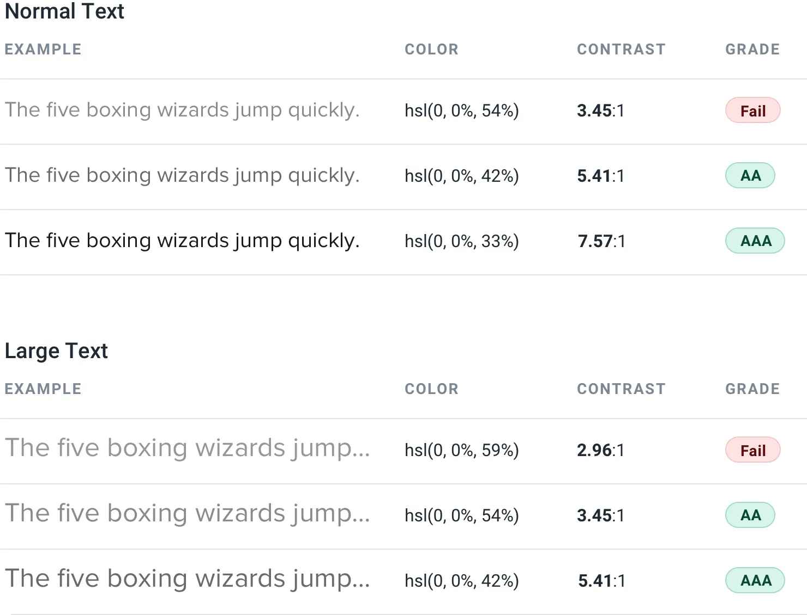

**Greys don’t have to be grey**

By definition, true grey has a saturation of 0% — it doesn’t have any
actual *color* in it at all.

But in practice, a lot of the colors that we *think of* as grey are
actually saturated quite heavily:

This saturation is what makes some greys feel cool and other greys feel
warm.

159

Greys don’t have to be grey

**Color temperature**

If you’ve ever purchased light bulbs before, you’ve had to make the
decision between “warm white” bulbs that give off a yellow-ish light,
and “cool white”

bulbs that give off a blue-ish light.

Saturating greys in a user interface works in a similar same way.

If you want your greys to feel cool, saturate them with a bit of blue:
To give your greys a warmer feel, saturate them with a bit of yellow or
orange:

Greys don’t have to be grey

160

To maintain a consistent temperature, don’t forget to increase the
saturation for the lighter and darker shades. If you don’t, those shades
will look a bit washed out compared to the greys that are closer to 50%
lightness.

How much you want to saturate your greys is completely up to you — add
just a little if you only want to tip the temperature slightly, or crank
it up if you want the interface to lean strongly in one direction or the
other.

161

Greys don’t have to be grey

