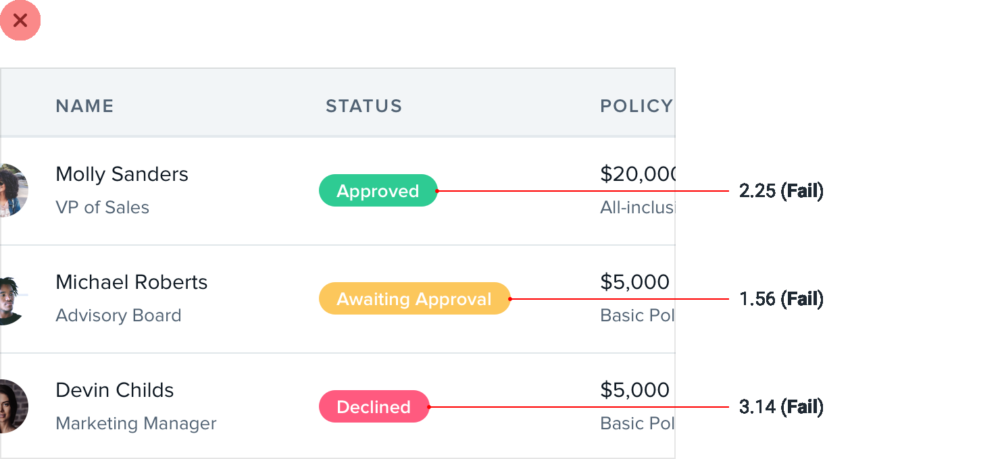
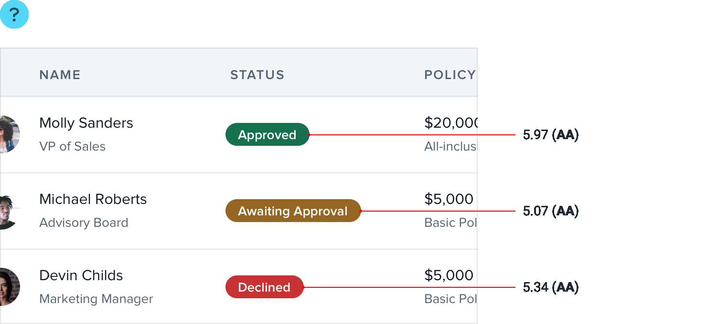
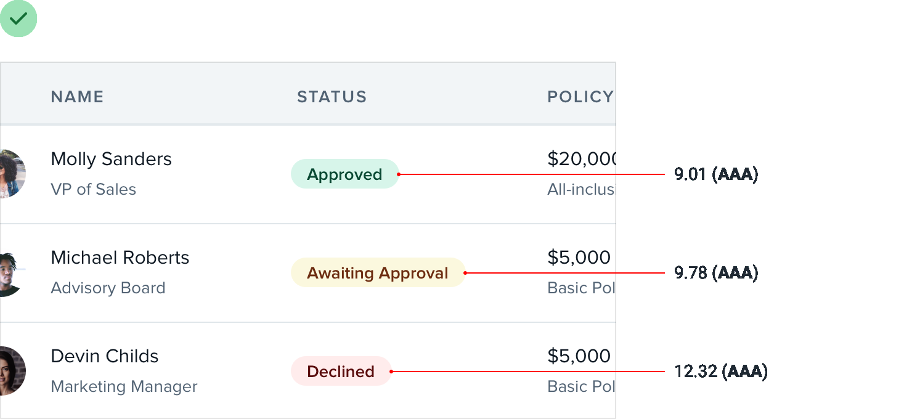
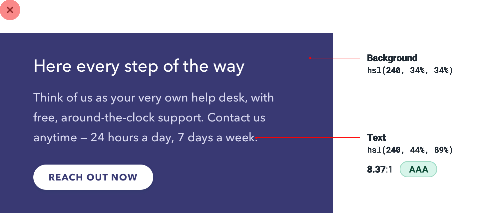
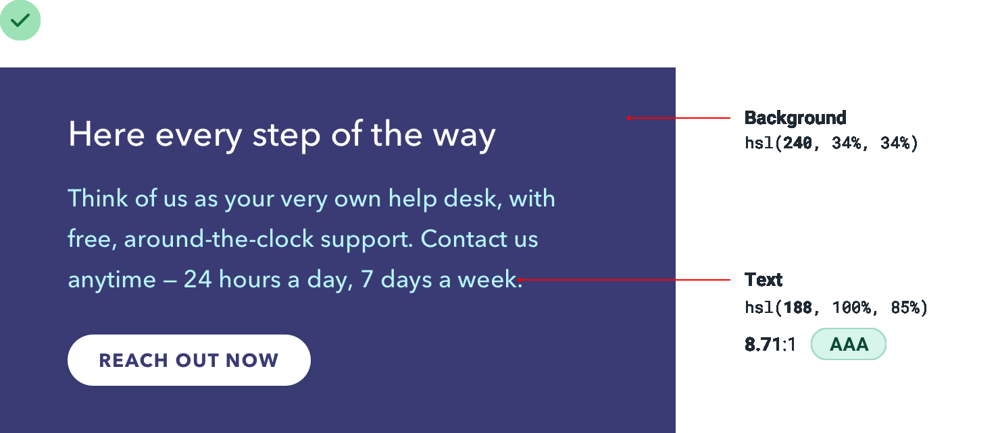
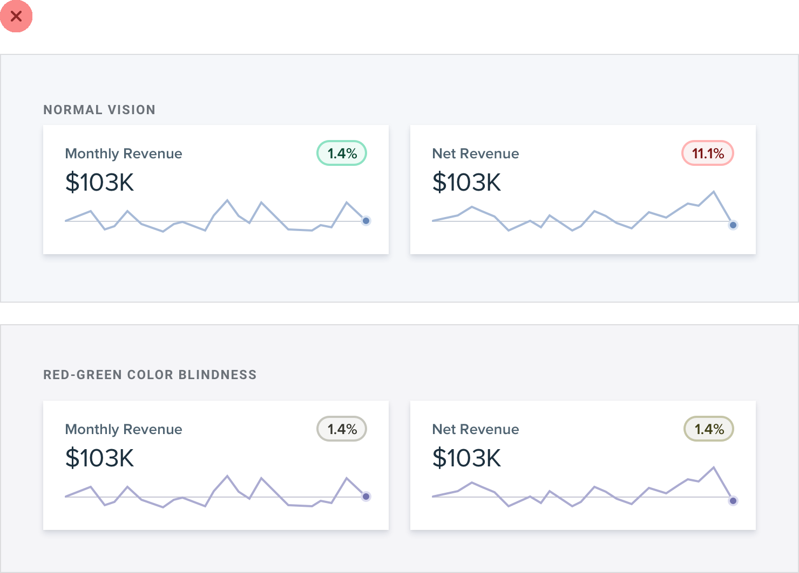

**Accessible doesn’t have to mean ugly**

To make sure your designs are accessible, the Web Content Accessibility
Guidelines (WCAG) recommend that normal text *(under ~18px)* has a
contrast ratio of at least 4.5:1, and that larger text has a [contrast
ratio](https://webaim.org/resources/contrastchecker/) of at least 3:1.

For typical *dark-text-on-a-light-background* situations, meeting this
recommendation is pretty easy, but it gets a lot trickier when you start
working with color.

163

Accessible doesn’t have to mean ugly

**Flipping the contrast**

When using white text on a colored background, you’d be surprised how
dark the color often needs to be to meet that 4.5:1 contrast ratio.

This can create hierarchy issues when those elements aren’t supposed to
be the focus of the page — dark colored backgrounds will really grab the
user’s attention.

Accessible doesn’t have to mean ugly

164

You can solve this problem by *flipping the contrast*. Instead of using
light text on a dark colored background, use dark colored text on a
light colored background:

The color is still there to help support the text, but it’s way less
in-your-face and doesn’t interfere as much with other actions on the
page.

**Rotating the hue**

Even harder than white text on a colored background is *colored* text on
a colored background. You’ll run into this situation if you’re ever
trying to pick a color for some secondary text inside a dark-colored
panel.

If you start by taking the background color and simply adjusting the
lightness and saturation, you’ll find that it’s hard to meet the
recommended contrast ratio without getting very close to pure white.

165

Accessible doesn’t have to mean ugly

You don’t want the primary text and the secondary text to look the same,
so what else can you do?

Well since some colors are brighter than others, one way to increase the
contrast without getting closer to white is to *rotate the hue* towards
a brighter color, like cyan, magenta, or yellow.

This can make it a lot easier to make the text accessible while still
keeping it colorful.

