**Creating Depth**

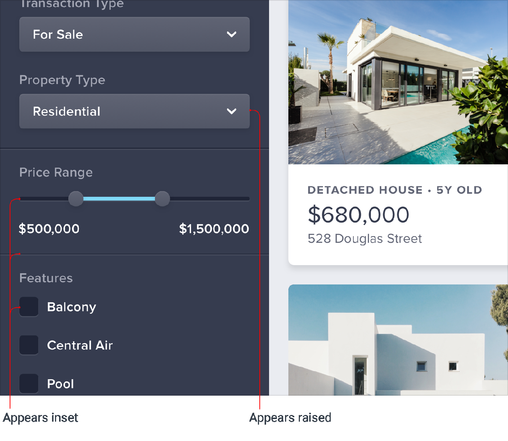

**Emulate a light source**

Have you ever noticed how some elements in an interface feel like
they’re raised off of the page, while others feel like they are inset
into the background?

Creating this effect might look complicated at first, but it actually
only requires you to understand one fundamental rule.

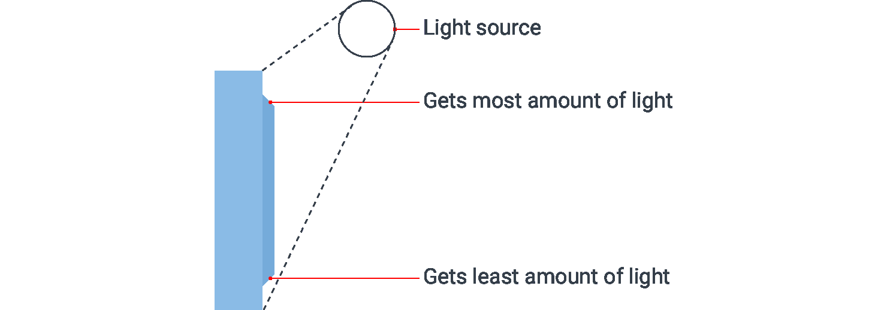

173

Emulate a light source

**Light comes from above**

Take a look at the panelling on this door:

Even though you’re just looking at a flat image, it’s still pretty
obvious that the panels on the door are raised. Why is that?

Notice how the top edge of the panel is lighter? That’s because it’s
angled towards the sky and receives more light. Similarly, the bottom
edge is darker because it’s angled *away* from the sky, receiving *less*
light.

The only way those edges could possibly be oriented that way is if the
panel itself is raised, so that’s how our brains perceive it.

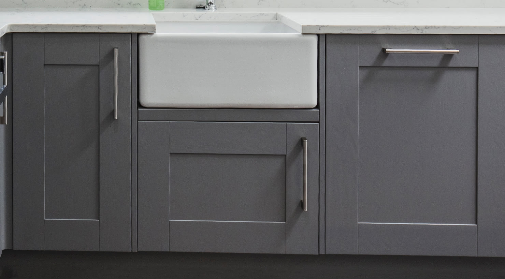

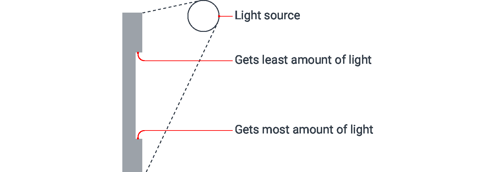

Emulate a light source

174

Now take a look at the panelling on this cabinet:

In this case it’s clear that the panels are *inset* because there’s a
shadow at the top indicating that the lip above is blocking the light,
and the bottom edge is lighter, indicating that it’s angled upward.

To create this same sense of depth in your designs, all you need to do
is mimic the way light affects things in the real world.

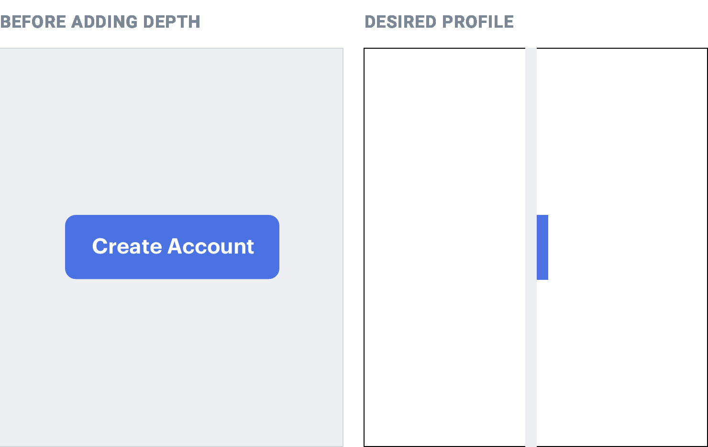

175

Emulate a light source

**Simulating light in a user interface**

If you want an element to appear raised or inset, first figure out what
*profile* you want that element to have, then mimic how a light source
would interact with that shape.

**Raised elements**

For example, say you had a button and you wanted it to feel raised off
of the page, with perfectly flat edges on the top and bottom: Because
the top and bottom edges are both flat, it would be impossible to see
both of them at the same time. People generally look slightly downward
towards their screens, so for the most natural look, reveal a little bit
of the top edge and hide the bottom edge.

Since the top edge is facing upward, make it slightly lighter than the
face of

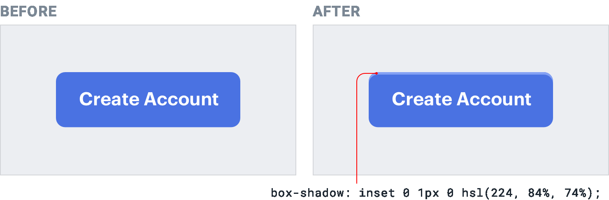

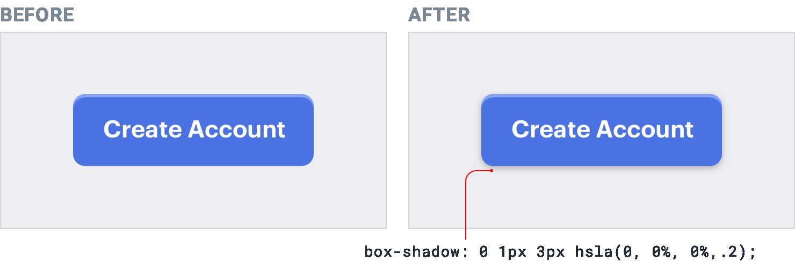

Emulate a light source

176

the button, usually using a top border or an inset box shadow with a
slight vertical offset:

Choose the lighter color by hand instead of using a semi-transparent
white for best results — simply overlaying white can [suck the
saturation](#index_split_000.html_p152) out of the underlying color.

Next, you need to account for the fact that a raised element will block
some of the light from reaching the area below the element.

Do this by adding a small dark box shadow with a slight vertical offset
*(you* *only want the shadow to appear below the element)*: Don’t get
carried away with the blur radius, a couple of pixels is plenty. These

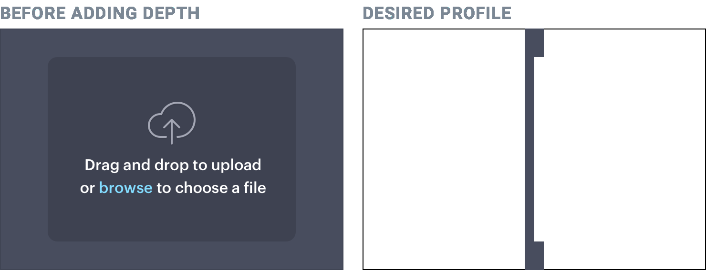

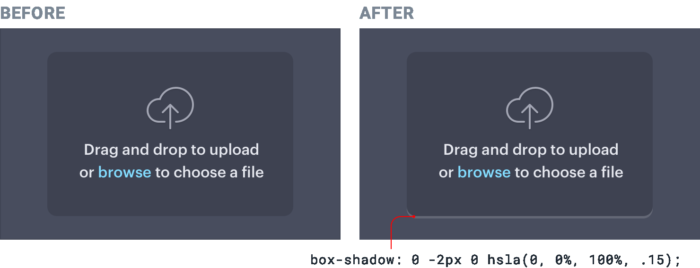

177

Emulate a light source

sorts of shadows should have pretty sharp edges — take a look at the
shadow cast by the bottom of a wall outlet or window frame for a
real-world example.

**Inset elements**

Say you’re designing a “well” component that should feel like it’s
recessed into the page.

Looking slightly downward, only the bottom lip would be visible. Since
it’s facing towards the sky, give that edge a slightly lighter color
using a bottom border or inset shadow with a negative vertical offset:

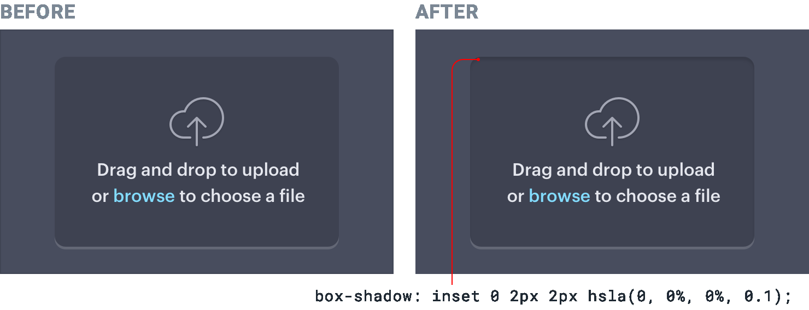

Emulate a light source

178

The area above the well should block some of the light from reaching the
very top of the well, so add a small dark inset box shadow with a slight
positive vertical offset to make sure it doesn’t poke through at the
bottom: This same treatment works for any element that may need to
appear inset, for example text inputs and checkboxes:

179

Emulate a light source

**Don’t get carried away**

Once you understand how to simulate light in an interface, it can be
tempting to tinker away for hours, tweaking and tweaking to see how
closely you can mimic the real world.

While this can be a fun exercise, in practice it can lead to interfaces
that are busy and unclear. Borrowing some visual cues from the real
world is a great way to add a bit of depth, but there’s no need to try
and make things look photo-realistic.

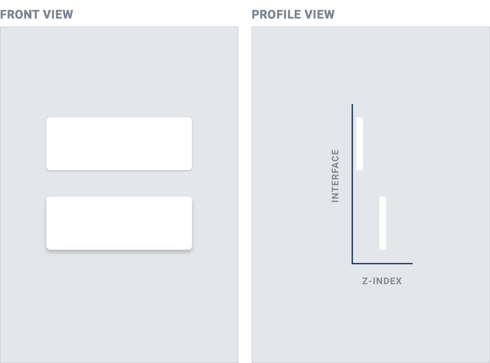

