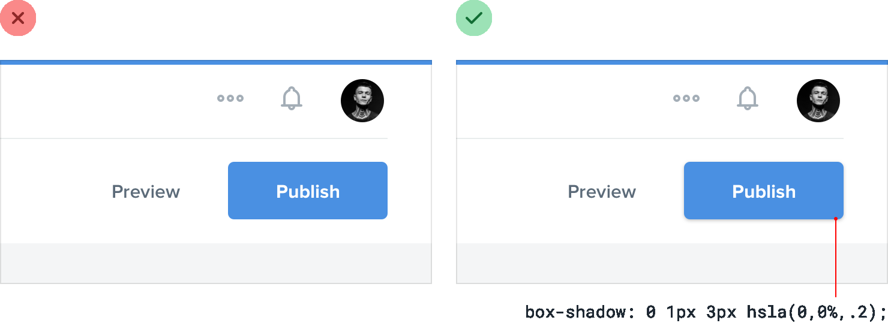
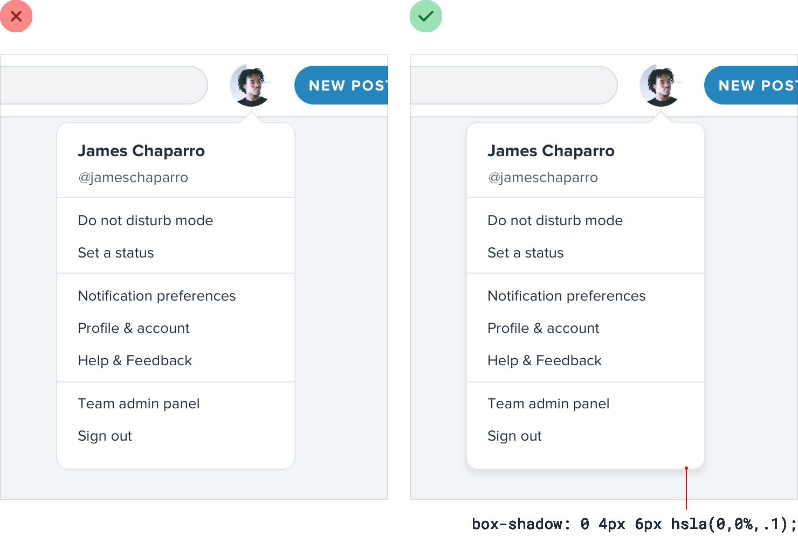
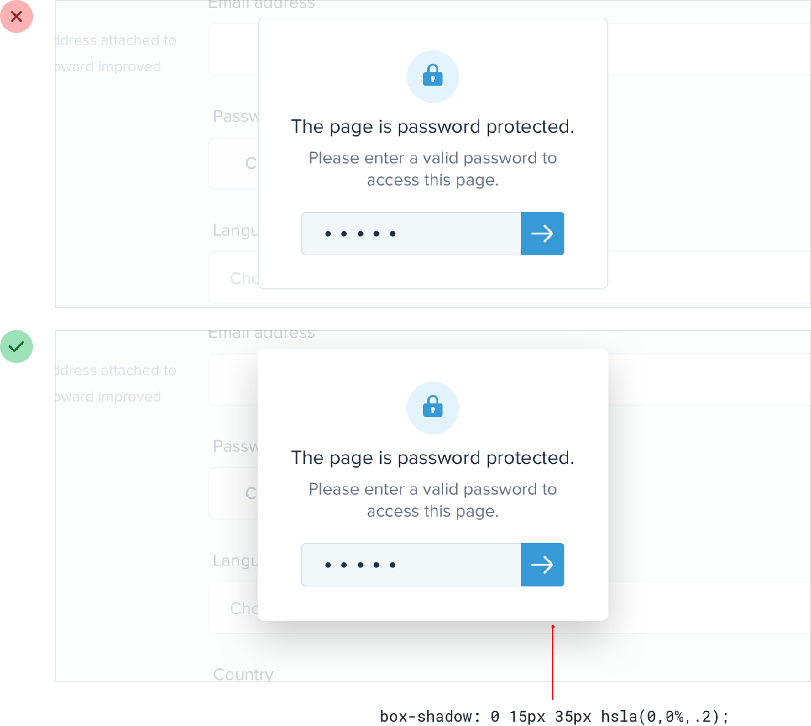
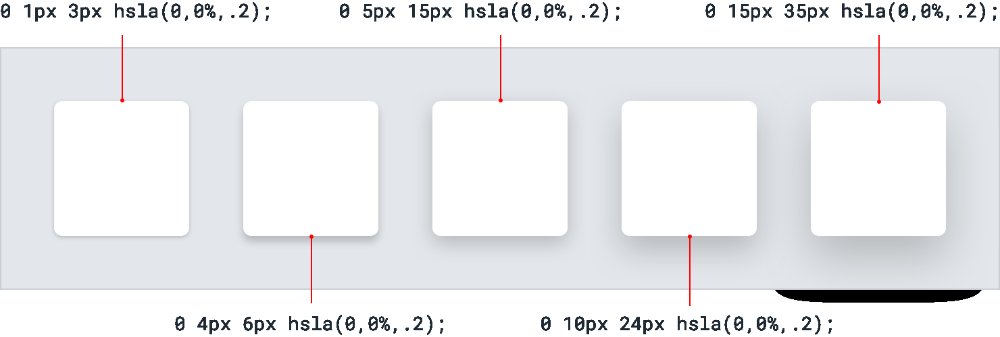
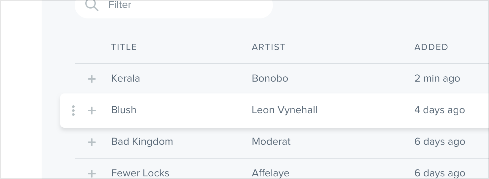
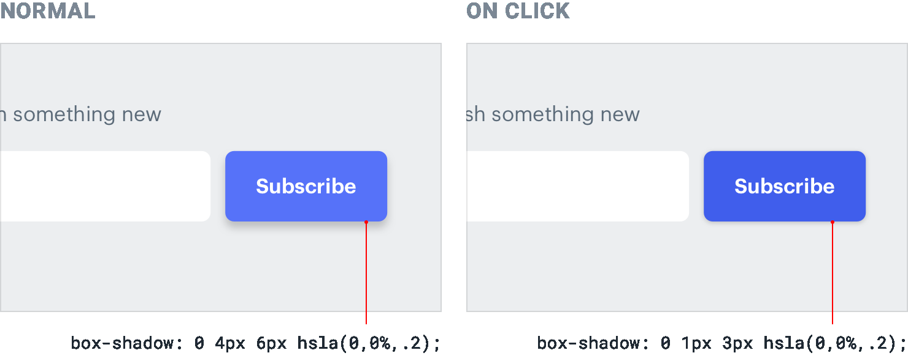
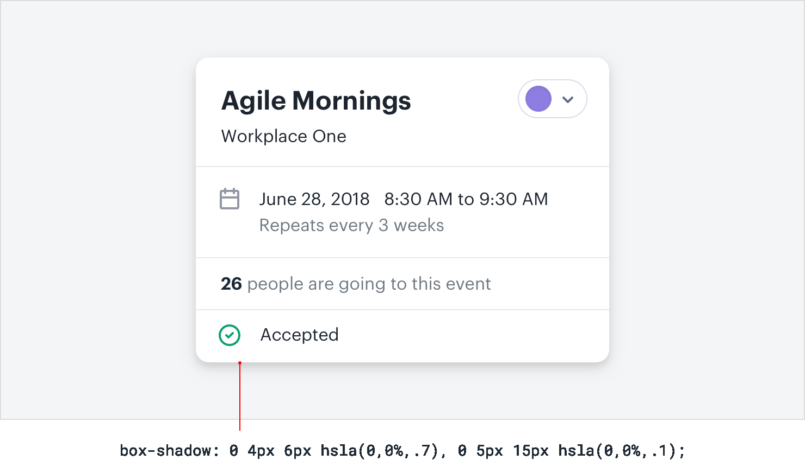

**Use shadows to convey elevation**

Shadows can be more than just a flashy effect — used thoughtfully, they
let you position elements on a virtual z-axis to create a meaningful
sense of depth.

Small shadows with a tight blur radius make an element feel only
slightly raised off of the background, while larger shadows with a
higher blur radius make an element feel much closer to the user:

The closer something feels to the user, the more it will attract their
focus.

181

Use shadows to convey elevation

You might use a smaller shadow for something like a button, where you
want the user to notice it but don’t want it to dominate the page:
Medium shadows are useful for things like dropdowns; elements that need
to sit a bit further above the rest of the UI:

Use shadows to convey elevation

182

Large shadows are great for modal dialogs, where you really want to
capture the user’s attention:

**Establishing an elevation system**

Just like with color, typography, spacing, and sizing, defining a fixed
set of shadows will speed up your workflow and help maintain consistency
in your designs.

You don’t need a ton of different shadows — five options is usually
plenty.

183

Use shadows to convey elevation

Start by defining your smallest shadow and your largest shadow, then
fill in the middle with shadows that increase in size pretty linearly:
**Combining shadows with interaction**

Shadows aren’t only useful for positioning elements on the z-axis
statically; they’re a great way to provide visual cues to the user as
they interact with elements, too.

For example, say you had a list of items where the user could click and
drag each item to sort them. Adding a shadow to an item when a user
clicks it makes it feel like it pops forward above the other items in
the list, and makes it clear to the user that they can drag it:

Use shadows to convey elevation

184

Similarly, you can make a button feel like it’s being pressed into the
page when a user clicks it by switching to a smaller shadow, or perhaps
removing the shadow altogether:

Using shadows in a meaningful way like this is a great way to hack the
process of choosing what sort of shadow an element should have. Don’t
think about the shadow itself, think about where you want the element to
sit on the z-axis and assign it a shadow accordingly.

185

Use shadows to convey elevation

