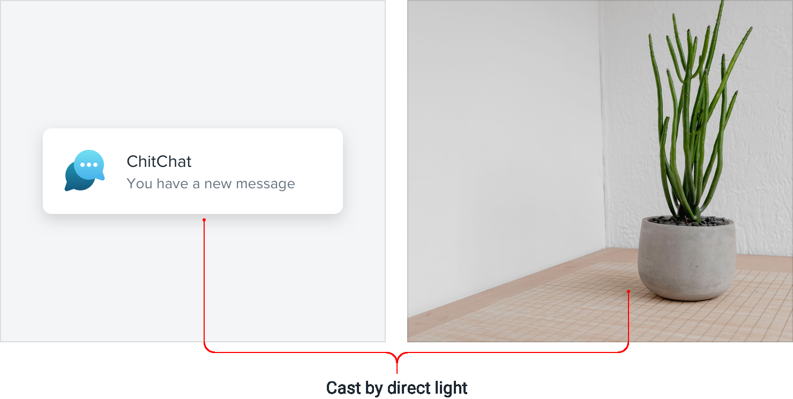
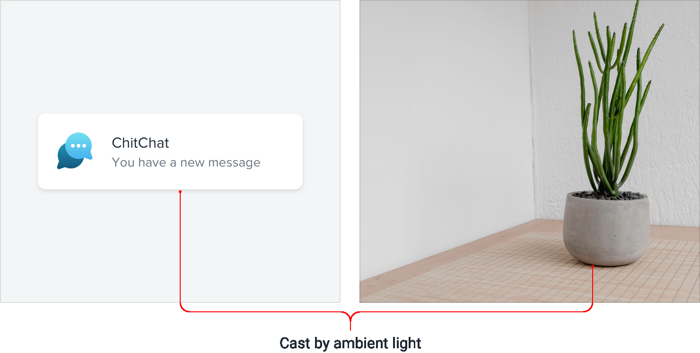
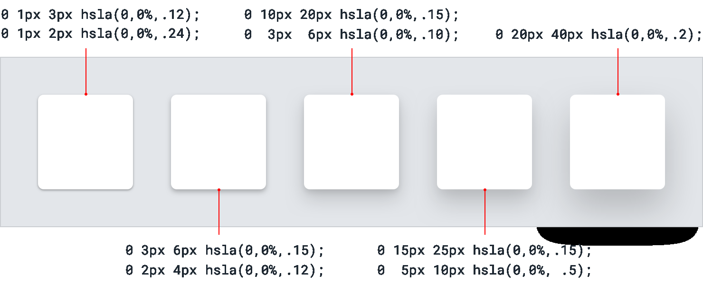

**Shadows can have two parts**

Ever inspected a really nice shadow on a site and noticed they were
actually using *two* shadows?

There’s a method to this madness, and it’s actually pretty simple and
makes a lot of sense.

When you see someone combining two shadows, they’re not just
experimenting randomly until things look nice, they’re using each shadow
to do a specific job.

The first shadow is larger and softer, with a considerable vertical
offset and large blur radius. It simulates the shadow cast behind an
object by a direct light source.

187

Shadows can have two parts

The second shadow is tighter and darker, with less of a vertical offset
and a smaller blur radius. It simulates the shadowed area *underneath*
an object where even ambient light has a hard time reaching.

Using two shadows like this gives you a lot more control than you’d get
with a single shadow — you can keep the larger shadow nice and subtle
while still

Shadows can have two parts

188

making the shadow closer the element’s edges nice and defined.

**Accounting for elevation**

As an object gets further away from a surface, the small, dark shadow
created by a lack of ambient light slowly disappears *(go ahead, try it
out with* *something on your desk)*.

189

Shadows can have two parts

So if you’re going to use this two-shadow technique in your own
projects, make sure you make that shadow more subtle for shadows that
represent a higher elevation.

It should be quite distinct for your lowest elevation, and almost *(or*
*completely)* invisible at your highest elevation.

