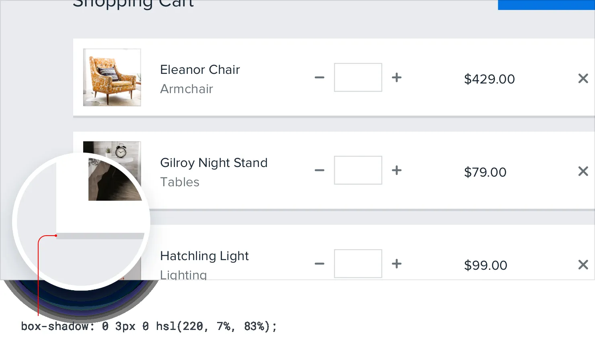

**Even flat designs can have depth**

When most people talk about “flat design”, they mean designing without
shadows, gradients, or any other effects that try to mimic how light
interacts with things in the real-world.

But the most effective flat designs still convey depth, they just do it
in a different way.

191

Even flat designs can have depth

**Creating depth with color**

In general *(especially with shades of the same color)*, lighter objects
feel closer to us and darker objects feel further away.

Make an element lighter than the background color to make it feel like
it’s raised off of the page, or darker than the background color if you
want it to feel inset like a well:

This is just as applicable to non-flat designs, too — color is just
another tool in your toolbelt for conveying distance.

Even flat designs can have depth

192

**Using solid shadows**

Another way to communicate depth in a flat design is to use short,
vertically offset shadows with no blur radius at all.

It’s a great way to make a card or button stand off the page a little
bit without sacrificing that flat aesthetic.

193

Even flat designs can have depth

