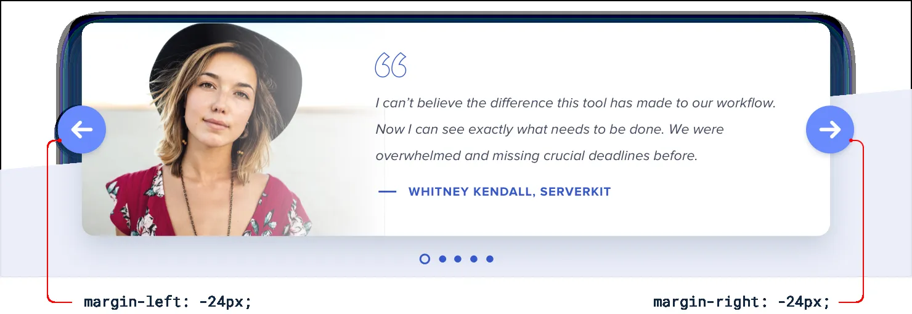
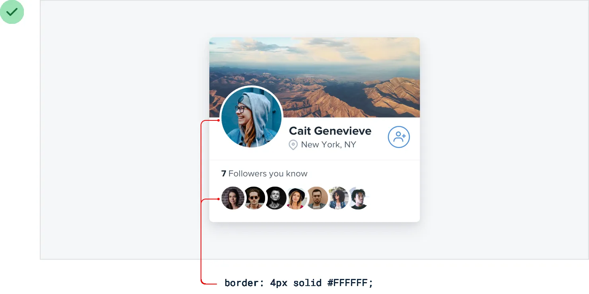

**Overlap elements to create layers**

One of the most effective ways to create depth is to overlap different
elements to make it feel like a design has multiple *layers*.

For example, instead of containing a card entirely within another
element, offset it so it crosses the transition between two different
backgrounds:

195

Overlap elements to create layers

You could also make an element taller than its parent, so it overlaps on
both sides:

Overlapping elements can add depth to smaller components too, for
example the controls on this carousel:

**Overlapping images**

This technique can work great with images as well, but without special

Overlap elements to create layers

196

consideration it’s easy for overlapping images to clash.

A simple trick for avoiding this is to give the images an “invisible
border” —

one that matches the background color — so there’s always a bit of a gap
between images:

You’ll still create the appearance of layers but with none of the ugly
clashing.

