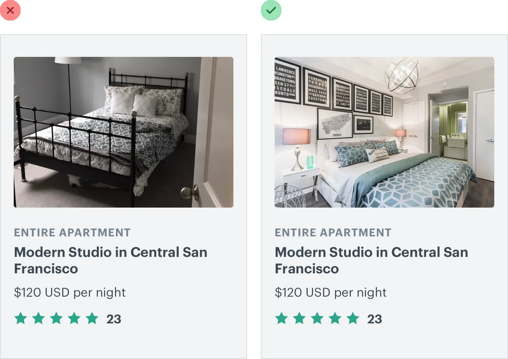
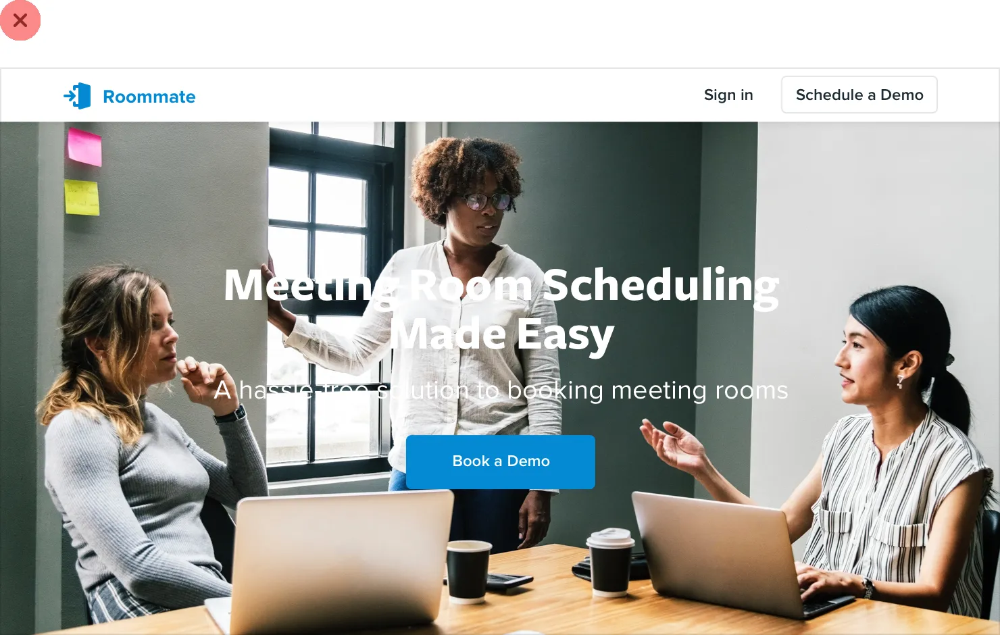

**Working with Images**

**Use good photos**

Bad photos will ruin a design, even if everything else about it looks
great.

If your design needs photography and you’re not a talented photographer,
you’ve got two options:

1\. **Hire a professional photographer.**

If you need very specific photos for your project, entrust a
professional.

Taking great photos isn’t just about using an expensive camera, it’s
about lighting, composition, color — skills that take years to develop.

201

Use good photos

2\. **Use high quality stock photography.**

If your needs are more generic, there are tons of great resources out
there where you can purchase great stock photos. There are even sites
like Unsplash that offer beautiful photography for free.

Whatever you do, don’t design using placeholder images and expect to be
able to take some photos with your smartphone and swap them in later. It
never works.

