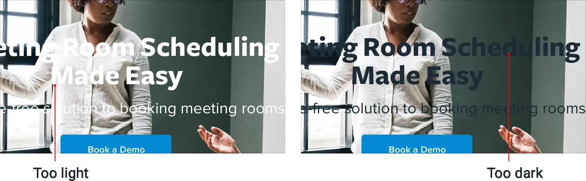

**Text needs consistent contrast**

Ever tried to slap a headline on a big hero image, only to find that no
matter what color you tried for the text, it was still hard to read?

That’s because the problem isn’t the text, it’s the image.

**The problem with background images**

Photos can be very dynamic, with a lot of really light areas, and a lot
of really dark areas. White text might look great in the dark areas, but
it gets lost in the light areas. Dark text looks great in the light
areas, but gets lost in the dark areas.

203

Text needs consistent contrast

To solve this problem, you need to *reduce* the dynamics in the image to
make the contrast between the text and the background more consistent.

**Add an overlay**

One way to increase the overall text contrast is to add a
semi-transparent overlay to the background image.

Text needs consistent contrast

204

A black overlay will tone down the light areas and help light text stand
out, while a white overlay will brighten up the dark areas and help dark
text stand out.

**Lower the image contrast**

One of the compromises you make when using an overlay is that you’re
lightening or darkening the *whole* image, not just the problem areas.

If you want more control, another solution is to lower the contrast of
the image itself:

Lowering the contrast will change how light or dark the image feels
overall, so make sure to adjust the brightness to compensate.

205

Text needs consistent contrast

**Colorize the image**

Another way to help text stand out against an image is to colorize the
image with a single color.

Some photo editing software includes this as a first-class feature, but
if yours doesn’t, you can create this effect in three steps: 1. **Lower
the image contrast**, to balance things out a bit.

2\. **Desaturate the image**, to remove any existing color.

3\. **Add a solid fill**, using the “multiply” blend mode.

This can also be a great way to make a background image pair more nicely
with your existing brand colors.

Text needs consistent contrast

206

**Add a text shadow**

If you want to preserve a bit more of the dynamics in a background
image, a text shadow can be a great way to increase contrast only where
you need it most.

You want it to look more like a subtle glow than an actual shadow, so
use a large blur radius and don’t add any kind of offset.

It’s still a good idea to reduce the overall image contrast, but
combining that with a text shadow means you can reduce it a little less.

207

Text needs consistent contrast

