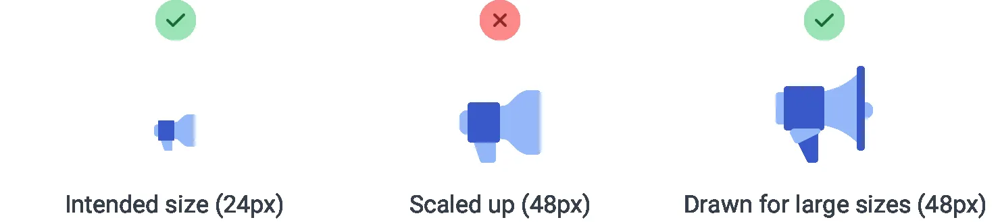
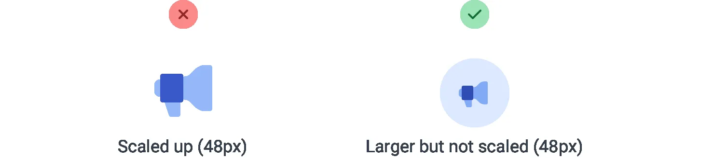
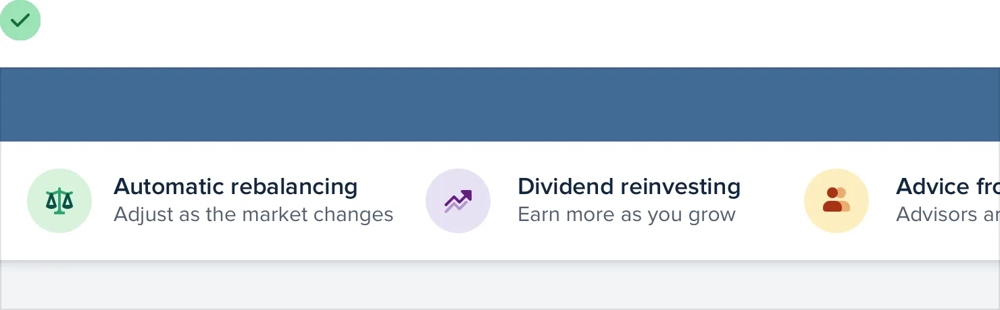
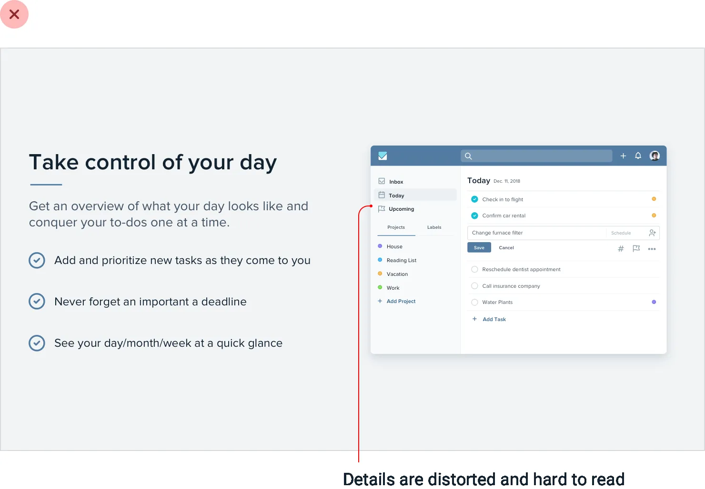
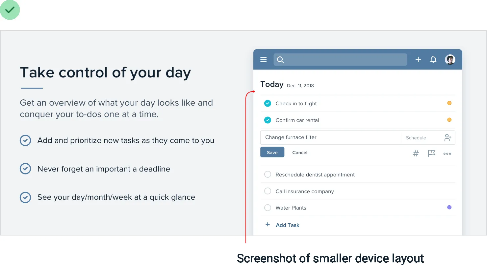
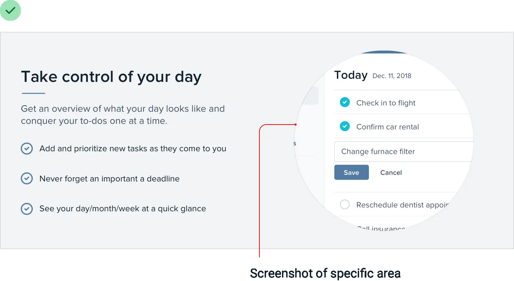
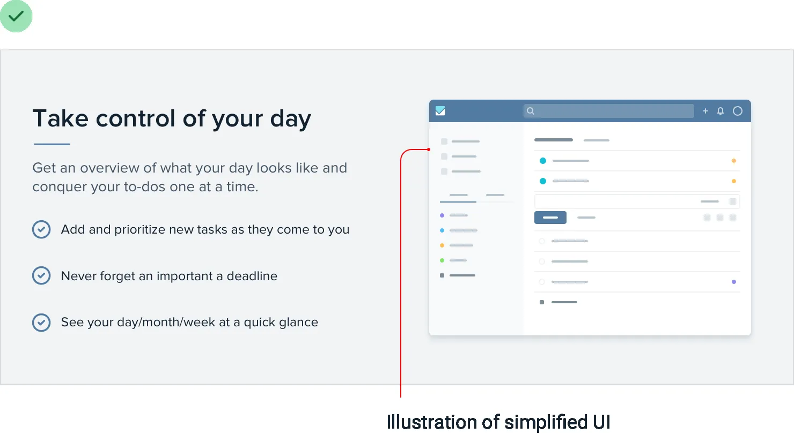
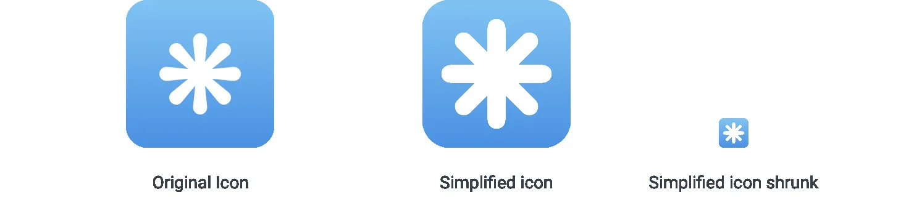
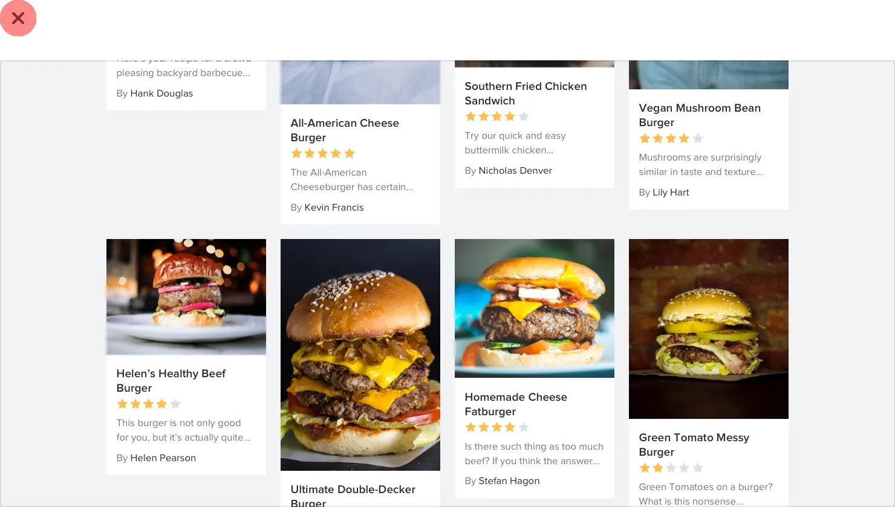

**Everything has an intended size**

Everyone knows that scaling bitmap images to larger than their original
size is a bad idea — they immediately feel “fuzzy” and lose their
definition.

But that’s not the only way you can go wrong with scaling, even when you
think you’re playing it safe.

**Don’t scale up icons**

If you’re designing something that could use some large icons *(like
maybe* *the “features” section of a landing page)*, you might
instinctively grab your favorite SVG icon set and bump up the size until
they fit your needs.

They’re vector images after all, so the quality isn’t going to suffer if
you increase the size, right?

209

Everything has an intended size

While it’s true that vector images won’t degrade in quality when you
increase their size, icons that were drawn at 16–24px are never going to
look very professional when you blow them up to 3x or 4x their intended
size. They lack detail, and always feel disproportionately “chunky”.

If small icons are all you’ve got, try enclosing them inside another
shape and giving the shape a background color:

This lets you keep the actual icon closer to its intended size, while
still filling the larger space.

Everything has an intended size

210

**Don’t scale down screenshots**

Say you want to include a screenshot of your app on that same features
page.

If you take a full-size screenshot and shrink it by 70% to make it fit,
you’ll end up with an image that’s trying to cram way too much detail
into far too little space.

The 16px font in your app becomes a 4px font in your screenshot, and
visitors will be squinting with their eyeballs two inches from the
screen, struggling to make out what all that text says.

If you want to include a detailed screenshot in your design, take the
screenshot at a smaller screen size *(like maybe your tablet layout)*
and save a

211

Everything has an intended size

lot of space for it so you don’t have to shrink it as much: Or consider
taking just a partial screenshot, so you can display it in less space
without needing to scale it down:

Everything has an intended size

212

If you really need to fit a whole-app screenshot in a tight space, try
drawing a simplified version of the UI with details removed and small
text replaced with simple lines:

It’ll still communicate the big-picture design without tempting visitors
to try and make out all of the details.

**Don’t scale down icons, either**

Just as icons drawn to be used at 16px look chunky when you scale them
up, icons intended to be used at larger sizes look choppy and fuzzy when
you scale them down.

The most extreme example of this are favicons, those little icons you
see next to the page title in a browser tab.

If you try to shrink a logo drawn at 128px down to favicon size, it all
turns to

213

Everything has an intended size

mush as the browser tries its best to render all of that detail in a
tiny 16px square:

A better approach is to redraw a super simplified version of the logo at
the target size, so you control the compromises instead of leaving it up
to the browser:

