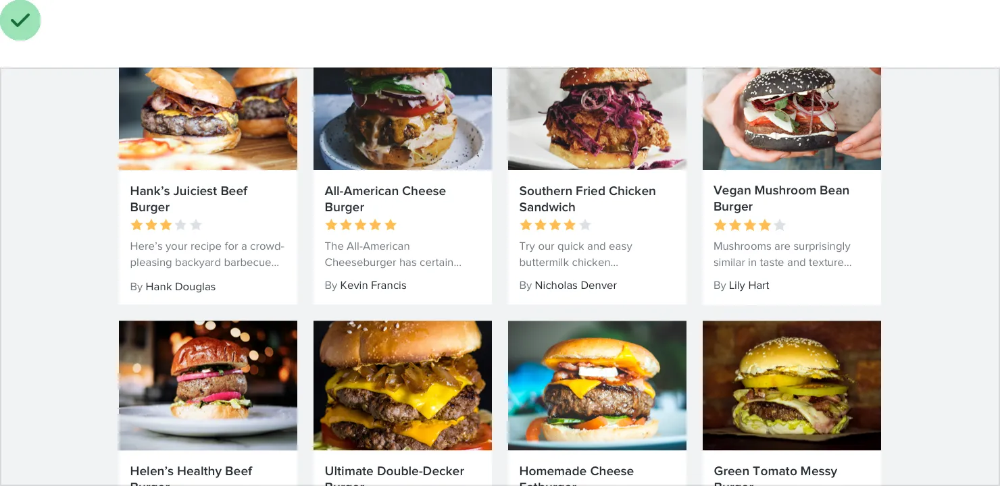
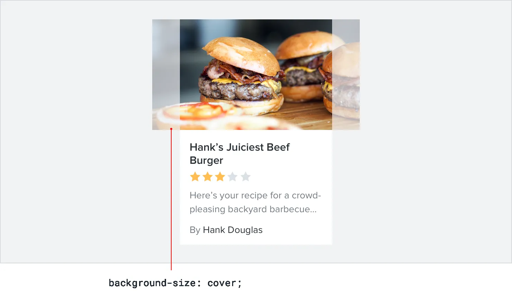
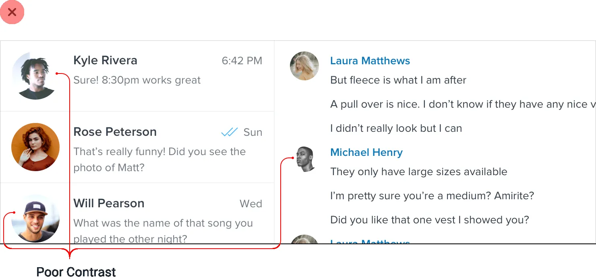
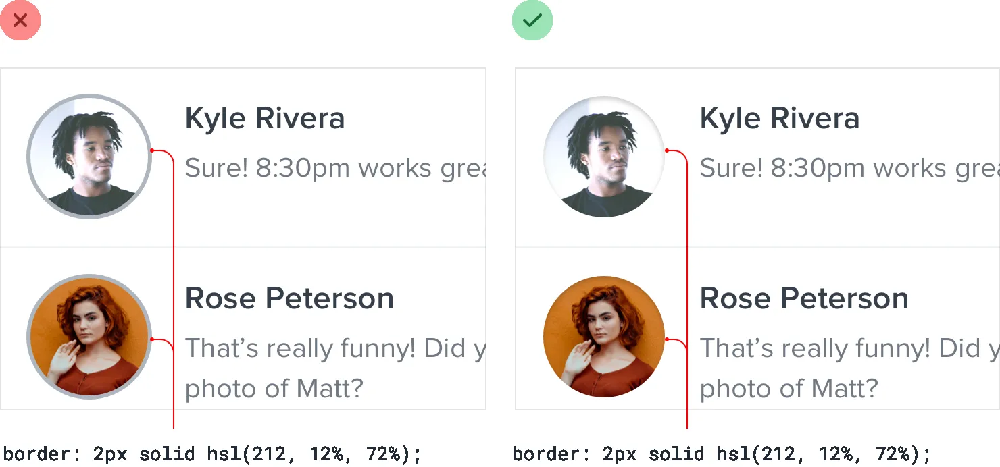
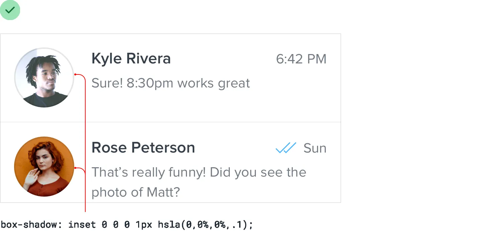

**Beware user-uploaded content**

When you’re depending on user-uploaded images, you don’t have the luxury
of fine-tuning contrast, carefully adjusting colors, or cropping the
perfect frame.

While you’ll always be at your users’ mercy to some extent, there *are*
a few things you can do to make sure their content doesn’t completely
undermine your design.

**Control the shape and size**

Displaying user-uploaded images at their intrinsic aspect ratio can
really throw off a layout, especially if there are a lot of images on
the screen at once.

215

Beware user-uploaded content

Instead of letting users wreak havoc on your page structure, center
their images inside fixed containers, cropping out anything that doesn’t
fit.

This is really easy to do with CSS these days by making the image a
background image, and setting the background-size property to cover.

Beware user-uploaded content

216

**Prevent background bleed**

When a user provides an image with a background color that’s similar to
the background in your UI, the image and the background can bleed
together, causing the image to lose its shape.

Instead of trying to solve this with a border, try using a subtle inner
box shadow:

217

Beware user-uploaded content

Borders will often clash with the colors in the image, while most people
will barely even realize the shadow is there.

If you don’t like the slight “inset” look you get from using a box
shadow, a semi-transparent inner border works great, too.

