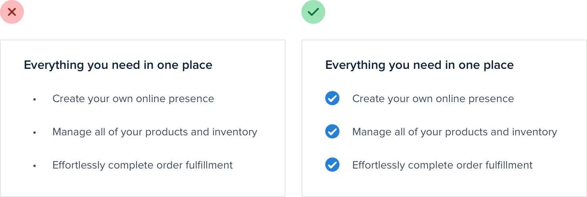
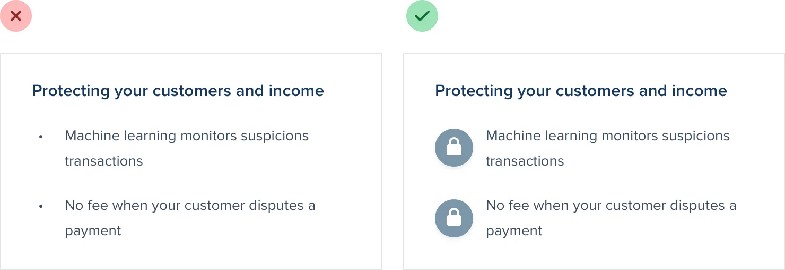
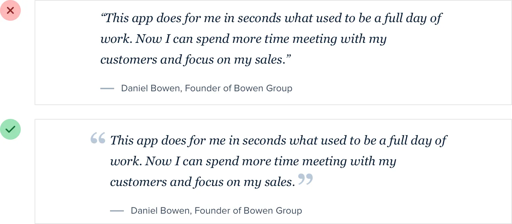
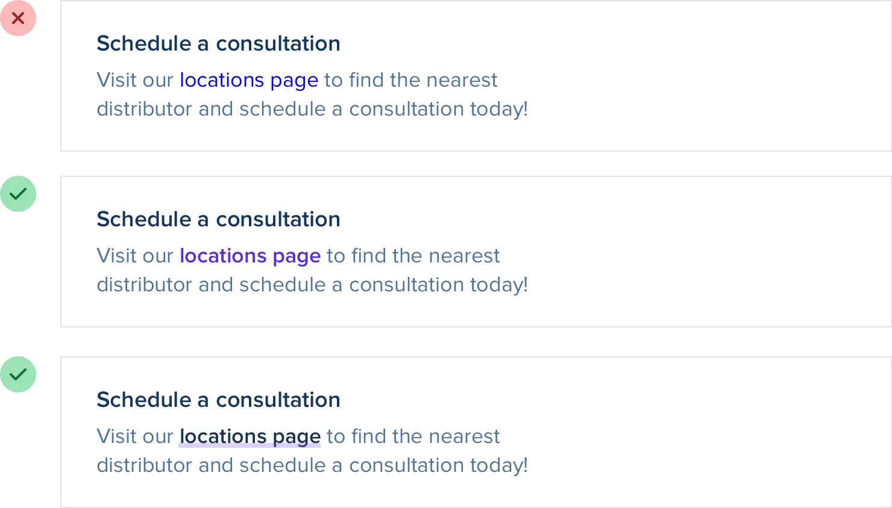
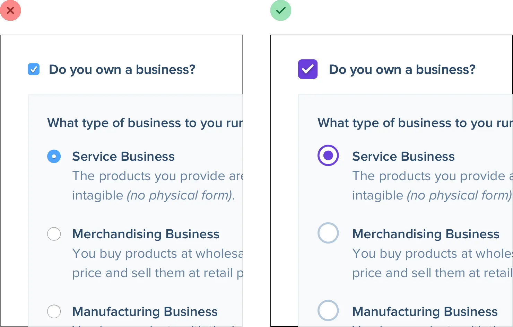
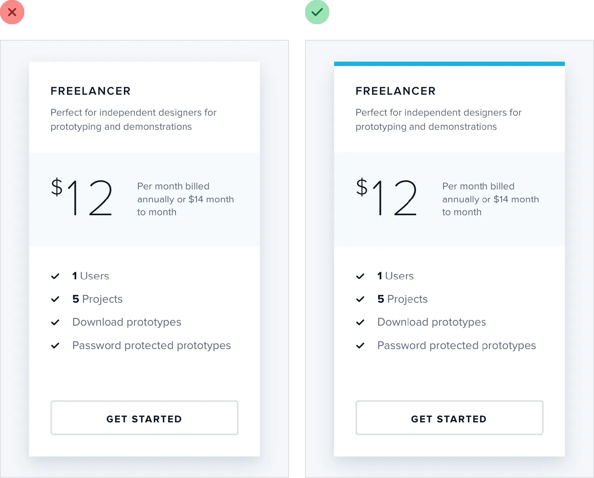

**Finishing Touches**

**Supercharge the defaults**

You don’t always have to add new elements to a design to add flare —
there are a lot of ways to liven up a page by “supercharging” what’s
already there.

For example, if your design includes a bulleted list, try replacing the
bullets with icons:

Checkmarks and arrows are great generic choices for a lot of situations,
but you can also use something more specific to your content, like a
padlock icon for a list of security-related features:

221

Supercharge the defaults

Similarly, if you’re working on a testimonial try “promoting” the quotes
into visual elements by increasing the size and changing the color:
Links are another great candidate for special styling. You can do
something as simple as changing the color and font weight, or something
as fancy as a thick and colorful custom underline that partially
overlaps the text:

Supercharge the defaults

222

If you’re working on a form, using custom checkboxes and radio buttons
is an easy way to add some color to the design:

Just using one of your brand colors for the selected states instead of
the browser defaults is often enough to take something from feeling
boring to feeling polished and well-designed.

223

Supercharge the defaults

