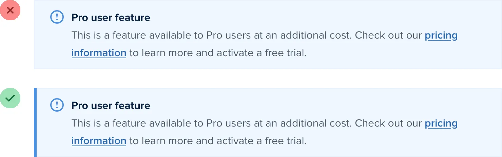

**Add color with accent borders**

If you’re not a graphic designer, how do you add that dash of visual
flair to your UI that other designs get from beautiful photography or
colorful illustrations?

One simple trick that can make a big difference is to add colorful
accent borders to parts of your interface that would otherwise feel a
bit bland.

For example, across the top of a card:

225

Add color with accent borders

…or to highlight active navigation items:

…or along the side of an alert message:

…or as a short accent underneath a headline:

Add color with accent borders

226

…or even across the top of your entire layout:

It doesn’t take any graphic design talent to add a colored rectangle to
your UI, and it can go a long way towards making something feel more

“designed.”

227

Add color with accent borders

