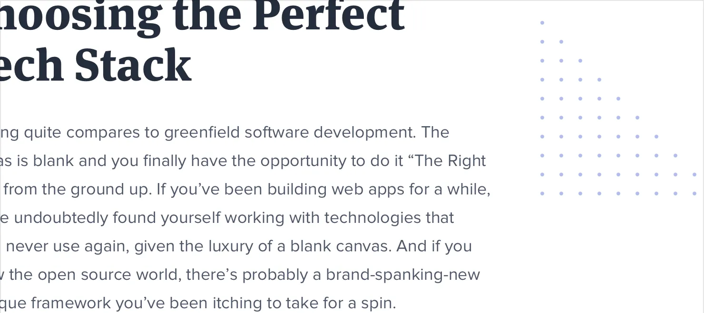

**Decorate your backgrounds**

Even if you do a great job with hierarchy, spacing, and typography,
sometimes a design will still feel a little bit plain.

A great way to break up some of the monotony without drastically
altering the design is to add some excitement to a few of your
backgrounds.

**Change the background color**

One way to add some excitement to a background is to simply change the
color.

229

Decorate your backgrounds

This works great for emphasizing an individual panel, as well as for
adding some distinction between entire page sections.

For a more energetic look, you could even use a slight gradient: For
best results, use two hues that are no more than about 30° apart.

Decorate your backgrounds

230

**Use a repeating pattern**

Another approach is to add a subtle repeatable pattern, like this one
from

[Hero Patterns:](http://www.heropatterns.com/)

You don’t have to necessarily repeat it across the entire background,
either

— a pattern designed to repeat along a single edge can look great, too.

Keep the contrast between the background and the pattern pretty low to
ensure readability.

231

Decorate your backgrounds

**Add a simple shape or illustration**

Instead of decorating an entire background, you can also try including
an individual graphic or two in specific positions.

Simple geometric shapes work well for this:

…as do small chunks of a repeatable pattern:

Decorate your backgrounds

232

You can even do something more complex, like a simplified world map:
Just like with a full background pattern, it’s best to keep the contrast
low so nothing interferes with the content.

233

Decorate your backgrounds

