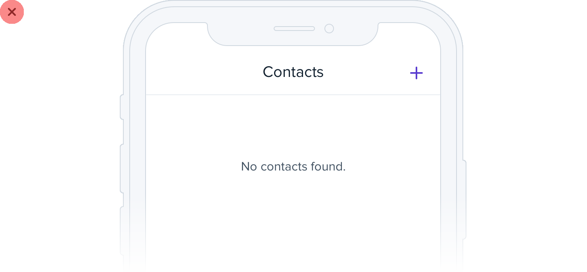
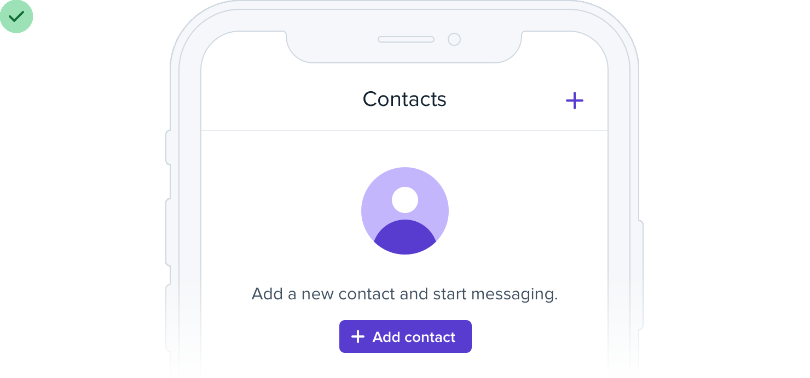
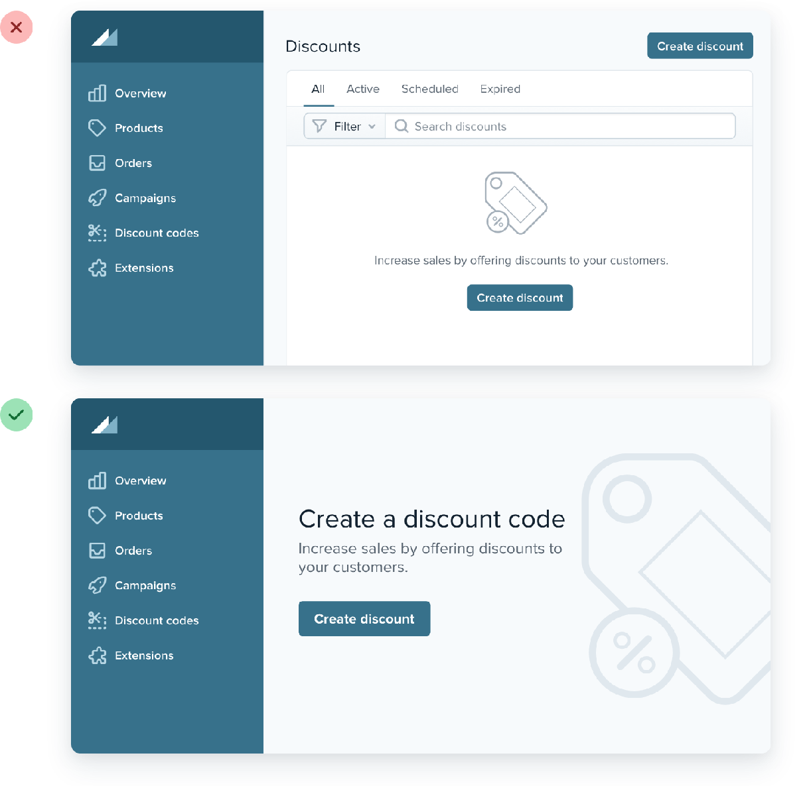
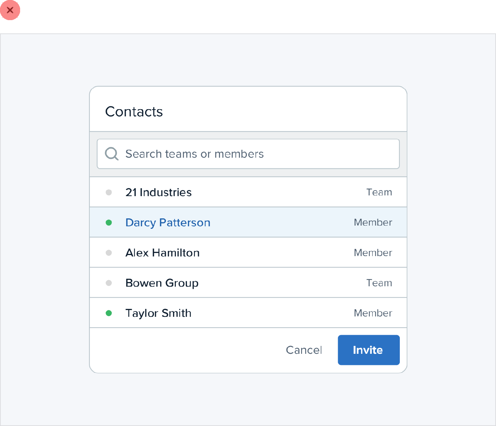

**Don’t overlook empty states**

Imagine you’re designing a new feature for an app you’re working on.

You’ve spent a ton of time crafting the perfect realistic sample data,
picking out usernames and avatars, and putting together a beautiful and
electrifying screen.

235

Don’t overlook empty states

You code it all up and deploy it to production. But when an excited user
clicks the new item in the nav, they see this:

If you’re designing something that depends on user-generated content,
the empty state should be a priority, not an afterthought.

Try incorporating an image or illustration to grab the user’s attention,
and emphasizing the call-to-action to encourage them to take the next
step:

Don’t overlook empty states

236

If you’re working on something that has a bunch of supporting UI like
tabs or filters, consider hiding that stuff entirely. There’s no point
in presenting a bunch of actions that don’t do anything until the user
has created some content.

Empty states are a user’s first interaction with a new product or
feature. Use them as an opportunity to be interesting and exciting —
don’t settle for plain and boring.

237

Don’t overlook empty states

