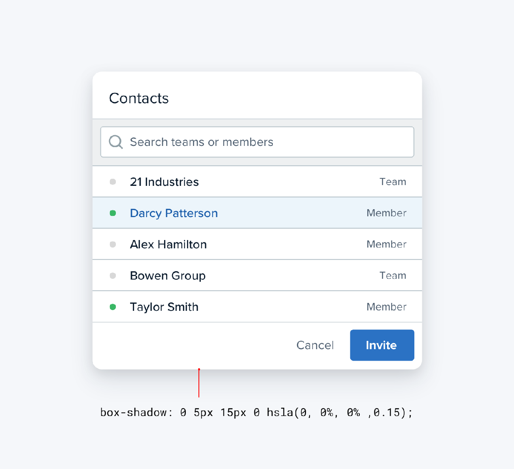

**Use fewer borders**

When you need to create separation between two elements, try to resist
immediately reaching for a border.

While borders are a great way to distinguish two elements from one
another, they aren’t the only way, and using too many of them can make
your design feel busy and cluttered.

239

Use fewer borders

**Use a box shadow**

Box shadows do a great job of outlining an element like a border would,
but can be more subtle and accomplish the same goal without being as
distracting.

This approach works best when the element you are applying the box
shadow to is not the same color as the background.

Use fewer borders

240

**Use two different background colors**

Giving adjacent elements slightly different background colors is usually
all you need to create distinction between them.

If you’re already using different background colors in addition to a
border, try removing the border; you might not need it.

241

Use fewer borders

**Add extra spacing**

What better way to create separation between elements than to simply
increase the separation?

Spacing things further apart is a great way to create distinction
between groups of elements without introducing any new UI at all.

