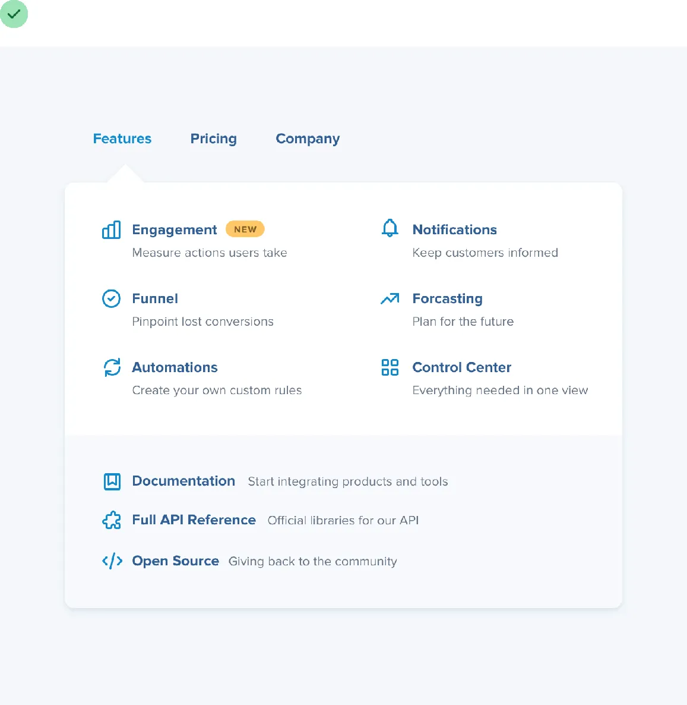
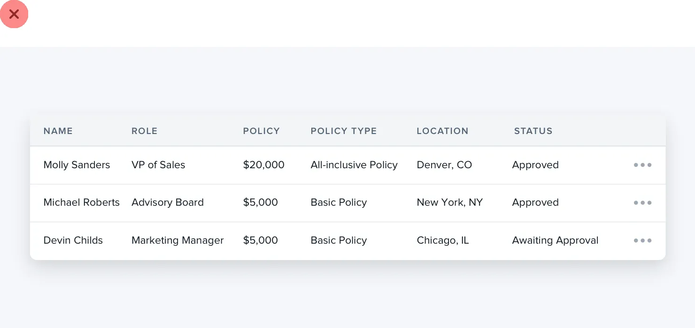
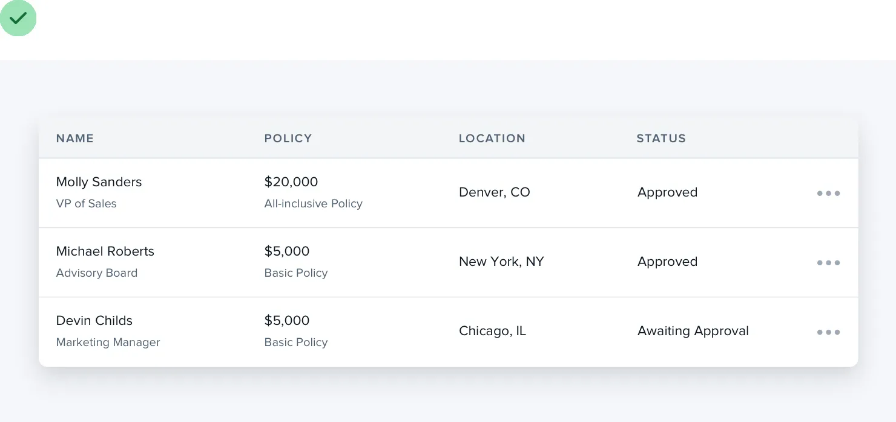
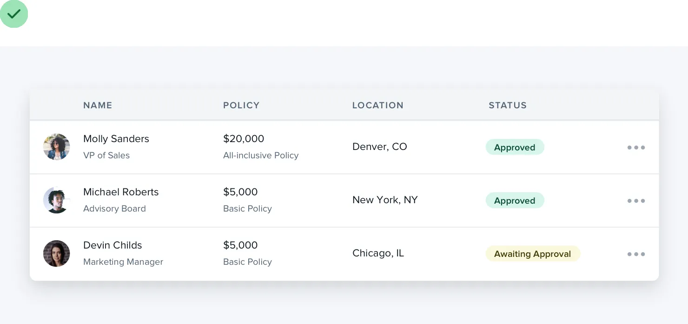
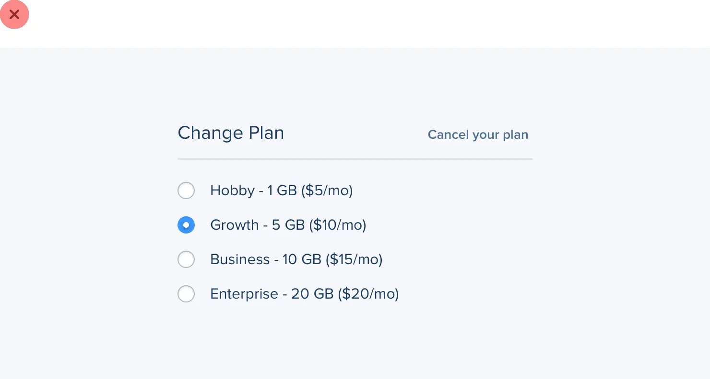
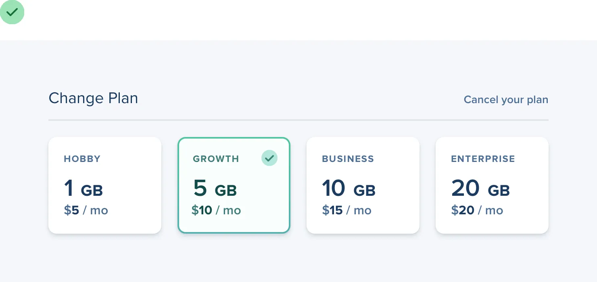

**Think outside the box**

Most people have a lot of preconceived notions about how certain
components are supposed to look. But just because we’ve been conditioned
to believe that there’s only one way to design a particular component,
doesn’t mean it’s true.

For example, picture a dropdown menu. You’re probably picturing a white
box with a bit of a drop shadow and a list of links stacked inside of
it:

243

Think outside the box

But who says a dropdown needs to be a boring list of links? It’s just a
floating box on the screen, you can do anything you want with it.

Break it into sections, use multiple columns, add supporting text or
colorful icons — do something fun with it!

And don’t just stop at dropdowns; what about something like a table?

Think outside the box

244

When you imagine a table, you probably think of columns that each
contain one specific piece of data:

Tables don’t *have* to work this way, though — if a column doesn’t need
to be sortable, there’s no reason you can’t combine it with a related
column and introduce some interesting hierarchy:

245

Think outside the box

Table content doesn’t have to be plain text, either. Add images if it
makes sense, or introduce some color to enrich the existing data: How
about radio buttons? There’s nothing more boring than a stack of labels
with little circles next to them.

Think outside the box

246

If a set of radio buttons are an important part of the UI you’re
designing, try something like selectable cards instead:

Don’t let your existing beliefs hold back your designs — constraints are
powerful but sometimes a bit of freedom is just what you need to take an
interface to the next level.

