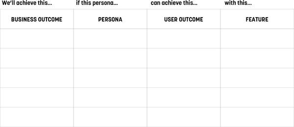
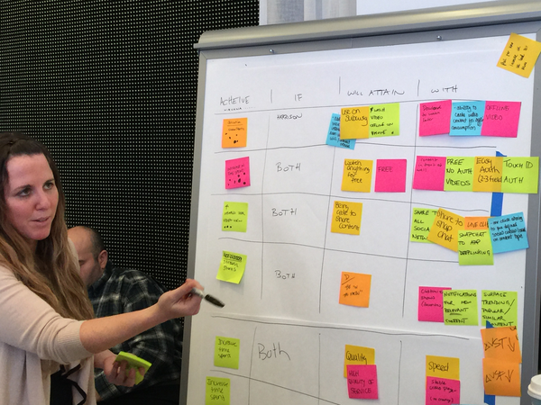
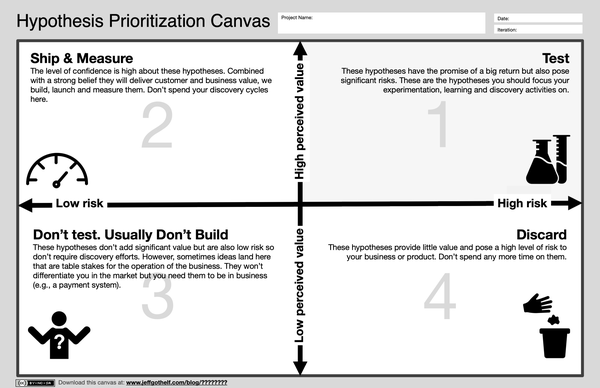

# 专题二：假设驱动 (Hypotheses)

> **知识来源**：《Lean UX》Chapter 5, 6, 10: Business Problem, Outcomes, and Hypotheses
> **关联周次**：W04 假设驱动与 MVP 构建

在传统的软件工程中，团队往往接受的是“需求文档 (Requirements)”和“功能规格 (Feature Specifications)”。但在精益用户体验 (Lean UX) 中，这种基于确定性输出的研发模式被**假设驱动 (Hypothesis-Driven)** 所取代。因为要想让团队创新，就必须给他们**要解决的问题**，而不是**要构建的解决方案**。

## 1. 从商业问题到商业产出 (Business Outcomes)

在构建任何假设之前，我们必须厘清业务诉求的层次。

### 商业问题陈述 (Business Problem Statement)
一个优秀的商业问题陈述绝不应该包含具体的解决方案。它应该：
- 为团队提供一个明确的挑战，而非一堆待实现的功能清单。
- 将团队锚定在以客户为中心的视角上。
- 明确界定范围与约束，让团队清楚什么在范围内，什么在范围外。
- 提供明确的成功衡量标准（KPI 或客户期望的行为变化）。

#### 商业问题陈述工作坊与模板
我们建议在工作坊中由整个团队协作起草。具体引导步骤如下：
1. **提供上下文**：由产品经理为团队解答为何要做、受众是谁、商业影响是什么。
2. **分组起草**：团队分为 2-3 人的小组，在 30 分钟内完成第一版草案。
3. **整合陈述**：各组分享草案并相互点评（非攻击性，而是为了澄清），随后合并为更大的小组（4-5人）进行整合，最终全队花 30 分钟敲定一个统一的商业问题陈述。
> 记住，陈述充满了早期的假设，不必追求完美，关键是建立团队共识。

对于**现有产品**的改进，可以使用以下模板：
> **[我们的服务/产品]** 最初是为了实现 **[这些商业/客户目标并交付此价值]** 而设计的。我们观察到 **[以这些方式]** 产品未能实现这些目标，这给我们的业务造成了 **[这种不利影响/问题]**。
> 
> 我们该如何改进服务/产品，使我们的客户更成功？这种成功将通过 **[他们行为的这些可衡量变化]** 来判定。

对于**全新项目**，模板如下：
> 目前 **[我们工作的领域]** 的现状主要集中在 **[这些细分客户、这些痛点、这些工作流等]**。
> 
> 现有产品/服务未能解决的是 **[市场上的这种差距或变化]**。
> 
> 我们的产品/服务将通过 **[这种产品策略或方法]** 解决这一差距。我们最初的重点将是 **[这个细分受众]**。
> 
> 当我们在目标受众中看到 **[这些可衡量的行为]** 时，我们就会知道我们成功了。

> [!TIP]
> **优秀陈述示例**：我们注意到客户很难找到密码找回功能，即使找到，也有 42% 的人因为流程复杂而无法自行完成。这导致呼叫中心成本增加了 12%，并加剧了客户不满。我们该如何重新设计密码找回体验，使过程完成率达到 90%，并将相关客服电话减少 50%？（这是一个极好的、不涉及具体技术方案的、战术级的问题陈述）。
> **反面教材**：“我们该如何创造一个更直观的 UI，让客户在每次访问时添加更多商品到购物车？”（这里规定了“只能通过修改 UI”来解决问题，限制了团队去寻找订单量下降的真正根源）。

### 商业产出 (Business Outcomes)：领先指标 vs 滞后指标
高管们关注的往往是利润、营收、市占率等**影响指标 (Impact Metrics)**，这些通常是**滞后指标 (Lagging Indicators)**，也就是向后看的历史成绩。
对于在一线作战的产品团队而言，我们需要寻找**领先指标 (Leading Indicators)**，也就是具体的客户行为变化——**“如果我们的解决方案有效，人们的行为会有什么不同？”** 这种客户行为的改变，就是我们在假设中要追求的**商业产出 (Business Outcomes)**。

> 在头脑风暴这些商业产出时，**每一个选项都应该以动词开头**。它可以是客户已经在做的有价值的事，或者是我们希望他们少做的事，又或者是我们希望他们开始做的全新行为。

为了找到这些有价值的客户行为，我们可以使用用户旅程模型，例如：
- **海盗指标 (Pirate Metrics - AARRR)**: 获取 (Acquisition)、激活 (Activation)、留存 (Retention)、收入 (Revenue)、推荐 (Referral)。
- **指标山峰 (Metrics Mountain)**: 相比于必然会漏出的漏斗模型，登山模型更贴切地描述了用户在使用产品过程中克服阻力、不断攀登直至顶峰（成为高价值用户）的流失过程。

*图 6-2：指标山峰 (Metrics Mountain)。*

#### 产出到影响的映射 (Outcome-to-Impact Mapping)
为了建立团队的全局观，我们可以通过白板连线的方式，将团队战术级的工作与高管关心的战略目标连接起来：
1. **顶层目标**：要求在场职位最高的人（高管）在白板最上方写下年度战略目标。
2. **影响指标**：在下方写下衡量该战略的滞后指标（Impact Metrics）。
3. **推导行为（第一层）**：让团队通过头脑风暴，用便利贴写下“什么具体的客户行为”能够驱动上述指标，贴在下方并连线（Leading Indicators）。
4. **多级展开（第二层及更多）**：在下方继续绘制新的一行，推导“驱动上述第一层行为的更底层行为”。

*图 6-3：将底层的客户行为（产出）连接至高管关心的滞后指标（影响）。*

最后，通过点赞投票（Dot Voting）选出团队下一周期最应该优先专注的 10 个行为指标（Outcomes）。

*图 6-4：King 团队真实的产出到影响的映射地图。真实的商业环境不是线性的，一个底层行为往往会驱动多个高层指标。*

> [!WARNING]
> **警惕假指标**：并非所有的数字或百分比都是“产出 (Outcome)”。例如，“货架上属于我们品牌的商品百分比”或“现在由系统自动完成的手动任务百分比”，这些都是**系统特性的变化**或产品策略决定，而不是**客户行为的衡量标准**。我们的目标是追踪**人的行为变化**（如：员工将节省下来的时间用于何处）。

## 2. 假设陈述 (Hypothesis Statement)

在产品开发中，“假设”一词越来越流行，这很大程度上归功于《精益创业》中所倡导的科学实验精神。所谓假设，就是“基于有限的证据，作为进一步调查起点的推测或拟议的解释”。

我们将之前的商业问题、用户画像和潜在解决方案融合在一起，形成一个战术性的、可测试的假设声明。在 Lean UX 中，标准的假设陈述模板如下：

> 我们相信我们会实现 **[这个商业产出]**
> 如果 **[这个受众/画像]**
> 获得了 **[这个利益/用户产出]**
> 通过 **[这个功能或解决方案]**

**(We believe we will achieve [this business outcome] If [these personas] Attain [this benefit/user outcome] With [this feature or solution])**

#### 如何推导和生成假设 (Facilitating the Exercise)
我们建议在白板上绘制一个横跨画布第 2 框（商业产出）至第 5 框（解决方案）的表格。团队成员把之前的便利贴物理移动到对应的列中，将其连成一行逻辑清晰的想法链条。

*图 10-2：假设推导表格结构。*

*图 10-3：通过便利贴对齐，强迫团队检查某个功能是否有清晰对应的画像和商业价值。*

在这个过程中，你会发现早期的头脑风暴存在漏洞：比如有些商业产出根本没有匹配的功能，或者有些功能既不能为客户提供价值也不能驱动商业产出（这些通常是“老板想要的功能”）。把不相关的想法丢掉，最终提取出 7-10 行逻辑自洽的、可供测试的连贯假设。

> [!IMPORTANT]
> **这与敏捷用户故事 (Agile User Stories) 有何不同？**
> 经典的敏捷用户故事通常是：“作为一个 `<某种用户>`，我想要 `<某个功能>`，以便于 `<实现某个目标>`。” 然而在实操中，团队往往忽略了后半段的目标，只专注于把功能做出来，**团队的成功变成了“能否快速交付功能”**。
> **假设陈述**将“行为的改变（商业产出）”作为成功的定义。交付上线只是对话的开始，我们通过客户是否真正达成了目标、业务是否产生了积极的数据变化来衡量成功。它将团队的关注点从“拼凑功能”拉回到“创造价值”。

## 3. 假设优先级矩阵 (Hypothesis Prioritization Canvas, HPC)

Lean UX 是一个关于**无情优先级排序 (Ruthless Prioritization)** 的过程。由于项目预算和时间有限，我们不可能去测试所有的假设。我们需要找出那些**风险最高**的假设优先测试。

团队可以通过一个 2×2 的**假设优先级矩阵 (HPC)** 进行决策。X轴代表**风险 (Risk)**，Y轴代表**感知价值 (Perceived Value)**。

*图 10-4：假设优先级矩阵 (HPC)*

评估后，假设会落入四个象限，团队应采取不同的策略：

1. **第一象限（高价值，高风险）-> 重点测试**：
   这些是对业务影响巨大，但在技术、品牌体验或设计实施上充满不确定性的假设。它们是我们最需要利用 MVP（最小可行产品）去验证的对象。
2. **第二象限（高价值，低风险）-> 直接构建并测量**：
   这些是业务价值明显且实施风险低的想法。直接把它们放入敏捷待办列表（Backlog）去开发，上线后记得持续测量即可。
3. **第三象限（低价值，低风险）-> 基础设施**：
   虽然价值不高，但往往是维持业务运转所必须的“基础功能”（例如电商的支付系统）。只做基础版，不需花费精力测试。
4. **第四象限（低价值，高风险）-> 彻底抛弃**：
   不值得构建，更不值得测试。

> [!TIP]
> **避雷指南**：
> 1. **具体性 (Specificity)**：千万不要使用“更好的用户体验”或“直观的界面”这类模糊词汇。你应该用更具体的表述，比如“一键结账”或“面部识别认证”来替换它。
> 2. **切忌过大 (Too big to test)**：初学者常犯的错误是写出范围大到无法测试的假设。如果你的假设包含了多个功能或多重产出，请将其缩小并拆分，直到团队能够完全掌控其测试范围。
