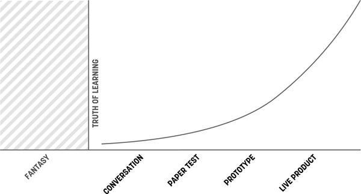
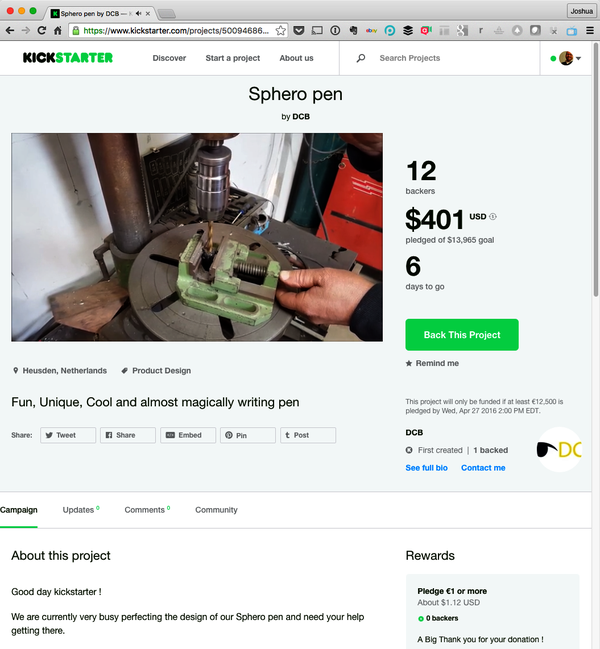
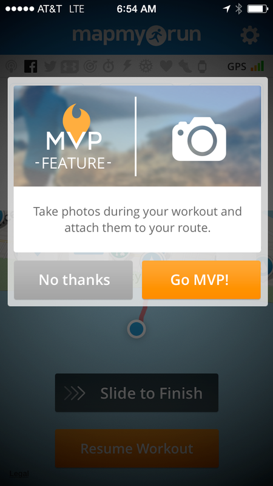
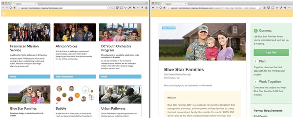
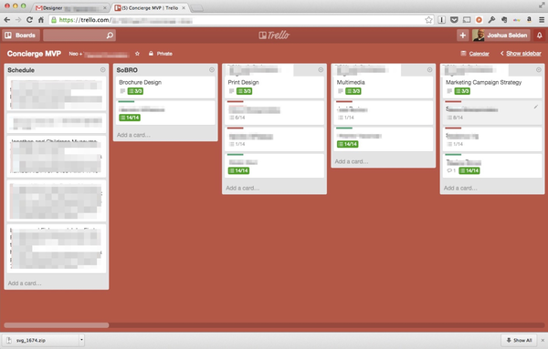
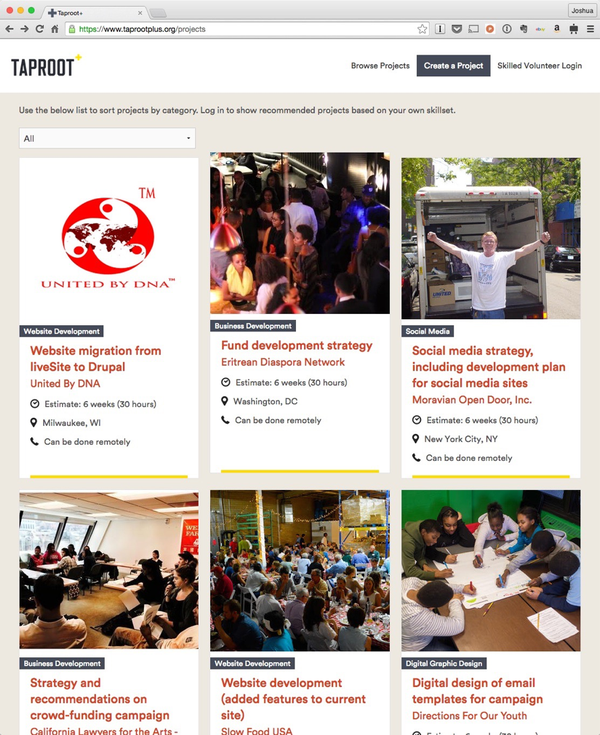

# 专题三：最小可行产品与实验 (MVPs and Experiments)

> **知识来源**：《Lean UX》Chapter 12: Box 8: MVPs and Experiments
> **关联周次**：W04 假设驱动与 MVP 构建

Lean UX 画布的最后一步是专注于实验。我们需要回答一个核心问题：**“为了学习到下一个最重要的事情，我们需要做的最少工作量是多少？”**
这个问题的答案，就是你要用来测试假设的实验。做最少的工作并不是懒惰，而是精益。因为任何用于测试想法的额外工作都是浪费（Waste）。

在 Box 8 中，你设计出来的实验就是你的**最小可行产品 (MVP, Minimum Viable Product)**。

## 1. 到底什么是 MVP？

如果你问一屋子的技术人员“什么是 MVP”，你可能会得到诸如“它是我们能最快发布且能跑通的东西”或者“它是项目的第一期 (Phase 1)”这类答案。
在业界，MVP 经常被误解为一个“小而快的功能发布”。但在 Lean UX 中，我们必须纠正这种认知：

> **MVP 是用来快速学习某种事物的极简方法。**

有时候，MVP 是一次软件发布；但更多时候，它根本不是软件——它可以是一张草图、一个着陆页 (Landing Page) 或一个原型。
构建 MVP 的主要目的**不是创造客户价值，而是创造认知 (Learning)**。尽管好的 MVP 通常能同时产生两者，但请牢记：MVP 的核心焦点是获取认知。

### 案例：我们应该推出一份电子报 (Newsletter) 吗？
一家公司想推出每月的电子报，这需要极高的内容运营成本。团队没有直接开发电子报系统，而是把这个想法当成一个假设。
他们问自己：*我们需要首先学习到的最重要的事情是什么？* 答案是：*客户是否有足够的需求来证明我们值得投入精力？*
他们的 MVP 只是在现有网站上加了一个“订阅电子报”的表单框，花了半天时间上线。这个表单暂时无法为客户提供任何价值，它的唯一目的是：**测量需求**。如果没人填表，就不开发；如果数据积极，再进入下一个 MVP 阶段。

## 2. 真相曲线 (The Truth Curve)

你应该在 MVP 上投入多少精力？Giff Constable 提出的**“真相曲线”**给出了完美的解答。

*图 12-2：真相曲线 (The Truth Curve)。*

- **X 轴**：你投入到 MVP 中的工程/设计成本。
- **Y 轴**：你目前掌握的关于该想法的市场证据。

**核心法则**：你投入到 MVP 中的努力程度，必须与你拥有的“证明该想法是个好主意的证据”成正比。
证据越少，你投入的努力就应该越少。如果在一个毫无证据的假设上投入大量工程开发，那就是纯粹的浪费。

## 3. 常见的高效 MVP 类型

为了在不同的“真相曲线”阶段获取证据，我们可以采用不同类型的 MVP 实验策略：

### A. 着陆页测试 (Landing Page Test)
这种 MVP 帮助团队确定市场需求。它包含一个具有清晰价值主张的营销页面、一个行动号召 (CTA) 以及衡量转化率的方法。
如果没人点击转化，可能意味着想法没价值，也可能只是故事没讲好。但好在它极其便宜且迭代极快。实际上，像 Kickstarter 这样的众筹网站，本质上就是成千上万个着陆页 MVP 的集合。

*图 12-3：Kickstarter 上的产品众筹页面就是典型的着陆页 MVP。*

### B. 伪造功能 (Feature Fake / Button to Nowhere)
当实现某个功能的成本极高时，制造该功能已经存在的“假象”会更便宜、更快捷。
例如，提供一个按钮，当用户点击时，弹出一个通知告诉用户“该功能即将推出，留下邮箱以便上线后通知您”。
这不仅能像着陆页一样测量兴趣，还能衡量用户的真实点击意愿。Flickr 和 MapMyRun 等成熟产品都曾使用过这种策略来探测用户对高级付费功能的需求。

*图 12-6：MapMyRun 网站上的伪造功能测试。*

### C. 绿野仙踪 (Wizard of Oz)
当你证明了需求存在后，你可以用“绿野仙踪”式 MVP 来弄清楚产品的内部运行机制。
这种 MVP 在用户看来是一个功能齐全的数字化服务。但**在幕后，所有的数据处理和业务沟通其实是由人类手动完成的**。
例如，亚马逊在研发 Echo 智能音箱时，为了测试人们会问什么类型的问题以及期望多快得到回复，他们在测试房间里放了一个“假”音箱设备。当用户呼唤“Alexa”提问时，隔壁房间的真人研究员会迅速在 Google 上搜索答案，然后通过音箱把答案念出来。用户完全不知道这不是人工智能。

> [!CAUTION]
> **深度案例：Taproot 基金会的志愿服务匹配系统**
> Taproot 基金会希望将其线下的“专业志愿者与非营利组织”的匹配业务搬到线上。面对诸如“双方应如何找到彼此？如何安排第一次通话？”等巨大的流程设计风险，团队没有直接写代码，而是构建了一个纯静态网页作为 MVP。
>
> 网站对外展示了 12 个试点项目。当志愿者点击邮件链接进入网站并提交申请时，**系统并没有写入数据库，而是直接给社区经理发了一封邮件**。社区经理在幕后使用 Trello 作为“数据库”来手动跟踪和匹配所有状态。
>
> 
> *图 12-7：看起来非常专业的 Taproot 申请网站。*
>
> 
> *图 12-8：幕后完全是人工驱动的 Trello 看板。*
>
> 团队用这种方式运行了几个月，通过真实的交互学习并优化了业务流程，最终才开发了真正的系统后台并升级了视觉（图 12-9）。这避免了花费大量金钱却开发出错误工作流的毁灭性风险。
>
> 
> *图 12-9：验证完商业流程后，最终落地的带有完整代码和视觉抛光的 Taproot Plus 网站。*

### D. 原型与无代码 (Prototyping & No-Code)
原型是最有效的 MVP 创建方式之一，但选择哪种保真度的原型取决于你的受众和时间：

1. **纸质原型 (Paper Prototypes)**
   - **优点**：一小时内可完成；成本极低；扔掉不可惜；是一个有趣的团队活动。
   - **缺点**：难以复制和分享；受限于极少数的现场观众；缺乏真实的交互感（如鼠标点击、键盘输入）。
2. **低保真屏幕线框图 (Low-Fi On-Screen Mock-Ups)**
   - **优点**：能够暴露出核心导航和工作流障碍；可以直接使用现有资产快速拼接。
   - **缺点**：测试者能明显感觉这是未完成的产品，从而过度关注占位文案而非流程本身。
3. **中高保真原型 (Mid/High-Fi On-Screen Prototypes)** (如 Figma, Axure)
   - **优点**：极度逼真；可以测试视觉设计和品牌元素。
   - **缺点**：如果不使用真实数据，依然存在交互局限；维护高保真原型非常耗时。
4. **无代码 MVP (No-Code MVP)** (利用 Airtable, Zapier 等拼接)
   - **优点**：无需工程师参与即可跑通真实的业务功能；让团队专注于差异化价值。
   - **缺点**：很难实现像素级的品牌视觉控制；难以在规模化后维护。
5. **真实代码与实时数据原型 (Coded and Live-Data Prototypes)**
   - **优点**：最高的真实度；甚至可以直接将代码转入生产环境。
   - **缺点**：开发耗时极长；团队往往会陷入“在上线前把代码写完美”的陷阱。

#### 原型里到底该放什么？(What Should Go into My Prototype?)
**只关注能让你测试假设中最大风险的核心工作流。**
完全不需要把整个产品体验都做成原型。只聚焦主要工作流会给团队带来一种暂时的“隧道视野”（这是好事），让团队集中精力评估特定体验的有效性，而不是在边缘功能上浪费时间。

### E. 游击测试与演示 (Demos and Previews)
不要把你建好的 MVP 藏在办公室里，把它带给真实的客户。
例如，某初创公司面临用户增长停滞，考虑向全新的市场群体转型并推出了新版社区设计。因为担心新老用户的双重流失，他们没有直接开发，而是花了一周时间制作了 5 张可点击的线框图放在 iPad 上。恰逢德州有一个目标客户大会，团队直接飞到德州，拿着 iPad 在会场走廊上“游击”测试。三天后，他们带着贴满反馈的便利贴回到纽约。**仅仅花了 8 个工作日，他们就获取了市场第一手的真实反馈，从而避免了盲目的架构重构。**

> [!TIP]
> **构建 MVP 了解价值 (Understand Value) 的铁律**
> 1. **直奔主题 (Get to the point)**：剔除所有边缘功能（如登录注册流程），把核心价值主张直接呈现给用户。
> 2. **测量行为，而非观点 (Measure behavior)**：必须有明确的 Call to Action，人们怎么做比怎么说更重要。
> 3. **与用户交谈 (Talk to your users)**：测量行为只告诉你他们做了什么，只有沟通才能告诉你“为什么”。
> 4. **无情地排雷 (Prioritize ruthlessly)**：想法是廉价的。如果实验数据与假设相悖，毫不留情地抛弃那个无效想法。
> 5. **保持敏捷 (Stay agile)**：使用能让你快速更新的工具。
> 6. **不要重复造轮子 (Don't reinvent the wheel)**：尽可能使用现成的工具（如微信群、问卷星、Shopify、No-Code 平台）来测试需求。

> [!TIP]
> **构建 MVP 了解技术实现 (Understand Implementation) 的铁律**
> 1. **具备功能性 (Be functional)**：必须与现有系统有一定程度的集成，以创造真实的使用场景。
> 2. **集成现有分析工具 (Integrate with existing analytics)**：在现有工作流的上下文中测量 MVP，有助于你理解看到的数据。
> 3. **与其余部分保持一致 (Be consistent)**：为尽量减少对新功能的偏见，MVP 的视觉和品牌感觉必须与当前产品契合。
