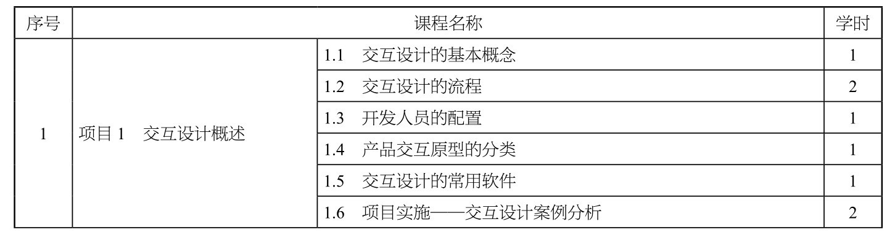
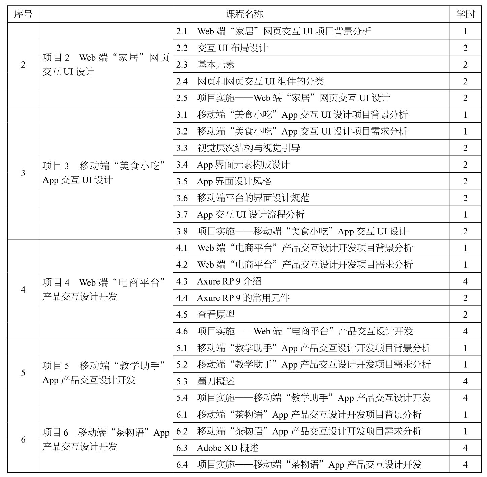

# 目录

## 项目1 交互设计概述 1
1.1 交互设计的基本概念 1
1.2 交互设计的流程 2
1.3 开发人员的配置 3
1.4 产品交互原型的分类 4
1.5 交互设计的常用软件 5
1.6 项目实施——交互设计案例分析 6

## 项目2 Web端“家居”网页交互UI设计 7
2.1 Web端“家居”网页交互UI项目背景分析 7
2.2 交互UI布局设计 8
2.3 基本元素 9
2.4 网页和网页交互UI组件的分类 10
2.5 项目实施——Web端“家居”网页交互UI设计 11

## 项目3 移动端“美食小吃”App交互UI设计 12
3.1 移动端“美食小吃”App交互UI设计项目背景分析 12
3.2 移动端“美食小吃”App交互UI设计项目需求分析 13
3.3 视觉层次结构与视觉引导 14
3.4 App界面元素构成设计 15
3.5 App界面设计风格 16
3.6 移动端平台的界面设计规范 17
3.7 App交互UI设计流程分析 18
3.8 项目实施——移动端“美食小吃”App交互UI设计 19

## 项目4 Web端“电商平台”产品交互设计开发 20
4.1 Web端“电商平台”产品交互设计开发项目背景分析 20
4.2 Web端“电商平台”产品交互设计开发项目需求分析 21
4.3 Axure RP 9介绍 22
4.4 Axure RP 9的常用元件 23
4.5 查看原型 24
4.6 项目实施——Web端“电商平台”产品交互设计开发 25

## 项目5 移动端“教学助手”App产品交互设计开发 26
5.1 移动端“教学助手”App产品交互设计开发项目背景分析 26
5.2 移动端“教学助手”App产品交互设计开发项目需求分析 27
5.3 墨刀概述 28
5.4 项目实施——移动端“教学助手”App产品交互设计开发 29

## 项目6 移动端“茶物语”App产品交互设计开发 30
6.1 移动端“茶物语”App产品交互设计开发项目背景分析 30
6.2 移动端“茶物语”App产品交互设计开发项目需求分析 31
6.3 Adobe XD概述 32
6.4 项目实施——移动端“茶物语”App产品交互设计开发 33

---

# **版权信息**

**COPYRIGHT**

书名：数字媒体交互设计（慕课版）

作者：张靖瑶 主编；郝鹏；周恩博 副主编

出版社：人民邮电出版社

出版时间：2023年9月

ISBN：9787115617873

字数：102千字

# **内容提要**

数字媒体交互设计是在产品创建初期搭建的简单产品框架中实现用户与产品进行交流互动的设计，包括按照客户需求快速创建产品的线框图、流程图、原型和Word说明文档等内容。同时，交互设计还支持多人协作设计和共享版本的控制管理。

本书由浅入深地介绍产品交互原型的创建方法和设计规范，以“知识解析+课堂案例”为主线展开讲解：知识解析部分帮助读者系统地了解Web端和移动端UI设计的各类规范；课堂案例部分帮助读者快速熟悉交互设计的流程与技巧，提高读者的实战技能。本书包括6个项目：交互设计概述、Web端“家居”网页交互UI设计、移动端“美食小吃”App交互UI设计、Web端“电商平台”产品交互设计开发、移动端“教学助手”App产品交互设计开发和移动端“茶物语”App产品交互设计开发。

鉴于实践在交互设计学习中的重要作用，本书通过多个案例，对本书编写团队总结的设计方法进行完整而详细的介绍，帮助读者对每个交互设计方法建立更深刻的认识，掌握相关方法的实践与运用技巧。

本书可作为职业院校数字媒体艺术类专业课程的教材，也可供移动UI设计初学者自学参考。

# **前言**

党的二十大报告中提出“教育、科技、人才是全面建设社会主义现代化国家的基础性、战略性支撑”的重要指示，坚持以人民为中心发展教育。本书全面贯彻党的二十大精神，有效利用各章中“素养拓展小课堂”教学环节，实现为党育人，为国育才使命，强化立德树人根本任务。本书在交互设计项目案例实践中，注重对学生创新意识的培养，为建设社会主义文化强国、教育强国、人才强国，实现以中国式现代化全面推进中华民族伟大复兴添砖加瓦。

随着科学技术的飞速发展，数字媒体交互设计与人们的生活、工作密不可分，成为一个内涵丰富的新兴产业。为了保证设计出来的软件符合用户的审美和操作习惯，很多设计团队在软件开发之初，会通过搭建产品交互原型来把控该软件的设计方向。市场对交互设计人才的需求日益增加，各大院校越来越关注数字媒体交互设计人才的培养，并开设了相应的专业和课程。

本书围绕“数字媒体交互设计”课程的教学目标，让学生不但可以系统地掌握基础知识和基本方法，而且可以运用所学知识解决实际问题。本书在教学内容选取、教学方法运用、教学环节设计、训练任务设置、教学资源配置等方面充分考虑了实际教学需求，并力求有所创新。本书具体特色如下。

（1）采用先进的教学模式组织教学内容，满足实践技能教学需求

本书采用“任务驱动，理论实践一体”的教学模式，以典型项目任务为载体，让任务贯穿教学的全过程。这些任务来源于电商平台、教务管理、企业营销等领域的真实工作内容，具有较强的代表性和职业性。

本书对以“任务驱动教学”进行了进一步优化，设置了带有交互设计功能的“基础操作”训练和实践“项目”两个层次的训练任务，以充分满足学生想掌握实践技能的需求。本书以运用交互设计解决学习、工作中的常见问题为重点，强调“做中学、做中会”，即不是以学习理论知识为主导，而是以完成任务为主导，学生在完成任务的过程中可以熟悉规范、学会方法、掌握知识。

（2）覆盖“数字媒体交互设计1+X职业技能等级”考试内容

本书对学历证书和职业技能等级证书所体现的学习成果进行认证、积累与转换。

（3）帮助学生提升技能素养

本书以帮助学生熟练掌握交互设计的基础知识和基本技能、按要求快速完成操作任务、遇到疑难问题时能想办法自行解决为目标编写而成。

本书的教学建议采用64个学时，具体可参考下方的学时分配表。

学时分配表

续表

本书提供多样化的教学资源，配套的资源包提供了书中案例的源文件和制作素材，并提供了全面的教学视频。读者可以在遇到问题时通过观看视频找到解决方法。本书每章最后都附有习题，以帮助读者检验对知识的掌握程度并学会灵活运用所学知识。通过数字化教学资源整理，有效推进教育数字化，从点滴做起为建设全民终身学习的学习型社会做出贡献，引领学生努力成为有理想、敢担当、能吃苦、肯奋斗的新时代好青年。

本书由张靖瑶任主编，郝鹏、周恩博任副主编。本书在框架搭建与内容审核的过程中，得到了天津电子信息职业技术学院姜巧玲教授的大力支持与帮助。在案例梳理及项目实施方面，本书同天津市敏生科技发展有限公司的技术团队进行深度合作，获取了大量的企业一手实践案例素材，充分体现了校企合作理念。在此对为本书编写提供帮助的组织及个人致以真挚的感谢。

由于编者水平有限，书中难免存在疏漏之处，敬请各位专家和读者批评指正。

编者

2023年2月

