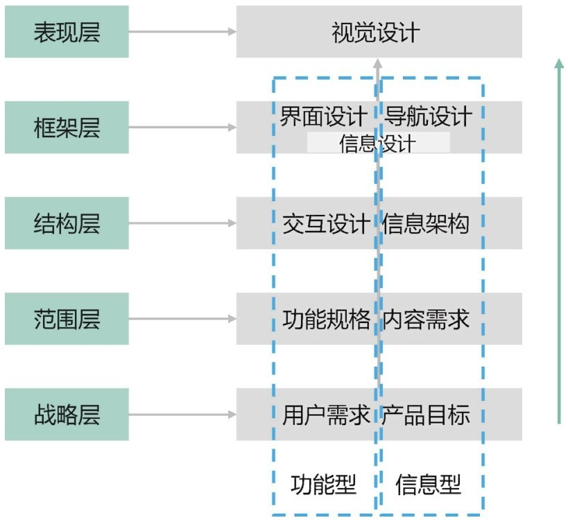
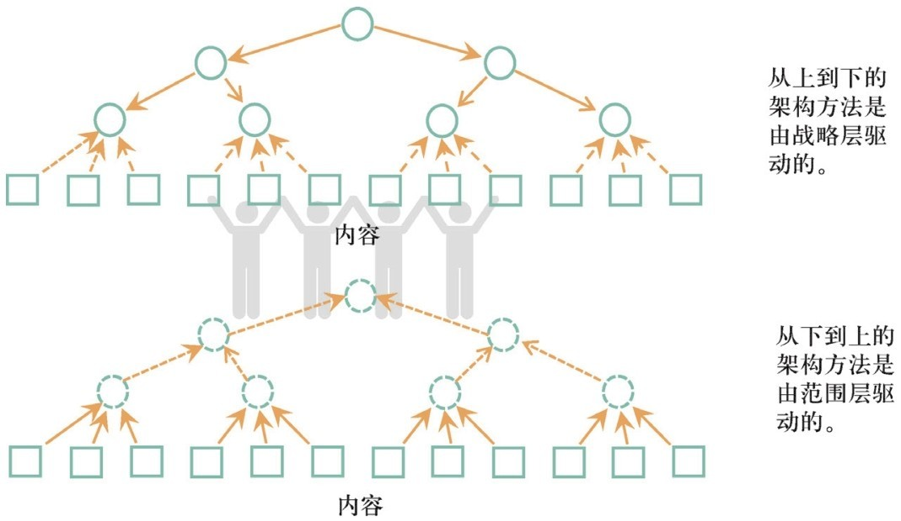
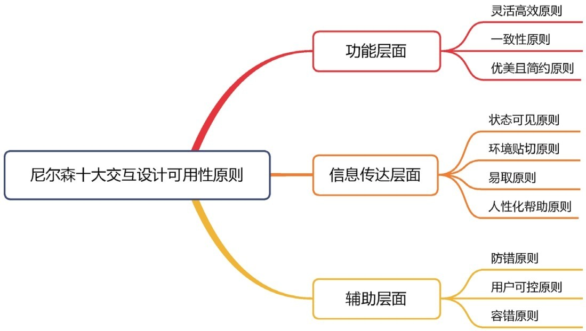
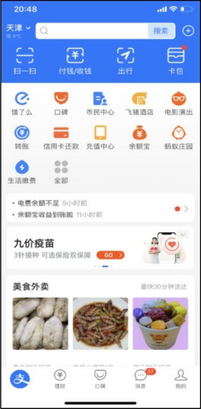
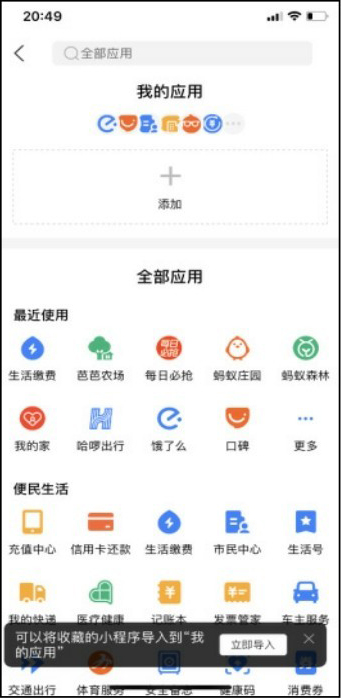
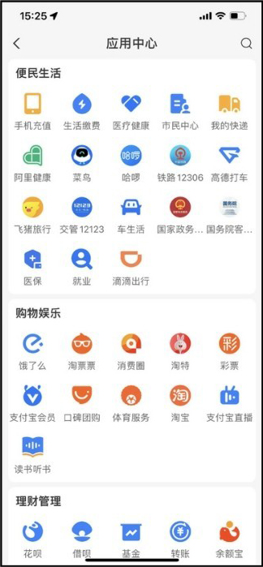
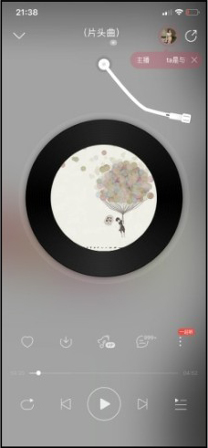
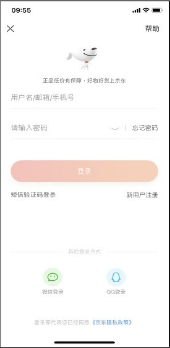
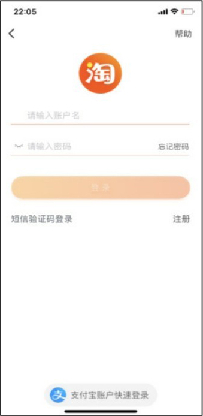
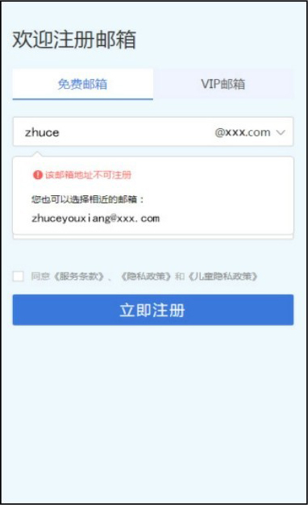

## **交互设计的基本概念**

交互设计是指设计人和产品或服务互动的一种机制﹐以用户体验为基础进行的人机交互设计要考虑用户的背景、使用经验及在操作过程中的感受，从而设计符合最终用户需求的产品，使得最终用户在使用产品时愉悦、符合自己的逻辑、有效完成并且高效使用产品。

### **1.1.1**

### **交互设计的定义**

国际交互设计协会（Interaction Design Association,IxDA）对交互设计的定义如下。

以用户为中心作为设计的基本原理，交互设计的实际操作必须建立在对实际用户的了解之上，包括他们的目标、任务、体验、需求等。从以用户为中心的角度出发，同时努力平衡用户需求、商业发展目标和科技发展水平之间的关系，交互设计师为复杂的设计挑战提供解决方法，同时定义和发展新的交互产品和服务。

交互设计通常涉及美学设计、动态设计、声音设计、空间设计等领域，这些领域交叠融合，可以说交互设计是一个多领域的融合结果。

### **1.1.2**

### **交互设计与用户体验**

用户体验这个词被广泛认知是在20世纪90年代中期，由用户体验设计师唐纳德·诺曼（Donald Arthur Norman）提出和推广。

用户体验（user experience, UE/UX）是指用户在使用产品的过程中建立起来的一种纯主观感受。随着计算机技术和互联网的发展，以用户为中心、以人为本的原则越来越得到重视，用户体验是用户关于产品的一整套体验，包括跟产品相关的设计、制作、生产、营销、售后和技术支持等各个环节，交互设计是用户体验设计的一部分。

用户体验分为5个层面：战略层、范围层、结构层、框架层、表现层，如图1-1所示。

▲图1-1 用户体验

▼微课视频

用户体验——结构层

① 战略层对应的是“用户需求、产品目标”。

② 范围层指的是“功能规格、内容需求”，当我们把用户需求和产品目标转变成产品后，思考应该提供给用户什么样的内容和功能时，战略就变成了范围。

③ 结构层就是“交互设计、信息架构”，目的是确定各个将要呈现给用户的元素的“模式”和“顺序”。

对于功能型的产品，在结构层注重交互设计：定义系统如何响应用户的请求。

对于信息型的产品，在结构层注重信息架构：合理安排内容元素，以帮助用户理解信息。

信息架构要求创建分类体系，创建方式可以是从上到下，也可以是从下到上，分类中的关系可以是线性关系或层级关系，如图1-2所示。

信息架构的基本单位是节点。节点可以对应任意的信息片段或组合，可以是一个数字、一个控件、一个组件、一个页面，甚至可以是一个功能。常见的结构类型有层级结构、矩阵结构、自然结构、线性结构。

④ 框架层指的是“界面设计、导航设计、信息设计”，确定用什么样的功能和形式来实现产品。

⑤ 表现层指的是“视觉设计”，主要解决“产品框架层的逻辑排布”的感知呈现问题。

图1-2 结构层

### **1.1.3**

### **交互设计的可用性原则**

这里讲的可用性原则是指十大交互设计可用性原则，由人机交互学博士雅各布·尼尔森（Jakob Nielsen）提出，用来评价用户体验的好坏。

尼尔森十大交互设计可用性原则被称为“启发式”原则，是对广泛经验的总结，可以把它当作一种经验来学习，并与现实中的设计技巧结合使用，如图1-3所示。

图1-3 尼尔森十大交互设计可用性原则

#### **1.灵活高效原则**

App产品应该同时满足有经验用户和无经验用户的使用需求，并允许用户定制常用功能。

如支付宝中的编辑应用功能，如图1-4所示，支付宝首页的应用是可以根据个人喜好自定义的，包括排序、删除、新增等常用应用，如图1-5所示；这样用户可以根据自己的兴趣和习惯定制适合自己的应用分布方式，如图1-6所示，这是灵活高效原则的一种体现。

#### **2.一致性原则**

对于用户来说，同样的文字、状态、按钮应该触发相同的事情，遵从通用的平台惯例，即同一用语、功能、操作保持一致。

▲图1-4 支付宝首页

▲图1-5 新增应用

图1-6 自定义应用

结构一致性：保持一种类似的结构，新的结构会让用户再次进行思考，有规律的排列顺序能减轻用户的思考负担。

色彩一致性：产品所使用的主要色调应该是统一的，而不是换一个页面颜色就不同。

操作一致性：能在产品更新换代后仍然让用户保持对原产品的认知，降低用户的学习成本。

反馈一致性：用户在点击按钮或者条目的时候，反馈效果应该是一致的。

文字一致性：产品中呈现给用户阅读的文字大小、样式、颜色、布局等应该是一致的。

#### **3.优美且简约原则**

展示的内容应该去除不相关的信息或用户几乎不需要的信息。不相关的信息会让原本重要的信息变得难以察觉。

如某软件的音乐播放界面，如图1-7所示，其在视觉及功能布局方面做得美观简约，看起来有留声机的代入感，功能主次分明、用户体验感好，这是优美且简约原则的一种体现。

图1-7 优美且简约原则

#### **4.状态可见原则**

系统应该让用户时刻清楚当前发生了什么事情，也就是快速地让用户了解自己处于何种状态，对过去发生的事情、当前目标及未来去向有所了解。一般的方法是在合适的时间给予用户适当的反馈，防止用户出现操作错误。

#### **5.环境贴切原则**

软件系统应该使用用户熟悉的语言、文字、语句，或者其他用户熟悉的概念，而非系统语言，软件中的信息应该尽量贴近真实世界，让信息更自然，在逻辑上更容易被用户理解。

#### **6.易取原则**

把组件、按钮及选项可视化，以降低用户的记忆负荷。用户不需要记住各个对话框中的信息。软件产品的使用指南应该是可见的，而且在合适的时候用户可以再次查看。例如一些App更新后的“新功能引导”，App更新完以后，当用户触发某些功能时，会出现类似遮罩的提示，如图1-8所示；这些提示用于告诉用户功能所在的地方以及功能的具体作用，如图1-9所示。这种做法在很多App中都会出现，这就是易取原则的一种体现。

▲图1-8 易取原则1

图1-9 易取原则2

#### **7.人性化帮助原则**

任何产品都应该提供一份帮助文档。任何帮助文档都应该可以方便地被找到，以用户的任务为中心，列出相应的步骤。

以两款App登录界面为例：有必要在比较重要的功能入口处提供相应的帮助入口，如图1-10和图1-11所示。不管是什么样的产品，都要给用户提供一个帮助入口，以帮助用户解决操作过程中遇到的问题。

▲图1-10 App帮助入口1

图1-11 App帮助入口2

#### **8.防错原则**

比错误提醒弹窗更好的设计是在这个错误发生之前就避免它。系统应该帮助用户排除一些容易出错的情况，或在提交之前给用户一个确认的选项。

特别要注意的是，在用户操作具有不可逆效果的功能时要有提示，防止用户犯不可挽回的错误。

#### **9.用户可控原则**

用户常常会误触到某些功能，系统应该让用户可以方便地退出。很多用户在完成一项操作时，会忽然意识到有不对的地方，所以系统最好支持撤销/重做功能。

#### **10.容错原则**

错误提示应用简洁的文字指出错误是什么，并给出处理建议。错误提示既要帮助用户识别出错误，分析出错的原因，还要帮助用户回到正确的操作上。

如用户注册邮箱，在输入出错时不但会出现错误提示，还会给出相应的建议，如图1-12所示，帮助用户进行正确的操作，在提高注册效率的同时也提供了良好的用户体验。

图1-12 错误提示

### **1.2**

