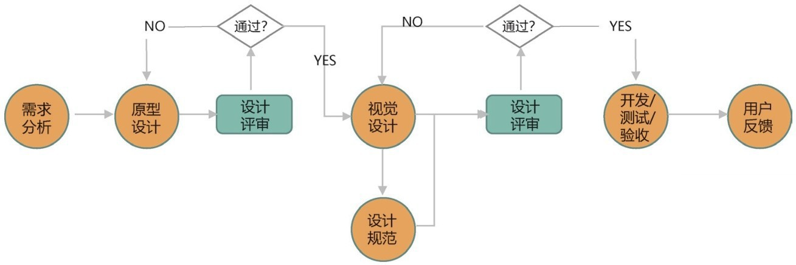
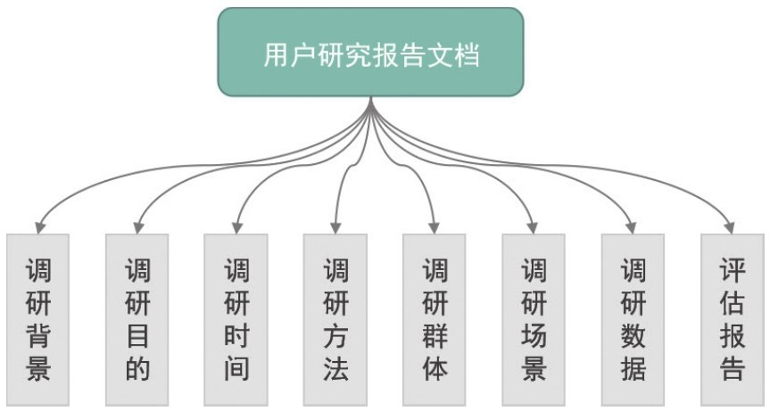
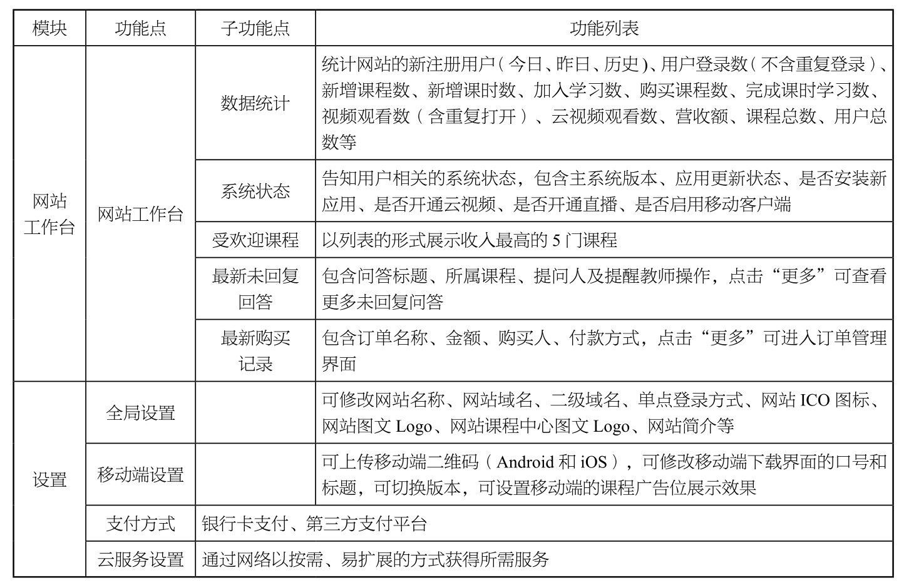
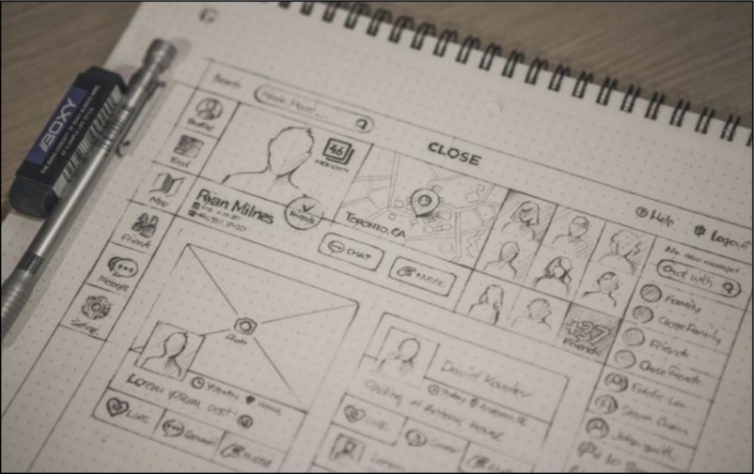
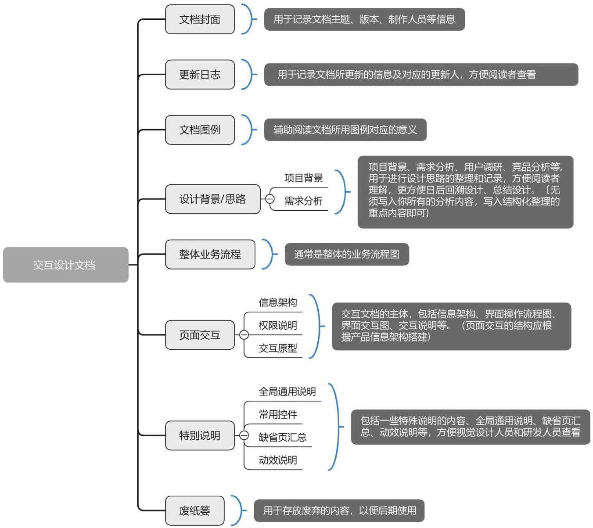

## **交互设计的流程**

交互设计不仅仅是输出设计方案，交互设计的流程如图1-13所示。

▲图1-13 交互设计的流程

▼微课视频

交互设计流程及用户体验

下面对交互设计的流程进行具体讲解。

### **1.需求分析**

需求分析是交互设计流程计划阶段的重要环节，也是产品生存周期中的一个重要环节，这个阶段是分析产品在功能上需要“实现什么”，而不是考虑“如何实现”。

需求分析的目标是把用户对待开发产品提出的要求或需要进行分析与整理，确认后形成描述完整、清晰与规范的文档，确定软件需要实现哪些功能、完成哪些工作。

在需求分析阶段，交互设计师需要编写用户研究报告文档、产品功能列表、场景故事板等。

（1）用户研究报告文档

该文档的价值与目的是通过用户调研，理性了解用户，根据他们的目的、行为和态度差异，将他们分为不同类型，然后从每种类型中抽取出典型特征建立用户画像，最终挖掘出不同用户对产品的偏好和潜在需求，以及对品牌的认知程度，从而指导市场推广和产品设计。用户研究报告文档的结构如图1-14所示。

微课视频

▲交互设计流程——需求分析

图1-14 用户研究报告文档的结构

（2）产品功能列表

交互设计师需要把产品功能以列表的形式展示出来，这是提出解决方案的第一步。

功能需求列表的价值是帮助产品经理理清思路，以及帮助项目团队的其他成员了解产品的功能需求，如图1-15所示。

图1-15 产品功能列表

（3）场景故事板

场景故事板起源于动画行业。在电影电视中，场景故事板的作用是安排剧情中的重要镜头，相当于一个可视化的剧本，场景故事板展示了各个镜头之间的关系（见图1-16），给观众或用户提供了一个完整的体验。

### **2.原型设计**

原型是一种让用户提前体验产品、交流设计构想、展示复杂系统的方式。本质上而言，原型是一种沟通工具，也是交互设计师与项目经理（Project Manager,PM)、产品设计（Product Design,PD）师、开发工程师沟通的最好工具。

图1-16 场景故事板

对产品需求分析定位后，就进入产品原型设计阶段，此时交互设计师运用设计理论、设计规范和设计原则画出交互稿，并说明哪些元素需要进行数据监测，将交互稿提交给交互组进行评审。这个阶段交互设计师需要编写交互文档，也就是交互设计文档（Design Requirement Drawing, DRD），它主要用来承载设计思路、设计方案、信息架构、原型线框、交互说明等内容。交互设计文档的结构如图1-17所示。

▲图1-17 交互设计文档的结构

▼微课视频

交互设计流程——原型设计和视觉设计

### **3.视觉设计**

在交互评审之后，设计师需要根据反馈对原型进行完善，之后就进入UI视觉设计阶段。交互设计人员在此阶段的主要任务是和UI设计人员配合，解答对方的疑问，以及确保UI稿与交互稿一致，并且没有交互方面的问题。

对输出的视觉设计方案，需要从交互角度进行评估，如与交互设计初衷是否一致、内容的主次是否表达得当、是否有细节遗漏等。

### **4.开发/测试/验收**

开发/测试/验收阶段的主要任务是，在开发人员对产品功能自测完成后，将实现的功能演示给测试人员，测试人员可以提出疑问，这些疑问由开发人员解答或解决；如果功能没有问题就可以开始进行交互验收，也就是使用某个功能，并查找该功能是否存在和交互稿不同的地方，所有的不同之处均需要提交给开发人员进行修改；验收结束后，以邮件形式发出验收结果，待所有不同之处修改完成后，即可用邮件发出“同意上线”的指令。这一过程中需要注意以下几点。

① 开发实现过程中，若开发遇到一些交互上的问题，需要实时跟进、讨论，确定最终的实现方案。

② 编写测试用例时，测试人员可能会在交互设计文档的基础上思考得更加全面，提出一些尚未考虑到的特殊操作场景。交互设计师需要思考并补充相应的交互设计说明。

③ 测试用例评审阶段，需要确认所有的用例是否与交互设计文档中的一致。

④ 验收阶段，需要验收最终的效果，看其与交互原型是否一致，对于有出入的地方要尽快跟进、确认。

### **5.用户反馈**

对于迭代的产品来说，需要持续关注用户反馈，通常采用的方式是收集用户反馈，进行可用性测试、A/B测试等。交互设计师需要分析用户反馈的问题的合理性并确认是否需要优化。对于值得重视的反馈，交互设计师需要思考设计方案并推进实现。

（1）收集用户反馈

首先，在界面上放置用户反馈入口，让用户在遇到问题时可以直接填写反馈信息。

其次，对于新产品以及改版产品，可以通过电子邮件、首页链接等方式主动发放调查问卷，收集用户意见。

最后，利用在线客服或产品论坛等功能，让客服把每天咨询最多的问题收集汇总给交互设计师。

（2）可用性测试

可用性测试是让用户使用产品的设计原型或成品，记录用户的感受和体验，从而改善及提升产品的可用性。

可用性测试适用于产品发展的各个阶段，包括前期设计开发阶段和后期优化改进阶段。

（3）A/B测试

将产品界面或操作流程的两个或多个版本，在同一时间分别让两个或多个组成成分相同或相似的访客群组访问，收集各群组的用户体验数据和业务数据，最后分析评估出最好的版本并正式采用该版本。

### **1.3**

