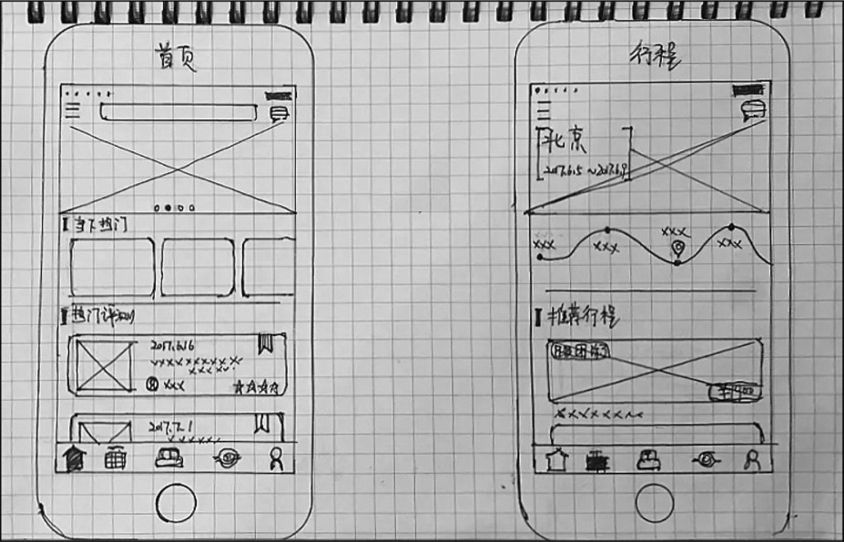
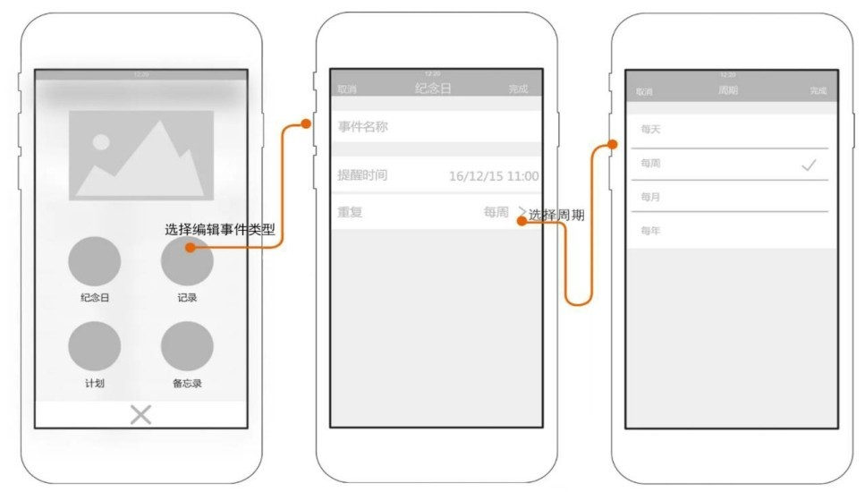

## **产品交互原型的分类**

根据页面的保真度，可以将产品交互原型分为草图、低保真原型和高保真原型。在进行原型设计之前，我们需要根据使用场景、使用人群或者项目的不同阶段来设计不同保真度的产品交互原型。

### **1.草图**

草图通常用于产品早期的概念阶段。在项目确立的早期，产品的功能及业务场景都处于规划阶段，没有成熟的产品方案。团队成员在规划项目、进行头脑风暴时，需要一个能够快速呈现产品雏形的原型，且该原型要便于修改，如图1-18所示。

图1-18 草图

草图绘制阶段的原型设计大部分都是在白板或者白纸上手绘完成的，方便在产品功能的讨论中发现问题，及时修改。草图原型能够表达出基本的界面功能及内容布局，利用基本的几何图形（如方框、圆形和一些线段）来表达产品的雏形，能让参与讨论会议的人员明白大概意图即可。

草图的优势在于设计成本低，能够随时进行修改，在项目早期有很多不确定因素的前提下，尽量使用草图进行讨论。

### **2.低保真原型**

明确产品的业务需求及使用场景后，产品经理和交互设计师可以使用低保真原型来快速设计产品的概貌。产品经理和交互设计师明确了产品的功能需求及业务范围后，根据业务会议上确定的产品方案，需要梳理清楚产品的功能结构和信息结构，根据业务需求推导出产品的详细功能点。产品的战略目标、需求范围、功能结构都清楚以后，就可以开始正式绘制低保真原型了。低保真原型又称为线框图，如图1-19所示。

图1-19 低保真原型

低保真原型可以帮助我们准确拆分页面，以及每个页面的功能模块和展示信息，确定每个页面元素的布局。低保真原型的绘制需要借助原型设计工具，其中的元素布局以及功能模块需要无限接近产品上线后的样子。

低保真原型可以不考虑页面元素的配色以及各功能的交互跳转效果与动画效果。设计页面的配色是UI设计师的工作，丰富的交互动作也不适合在这个阶段去详细分析。通常低保真原型设计完成后，需求提出人员、UI设计师、前端开发工程师、后端工程师和测试人员等需要进行原型设计评审会，根据评审结果对低保真原型进行多轮调整，直至得到满意的结果，确保能继续向下推进。低保真原型确定后，UI设计师及开发工程师可以据此进入项目实施阶段。

### **3.高保真原型**

高保真原型常用于向高层领导进行产品演示或者向投资人展示产品概念，以寻求项目融资。高保真原型又可以作为产品的demo（试样），除了没有真实的后台数据进行支撑外，几乎可以模拟前端的所有功能，是一个高仿真产品。对于一些非专业的高层领导、老板及投资人，他们希望看到的是一个无限接近线上产品的demo，它能够尽可能详细地展示产品的功能及业务范围，在视觉展示以及交互动作上都和真实产品大致相同，如图1-20所示。

图1-20 高保真原型

通过以上内容我们知道，明确当前的项目阶段及使用人群后，再决定使用什么样保真度的原型才是最合适的。既不能为了方便而总是使用草图，也不能一味地追求高保真原型，而应综合评估使用的场景及适用人群。在工作当中，我们使用最多的是低保真原型，毕竟项目团队中最关心产品原型的是项目的实施人员，低保真原型也能较为准确地阐述项目需求，以及一些简单的交互动作与交互效果，可以让行业内的设计人员一看便知。有些业务规则及交互细节，还需要配有说明文档，这样才能方便开发人员及测试人员深刻理解产品需求。

